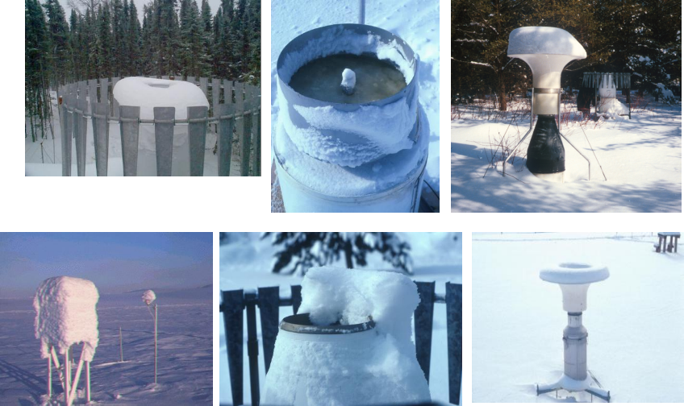
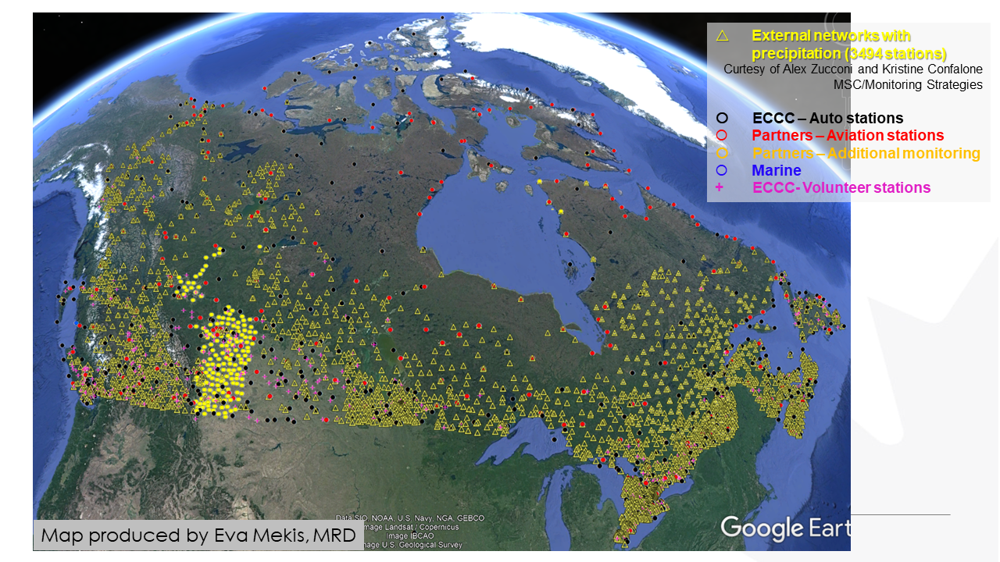

---

marp: true
theme: descartes
_class: lead
class: default
footer: Données climatiques : Acquisition, interprétation et manipulation
header: École d'été en sciences du climat
author: Trevor James Smith
paginate: true
backgroundColor: 
transition: fade
# backgroundImage: url('https://marp.app/assets/hero-background.svg')
size: 16:9
style: |
    footer {
      left: 5%;
      font-color: white;
      font-size: 20px;
    }
    header {
      right: 10%;
      left: 60%;
      text-align: right;
      font-size: 20px;
    }
    img[alt~="center"] {
      display: block;
      margin: 0 auto;
    }
    .container{
      display: flex;
    }
    .col{
      flex: 1;
    }

---
<!-- _header: "" -->
<!-- _footer: "" -->
<!-- _paginate: skip -->

<!-- Bonjour!

On va aborder le sujet des données climatiques, donc comment on procède pour les acquérir, comment on les interprètes et aussi comment on peut les manipuler avec divers logiciels. -->

# <!-- fit --> Données Climatiques : Acquisition, Interprétation, et Manipulation

### Trevor James Smith

Avec remerciements à Blaise Gauvin St-Denis et l'équipe PCDO

- Plateformes climatiques, données et opérations, Ouranos
- École d’été en science du climat et des changements climatiques
- 30 mai 2024

---

<!-- Les objectifs du cours sont les suivants : [...] donc ici on va plus parler du travail qui est fait par les services météorologiques nationaux pour prendre des mesures. 

Ensuite [...] où là on va parler des données qui sont diffusées au public et donc que des organismes comme Ouranos ou des étudiants comme vous peuvent utiliser. 

Ensuite, comme vous allez le voir, il y a vraiment une quantité d'information faramineuse pour ce qui est de l'observation de la terre et de notre atmosphère et il n'y a pas le jeu de données parfaits qui répond à toute les questions donc il faut comprendre les [...], et aussi je souhaite vous donner une appréciation de la [...]. -->

# **Objectifs du cours**

* Connaissance de base de l’historique de la collecte de données climatiques, du fonctionnement des différents instruments et de leurs incertitudes.
* Vue d’ensemble des données disponibles pour faire des études climatiques.
* Connaissance des forces et faiblesses des différents types de jeux de données.
* Compréhension de la taille considérable de certaines des bases de données et des défis à les analyser.

---

<!-- _footer: "" -->

# Qui suis-je ?

Trevor James Smith

 [**github.com/Zeitsperre**](https://github.com/Zeitsperre)
 [**Zeit@techhub.social**](https://techhub.social/@zeit)

- Developpeur/packageur/mainteneur des logiciels de recherche scientifiques
- M.Sc. en Géographie, environnement et urbanisme
  - Sujet: Analyse des impacts des changements climatiques sur les vignobles en sud du Québec
- 10+ années d'expérience en utilisant Python, Linux, GIS, et autres téchnologies associées

---

<!-- Ce cours est séparé en huit (8) sections : [...] -->

# **Contenu du cours**

1. Historique des instruments d’observations météorologiques
2. Fonctionnement des instruments d’observations météorologiques
3. Données observées
4. Données de réanalyses
5. Données de modèles climatiques
6. Données dérivées
7. Formats habituels des données climatiques et outils d’analyses
8. Les services climatiques (PAVICS)

---

# **1. Historique des instruments d'observations météorologiques.**

<!-- La NOAA «National Oceanic and Atmospheric Administration».
Célébration de ses 200 ans un petit historique sur la météorologie.
Centré sur les États-Unis mais quand même interessant. -->

---

<!-- _paginate: false -->

<!-- Benjamin Franklin, connu pour son expérience du cerf-volant attaché à un fil conducteur pour démontrer que les éclairs c'est de l’électricité
en 1743, il avait noté le mouvement d'une tempête de Philadelphie à Boston et a remarqué que la direction du mouvement d'une tempête n'était pas nécessairement dans la direction des vents prédominants. 
Évoqué le lien entre un hiver très froid en Europe suite à une éruption du volcan Laki en Iceland. -->

# 1743

### Benjamin Franklin fait des observations des mouvements de tempêtes et patrons météorologiques.

---

<!-- _footer: "" -->

<!-- George Washington, qui a commencé à maintenir un journal d'observations météorologiques en 1767 jusqu'au dernier jour avant sa mort.
en lien avec ses intéresses pour la culture de tabac et de blé, et son rôle en temps que commandant durant la révolution américaine. -->

# 1767

## Georges Washington commence un journal d’observations météorologiques.

---

<!-- _paginate: false -->

<!-- Et l'intérêt des grandes figures politiques américaine pour la météo se poursuit avec Thomas Jefferson qui faisaient aussi des observations météorologiques sur une base régulière. 
Deux observations par jour, à son levé, qu'il considérait comme étant la température minimum de la journée, et vers 3 ou 4h, qu'il considérait comme étant la température maximale. 
Il notait aussi l'arrivé d'oiseau ou la date de fleuraison des plantes. 
1776 : Thomas Jefferson recrutait des observateurs météo bénévoles à travers la Virginie. -->

# 1776

## Thomas Jefferson recrute des observateurs météo bénévoles en Virginie.

---

<!-- _paginate: false -->

<!-- 1800 : des bénévoles étaient présent dans 5 autres états : Massachusetts, Pennsylvanie, Connecticut, New York et La Caroline du Nord. -->

# 1800

## Le réseau de bénévoles s’étend dans 5 états.

- Massachusetts
- Pennsylvanie
- Connecticut
- New York
- Caroline du Nord

---

<!-- Thomas Jefferson a également commissionné l'expédition de Lewis et Clark, vers l'Ouest en 1804 et des observations météorologiques étaient faites sur une base régulière. -->

# 1803 / 1804

## L’expédition de Lewis et Clark vers l’ouest américain fait des observations météorologiques régulières

- [https://lewisandclarkjournals.unl.edu/item/lc.jrn.1803-08-30](https://lewisandclarkjournals.unl.edu/item/lc.jrn.1803-08-30)

---

<!-- _paginate: false -->

<!-- En 1814, le chirurgien en chef de l'armée américaine, James Tilton 
Noté l’importance des observations météorologiques pour les affaires du gouvernement
L'idée d'un réseau d'observation météorologique en utilisant plusieurs postes militaires à travers le pays -->

# 1814

## James Tilton ordonne les observations météorologiques dans les postes militaires.

---

<!-- _paginate: false -->

<!-- Joseph Henry, premier secrétaire de l'institution Smithsonian, et plus connu pour ces découvertes par rapport à l'inductance des matériaux.
En 1848, il inaugurait un réseau télégraphique de 150 observateurs 150 bénévoles pour résoudre le problème des tempêtes américaine. -->

# 1848

## Joseph Henry inaugure un réseau télégraphique d’observateurs de 150 bénévoles.

---

<!-- _paginate: false -->

<!-- 1860 : 500 stations, opérés par des bénévoles, fournissaient des rapports télégraphiques journaliers. -->

# 1860

## 500 stations fournissent des rapports télégraphiques journaliers

---

<!-- En 1870, le président Ulysses S. Grant (GAUCHE) autorisait l'établissement d'un service météorologique national, le US Weather Bureau, qui deviendra plus tard la NOAA.

Brigadier général Albert J. Myer, du Signal Corps de l'armée, responsable pour infrastructures de communication américaine était premier en charge du US Weather Bureau. 

Les premières observations météo synchronisé ont eu lieu le 1er novembre 1870 à 7:35 du matin à 24 stations qui ont transmis à un site central à Washington.

3 ans plus tard à Vienne, l'idée d'avoir des échanges journaliers des observations météorologiques à travers le monde est lancé, ce qui marque aussi les début de la OMM (WMO : World Meteorological Organization). Rendu en 1891, le réseau d'observateurs météo bénévoles contenait plus de 2000 stations. -->

# 1870

## Ulysses S. Grant (**à gauche**) autorise un service météo national sous la direction de Albert J. Myer (**à droit**).

---

<!-- 1891 : le réseau d'observateurs météo bénévoles contenait plus de 2000 stations autour du pays. -->

# 1891

## Le réseau d'observateurs météo bénévoles contenait plus de 2000 stations autour du pays.

---

<!-- 1898 : le U.S. Weather Bureau commençait à expérimenter avec des cerf-volant pour mesurer la température, l'humidité relative et les vents en hauteur dans l'atmosphère. -->

# 1898

## Le U.S. Weather Bureau expérimente avec des cerf-volants.

---

<!-- _paginate: false -->

<!-- 1909 : l'utilisation de ballons pour obtenir ces information débutait. -->

# 1909

## Début de l’utilisation de ballons.

---

<!-- 1926 : le Weather Bureau a eu le mandat de fournir des services météorologiques à l'aviation civile.
 
Au même moment, des observations commençait à être prises à partir d'avions de l'armée américaine et du Weather Bureau. -->

# 1926

## L’aviation change le rôle du Weather Bureau qui doit fournir des services météorologiques à l’aviation civile.

---

<!-- 1931 : les vols d’avions pour prendre des observations à était possible jusqu’à une hauteur de 5Km et par 1934, 20 avions du Weather Bureau faisait des observations régulièrement -->

# 1931 à 1934

## Le Weather Bureau opère 20 avions d’observations météorologiques.

---

<!-- Cette pratique a était coûteuse et dangereuse pour les pilotes et alors a été remplacé par des radiosondes qui pourrait atteindre une hauteur au dessus de 16Km en 1939. -->

# 1939

## L’utilisation de radiosondes remplace les observations par avions.

---

<!-- Après WWII, les technologies de radar développé pour détecté les avions ennemies on été adapté aux observations météorologiques dans les années 1950.

La OMM à débutait comme direction des efforts internationaux pour la surveillance météorologique. -->

# 1950

## Les technologies radar développées durant la 2e guerre mondiale sont adaptées aux observations météorologiques.

---

<!-- -->

# 1960

## Les premiers satellites d’observations météorologiques sont lancés.

- TIROS-I (**à gauche**)
- TIROS-II (**à droit**)

---

<!-- Fonctionnement des différents instruments d'observations météo les plus utilisés, ainsi que les incertitudes ou potentiels problèmes associés à leur utilisation.

Je dois mentionner que ma formation est en géographie, alors je ne suis donc pas un expert en outils de mesure météorologique, mais si vous avez des questions spécifiques, n'hésitez pas à les poser tout de même. Je peux vous revenir si cela dépasse mes connaissances. -->

# **2. Fonctionnement des instruments d'observations météorologiques**

---

<!-- Les instruments d'une station météorologiques sont pour la plupart de type "in situ", c'est-à-dire en contact avec l’objet à mesurer.

Les stations peuvent être soit automatisé ou à observateur. Les stations à observateur requiert qu'une personne prenne des mesures deux fois par jours tout les jours de l'année. 

Québec, le MELCC maintient le document de référence pour les observateurs, et maintient un réseau de 329 stations, 241 avec observateurs et 88 automatiques.  -->

# Station d’observation météo

Observation **in situ** : observation obtenue par contact direct avec l’objet en question.

Stations à observateurs : un ou deux temps d’observations par jour.

Au Québec, les heures d’observations sont 8h et 18h heure normale de l’est.

Stations automatiques : observations possibles à toutes les heures.

---

<!-- _paginate: false -->

<!-- Des carnets des observateurs existent pour noter les observations. À l'époque, ces carnets étaient entré manuellement dans les systèmes par des techniciens, mais il existe maintenant des méthodes électroniques pour soumettre les observations.

Bien qu'une validation sommaire est faites sur les données soumises, il reste que des erreurs d'observations sont inévitable à long terme. Il faut aussi considérer que chaque instrument peut comporter un manque de précision ou se comporter de façon un peu différentes dans diverses conditions climatiques. -->

# Station d'observation météo

**source: MELCC**

---

<!-- Quelques détails sur les instruments de bases, le bon vieux thermomètre, qui est basé sur les propriété d'expansion en fonction de la température de certain liquides. 

Généralement au mercure, mais pour les température plus froide, il faut un thermomètre à l'alcool parce que le mercure gèle à -39 degrés Celsius. 

Pour des mesures automatiques, on peut utiliser une thermistance, qui est basé sur la variation de la résistance électrique d'un matériaux en fonction de la température. -->

# Thermomètre

La température minimum et maximum de l’air est mesurée à l’aide d’une combinaison d’un thermomètre à mercure et thermomètre à alcool.

Pour les stations automatiques, une thermistance est utilisée.

Au Québec, les mesures des observateurs se font à une précision d’un demi-degré Celsius

---

<!-- Pluviomètre : pas compliqué, l'observateur n'a simplement qu'a noté la quantité accumulé dans le cylindre depuis la dernière observation, puis le vider. -->

# Pluviomètre

---

<!-- _paginate: false -->

<!-- Pluviomètre à auget basculeur : Après une certaine quantité de pluie tombé, par exemple 0.1 mm, l'auget bascule et envoie un signal électrique. Donc le nombre de bascule multiplier par 0.1 mm donne la précipitation sur une période de temps donnée. 

Il est également possible d'avoir un système qui chauffe le cylindre qui permet également de mesurer l'équivalent en eau de la neige lors de précipitation solide. -->

# Pluviomètre cont.

---

<!-- Table a neige, pour mesurer la hauteur de neige tombé. Après un temps d'observation, la table est dégagé, replacé au niveau du sol ou du couvert de neige actuel. -->

# Table à neige

---

<!-- _paginate: false -->

<!-- Nivomètre à écran Nipher : pour mesurer la neige.
Cet instrument a une hauteur ajustable au fur et à mesure que le couvert de neige augmente, l'instrument est rehaussé. La forme de l'embouchure sert à limiter un peu la turbulence autour de l'instrument qui va affecté la quantité de neige accumulé dans l'appareil. Un observateur vient ensuite prendre le cylindre, fait fondre son contenu et mesure la quantité d'eau équivalente. -->

# Nivomètre à écran de Nipher

---

<!-- _header: "" -->
<!-- _footer: "" -->

<!-- Ici je vous montre des travaux de Julie Thériault, prof à l'UQAM, qui avait passé du temps à NCAR à Boulder au Colorado avec des instruments asser sophistiqué. Ce que vous voyez en bas à droite c'est le DFIR, Double Fence Intercomparison Reference qui est considéré comme ce qui se fait de mieux pour réduire la turbulence autour de l'appareil de collecte.

À gauche dans le graphique, vous avez l'efficacité de collecte entre le DFIR et un autre appareil, le single Alter, en fonction de la vitesse du vent, et du type de neige, mouillé ou sèche. On peut voir qu'à partir de vents de 2-3 m/s, les mesures d'appareils traditionnelle se dégrade rapidement pour aller jusqu'à 20% de la quantité de neige mesuré par le DFIR. Bref, c'est tout un casse-tête de mesurer la précipitation sous forme de neige. -->

<!-- # “Single alter” et DFIR -->

---

# « Sous Captation »

La **sous-captation** est un phénomène où le pluviomètre ou nivomètre sous-estime la quantité de précipitation tombée en période de grands vents ou lors de fortes tempêtes.

Au Québec, les mesures se font à une précision d’un dixième de millimètre.

---

<!-- Voici plusieurs photos courtoisie de Ross Brown et Barry Goodison d’Environnement Canada qui montre les nombreuses façons dont les nivomètres peuvent sous-capturer la neige. 

Le gel des plaques qui mesure le deplacements par poids, 
Une incapacité à faire fondre la neige assez rapidement. 

Les mesures peuvent mal se passer et elles le font assez souvent pour la neige. 

Cela souligne la nécessité de corriger les données, ce dont je parlerai à plus tard. -->

# « Sous Captation »

---

<!-- Jusqu'à présent, nous avons vu des moyens assez conventionnels d'observer les précipitations mais on peut s'imaginer des sites d'observations beaucoup plus sophistiquées qui sont en général des sites expérimentaux pour des projets de recherche spécifique. 

Ici, l'exemple d'une tour d'observation dans le BEREV, le bassin expérimental du ruisseau des eaux-volée dans la forêt Montmorency. C'est quelque chose qui est fait le cadre du projet EVAP piloté par François Anctil et Daniel Nadeau à l'université Laval. Ils s'intéresse à l'évapotranspiration qui est quelque chose de très peu mesurée, par la difficulté que sa représente. Et donc ils ont fait une tour de 10m au milieu de la forêt, entouré d'une peuplement d'arbre uniforme. Ils ont des instruments de mesures pour le rayonnement net, les flux de chaleurs latente et sensible, un scintillomètre qui mesure un profil d'évapotranspiration par méthode de covariance des tourbillons, des instruments dans les arbres pour mesurer l'écoulement de la sève, des capteurs de températures dans le sols, etc. -->

# Site expérimental - BEREV

---

<!-- _header: "" -->

<!-- Finalement, l'échelle à neige : vieille mais moins cher.

Permet de mesurer la hauteur de la neige au cours de l'hiver à un site précis. -->

# Échelle à neige

**source: MDDEFP**

---

<!-- Les stations et leurs instruments doivent répondre à une panoplie de critères afin d'uniformiser les observations à différents endroits. L’Organisation météorologique mondiale (OMM) est responsable de la publication du guide sur l'instrumentation météorologique et des méthodes d'observations. C'est un document de plus de 700 pages qui décrit la mise en place et les spécifications des instruments.

Par exemple, les thermomètres et hygromètres doivent être à l'intérieur d'un abri Stevenson pour les protéger de l'influence de la radiation solaire directe et des intempéries. La distance minimale à laquelle certains obstacles peuvent se trouver de la station est aussi décrite. -->

# *Standards* des stations d’observation météo

---

<!-- Il y a un station de météo automatique situé à Burnside Hall, à l'université McGill.

Il n'est pas dans la réseau du MELCC ou Environnement Canada mais prends des mesures à tous les 5 mins et les mettre en ligne. -->

# Stations d’observation météo

### [https://radar.mcgill.ca/imagery/weather-station.html](https://radar.mcgill.ca/imagery/weather-station.html)

---

<!-- Lancer des capteurs du sol vers l’atmosphère.

Radiosonde : outil de mesure atmosphérique généralement attaché à un ballon et capable de mesurer des éléments tels que la pression, l'humidité relative, la température, le vent et l'altitude, lors de sa navigation dans la troposphère et la stratosphère jusqu'à 30 km d'altitude.

Nous aide à comprendre les différences entre les zones atmosphériques, les cellules éoliennes, et sont lancées des centaines de fois par jour autour le monde.

Christopher peut-être avait parler un peu de ces choses l’autre jour. -->

# Radiosonde

La **radiosonde** est composée d’un ensemble d’instruments d’observations attachés à un ballon qui s’élève dans l’atmosphère.

Permet d’obtenir la distribution verticale de température, pression et humidité jusqu’à *30 Km d’altitude*.

Avec un équipement de localisation au sol, il est possible d’obtenir le profil vertical de vent.

---

<!-- Deux types : 

1. Lancés depuis le sol via un ballon, comme celle illustrée ici, s'appellent des rawinsondes (RADAR-WIND-SONDES)

2. Tombent ou « droppés » des avions vers le sol s'appellent des dropsondes. 

Légers - ne pesant que 250g.

Quand le ballon apparaît dans la haute atmosphère, déploie un parachute et retombe sur la terre. -->

# Radiosonde

---

<!-- Ici, on a une diagramme SkewT qui vient d’une radiosonde avec les isobares sur l'axe vertical et un paquet d'autres ligne, dont des isothermes, des adiabats, et les deux lignes en gras qui indique la température de l'air et la température du point de rosé à gauche. Les endroits ou les deux lignes se touchent se sont les niveaux dans l'atmosphère ou l'air est saturé en vapeur d'eau et ou on s'attend à avoir de la condensation.

À droite on a également les vents avec l'altitude, donc du nord à la surface et des vents de l'ouest en hauteur. Les météorologues utilisent ce genre de graphique pour dérivé une panoplie de variables secondaires comme le CAPE, l'énergie potentielle de convection disponible ou « Convective Available Potential Energy ». -->

# Radiosonde

---

<!-- _paginate: false -->

<!-- Télédétection : comme le radar et les satellites.

La production de nouvelles informations à partir de données observées à distance. 

Spectroscopie mais à grande échelle: l’identification des substances chimiques par les changements au radiation, réfléchi or émis.

L’interprétation par bande : pour les satellites, est utilisé pour identifier la végétation et d'autres types de couverture terrestre. Ça pourrait aussi être utilisé pour voir la concentration et distribution des espèces chimiques. Je vais revenir à ça.

Avant de continuer, je tiens à mentionner que même avec une formation en géographie, je suis pas une expert en télédétection.

Mais, ca se peut qu’on à des experts dans la salle.  -->

# Télédétection

- Différence entre les bandes spectrales ou l’intensité ou fréquence des signales
- Utile pour identifier la couverture des sols, la distribution spatiale des émissions ou d’espèces atmosphériques
- Essentielle pour générer des topographiques spatiales
- **Source : NASA Climate Science Investigations (https://www.ces.fau.edu)**

---

<!-- Radar : Télédétection in situ.

l’idée autour de radar c’est d’émettre des micro-ondes et d’utiliser les changements au signale récupéré pour savoir la nature des objets à distance.

L'effet Doppler : Déterminer si les particules sont en mouvement et donc d'inférer de l'information sur les vents auquel sont soumis les particules de précipitation

La polarisation : c'est-à-dire choisir l'axe dans lequel l'onde oscille pour obtenir de l'information sur la forme des particules. -->

# Radar

Observation de télédétection **in situ** : observation obtenue sans contact avec l’objet en question.

Trois (3) composantes majeures : 
- un émetteur d’ondes radioélectriques,
- une antenne, 
- et un receveur d’onde.

Portée d’environ 200 km autour du radar.

---

<!-- _paginate: false -->

<!-- Ici on a une photo du radar de l’observatoire du J.S. Marshall gérer par l'université McGill sur le campus à Saint-Anne de Bellevue dans l'ouest de l’île de Montréal qui fait partie du réseau d'observation radar d'environnement Canada. C'est d'une hauteur d'environ 5 étages dans un endroit bien dégagé histoire de ne pas être obstrué par des structures avoisinantes. À l'intérieur du dôme, on retrouve le radar en tant que telle. 

À McGill l'antenne est de 9m à l'intérieur de la coupole. Et donc le radar tourne continuellement, à plusieurs rotations par minute et après chaque rotation, l'angle vertical est augmenté afin de faire un image en 3D de l'atmosphère. Ce cycle de rotation horizontal et de changement d'angle vertical prend environ 5 à 10 minutes, puis recommence. -->

# Radar

**Source: Université McGill**

---

<!-- L'émetteur d'onde va émettre des pulses micro-onde sur des échelles de microsecondes avec des longueurs d'ondes de 1-10 cm, ce qui est environ 10x la taille des gouttes de précipitations et donc lorsque ces ondes rencontres de la précipitation dans l’atmosphère, il y a un phénomène de diffusion de Rayleigh par lequel les ondes sont redirigés dans plusieurs direction, dont certaines de retour vers le radar.

Après le pulse envoyé, le radar passe en mode écoute pendant environ une milliseconde et à ce moment là, si un signal de retour est enregistré, il est possible de calculer sa distance en multipliant le temps écoulé par la vitesse de la lumière dans l'air et en divisant par 2 pour tenir compte de l'aller-retour de l'onde.

On mesure aussi l'intensité du signal de retour par une mesure qu'on appelle la réflectivité en décibel. En fait, de nos jours la technologie est encore bien plus complexe. -->

# Radar

**Source: NOAA**

---

<!-- La puissance reçu peut être relié au facteur de réflectivité d'un volume de particule.

Ce facteur de réflectivité est à son tour dépendent de la distribution de la taille des gouttes.

Dans sa version la plus simple, la relation entre facteur de réflectivité et précipitation est donné par la relation Z-R. Z=200R^1.6 pour la pluie et Z=2000R^2 pour la neige, où Z est en mm^6/m^3 et R en mm/h. -->

# Relation Z-R

La puissance reçue est reliée au facteur de réflectivité d’un volume de particules.

Le facteur de réflectivité est dépendant de la distribution de la taille des gouttes.

Dans sa version la plus simple, la relation entre facteur de réflectivité et précipitation est donnée par la relation **Z-R**.

*Z = 200R^1.6 pour la pluie (Z en mm^6/mm^3, R en mm/h)*

*Z = 200R^2 pour la neige*

---

<!-- _header: "" -->

<!-- Réseau d’observation radar : Nécessaire pour la cartographie des systèmes de météo.

Environnement Canada : le réseau canadien d'observation radar. Comme vous pouvez le constater, la couverture spatiale se limite au sud du pays. -->

# Radars canadiens

---

<!-- _header: "" -->

<!-- Si on regarde au États-Unis, le territoire entier est presque couvert et la densité des radars est aussi supérieur à celle du canada. -->

# Radars americains

---

<!-- Au Canada, on peut suivre en temps réel, avec des images aux 10 min, les observations radar d'environnement Canada. De même au États-Unis aux 5 min. 

Avantage : résolution temporelle et spatiale. La résolution spatiale d'un radar est d'environ 1 degré en azimut et en élévation, et quelques centaines de mètres en distance. Donc une image radar de 200 km enregistre la puissance moyenne à chaque pas de temps dans environ 3 millions de points de grille. 

Problème : La taille des données. Réseau = plusieurs terabytes de données produites par jour. Il faut donc développer des produits intermédiaires ou des cartes qui eux pourront être archivé. -->

# Radar

Résolution temporelle de *5 à 10 min*.

Résolution spatiale de 1 degré en azimuth et en élévation. ~100 m sur l’axe de l’onde émise.

Une image de 200 km → *3 millions points de grille*

Plusieurs téraoctets de données produites par jour.

---

<!-- _header: "" -->

<!-- Difficile de transformer l’information sur une grille uniforme de précipitation. 
Problème est causée par la résolution du radar qui se dégrade en fonction de la distance.

Exemple : climatologie en Angleterre ou l'on peut voir des artefacts de blocage du rayon ou de délimitation entre les radars.

Erreurs peut venir du terrain, tels que les montagnes, ainsi que des insectes et des oiseaux en vol. -->

# Composite radar

---

<!-- _header: "" -->
<!-- _paginate: false -->

<!-- Voici le page internet de l’observatoire du J.S. Marshall qui j’ai parlais de plus tôt. On peut voir les images de ce radar en temps réelle avec couplée avec une modèle de prévision qui estime les prochains trois (3) heures. -->

# Radar + Prévision

* [McGill Radar Nowcasting (site web)](https://radar.mcgill.ca/imagery/nowcasting.html)

---

<!-- _header: "" -->

<!-- Observations satellitaires : Beaucoup à apprendre sur l'imagerie par satellite. 

Une source d'information non-négligeable pour le climat et toutes sortes d'informations provenant des satellites peuvent nous aider à mieux comprendre le système climatique, indépendamment des facteurs climatiques directement observés.-->

# Satellite

---

<!-- _header: "" -->

<!-- Toutes sortes d'informations provenant des satellites peuvent nous aider à mieux comprendre le système climatique, indépendamment des facteurs climatiques directement observés.

L’image ici parvient à GPM, le mission de « Global Precipitation Measurement » une initiative de plusieurs pays.-->

# Données satellitaires

Coordination à l'international

Plusieurs « *missions* » en opération en même temps

- **Source : NASA** 

---
<!-- Deux types d'orbites de satellite possible :

1. Géostationnaire : un satellite à 36000km au dessus de la terre qui orbite l'équateur au même rythme que la rotation de la terre et donc reste fixé au dessus du même point terrestre en permanence. 

2. Orbite polaire : Passent au dessus du pole nord et pole sud à une altitude d'environ 850 km. 

Au fur et a mesure que la terre tourne vers l'est, le satellite passe au dessus d'une région à l'ouest et enregistre des bandes successives d'information sur le globe. Un satellite à orbite polaire typique va faire une rotation complet autour de la terre en un peu moins de deux heures, 14 fois par jour. -->

# Satellite

Également de la famille d’observation par « *télédétection* »

Deux types d’orbites : *géostationnaires* et à *orbite polaire*.

Géostationnaire : 
  - 36,000 Km au dessus de la terre fixé au dessus du même point terrestre en permanence

Orbite polaire : 
  - ~850 Km au dessus de la terre
  - ~14 orbites par jour

---

<!-- _header: "" -->

<!-- L'utilisation de base des satellites d'observations consistait en une image photographique afin d'observer les nuages, comme on peut voir ici des satellite géostationnaires GOES-1 et GOES-18. 

Le nombre d'instruments et leur capacité d'observation c'est grandement amélioré avec les années. -->

# Mission Satellitaire « GOES »

GOES-1 (1975)

GOES-18 (2022)

* **Crédits des images : NASA, NOAA, JMA**

---

<!-- Un capteur photographique multispectrale à plusieurs bande pour capter autant la lumière visible que l'infrarouge. 

Ils ont aussi un sondeur qui permet de mesurer un meilleur profile vertical de température et d'humidité dans l'atmosphère. 

Il permet de dériver une panoplie d'information comme la hauteur et l'épaisseur des nuages, la température de surface de l'océan, l'étendu de la neige en hiver, la glace de mer et la hauteur de la surface de l'océan. -->

# Satellite

Équipé d’un capteur photographique multispectres et sondeur,

Information obtenue sur : hauteur et épaisseur de nuages, température de surface de l’océan, étendue de la neige et glace de mer, hauteur de la surface de l’océan, etc.

---

<!-- Acquisition : Collecter des données à différentes fréquences dans des bandes spectrales très spécifiques :

Visible (380 à 740 nanomètres).

Proche infrarouge (1 micromètre).

Infrarouge (10 micromètres).

Radar (dizaines de centimètres).

Détectés de l'espace pour donnez l’idée de l'énergie réfléchi et émis de la surface. 

Avec quelques corrections, ce type d'imagerie peut déterminer de manière très fiable des choses telles que la couverture nuageuse. -->

# Satellite

* **Source : NASA**

---

<!-- _header: "" -->

<!-- Télédétection et Machine Learning : Créer des images de nombreuse phénomènes, identifier les objets ou surveiller les événements climatiques.
Ouragans, les El Nino, tempêtes. -->

# Satellite 
## Imagerie aérienne

* **Li (2014): Object-based land-cover mapping with high resolution aerial Photography at the county scale in midwestern USA**

---

<!-- Télédétection et apprentissage automatique : Créer des images de nombreuse phénomènes, identifier les objets, ou surveiller les événements climatiques.

Il y a eu plusieurs avancements récemment dans la domaine d’identification et prévision des Ouragans, les El Nino, tempêtes, et autres phénomènes. -->

# Satellite
## Ouragans et « Machine Learning »

- **Source : Herrera et al. (2022) Predicting Atlantic Hurricanes Using Machine Learning (https://doi.org/10.3390/atmos13050707)**

---

<!-- Grand réseau demande nombreux satellites et ressources alors les responsabilités sont partagés.

« Japan Meteorological Agency » JMA : Himawari (« Tournesol »)

NASA « Geostationary Operational Environmental Satellites » (GOES West et GOES East)

EUMETSAT : METEOSAT. 

ISRO : INSAT « Indian National Satellite System »

Satellites à orbite polaire : Données de plus haute résolution sur la géologie, l'hydrologie, l'océanographie et l'écologie. -->

# Satellite

- Couverture globale de satellite géostationnaire
- GMS Himawari 8 (japonais : JMA)
  - l’est asiatique et l’océan pacifique.
- GOES West et GOES East (américains : NASA)
  - l’océan pacifique\, les Amériques\, l’océan atlantique.
- METEOSAT (européen : EUMETSAT)
  - Europe et Afrique.
- INSAT (indien : ISRO)
  - Asie et l’océan Indien.
- Les satellites en orbites polaires ont des missions plus spécialisées 
  - e.g. LANDSAT, SRTM, Terra, Aqua, etc.

---

<!-- Plusieurs autres systèmes d'observations existes.

Les bouées Argos qui consistent en une flotte de quelque 4000 bouées dont le déploiement à débuté au début des années 2000. Ces bouées dérivent à une profondeur de 1000 m et à chaque 10 jours, plongent jusqu'à 2000 m pour ensuite remonter à la surface et transmettre le profil vertical de conductivité, température et pression, à partir desquels la salinité et densité peuvent être calculé.

Ceci est une des outils qui est déployé pour mieux comprendre la circulation thermohaline que Chris avait présenté lundi. -->

# Bouée Argos

- **Crédit: http://www.jamstec.go.jp/e/about/equipment/observe/seawater.html**

---

<!-- _footer: "" -->

<!-- Pour les hydrologues : Station de jaugeage pour mesurer le débit en rivière.

Basé sur une relation hauteur débit, ou une courbe d’étalonnage qui est calibré par des techniciens lors de périodes de différents débits. 

Si vous avez des questions spéciqiues à ces genres de structures, je vous suggerez de parler avec les experts au fond de la salle.-->

# Station de jaugeage

---

<!-- _header: "" -->

<!-- On parle souvent de la concentration de CO2 dans l'atmosphère. 

Montré : Station de mesure de CO2 de Mauna Loa à Hawaï Ainsi qu'une photo du spectrophotomètre original utilisé au début des années 1950 par le chercheur Charles Keeling

Fameuses mesures qui sont la base de la courbe Keeling qui montre l'évolution du CO2 dans l'atmosphère avec ces variations saisonnière.

la dernière lecture que j'ai faite pendant la semaine passée suggère que les niveaux de CO2 sont supérieurs à 427 PPM. -->

# Mesure de CO2 
## Spectrophotomètre

---

<!-- Greenhouse Gases Observing Satellite (GOSAT) maintien par NASA et Japan Aerospace Exploration Agency (JAXA) 
La distribution du CO2 dans l'atmosphère à travers le monde en utilisant ces genres de techniques de spectroscopie avec télédétection -->

# Mesure de CO2 par Satellite

* **Source : World Data Center for Greenhouse Gases (https://gaw.kishou.go.jp)**

---

<!-- On a fait un survol théorique des instruments d'observations. 

On va maintenant regarder plus concrètement qu'est ce qui est disponible comme données climatiques et à quoi ça ressemble de trouver les données dont on a besoin, les obtenir et les manipuler.

QUESTIONS -->

# 3. Données observées

---

<!-- La plupart des centres urbains ont des stations météo qui sont opérationnelle depuis très longtemps, souvent colocalisé avec les aéroports. 

Au Canada, les données de stations archivées remontent jusqu'en 1840 pour la ville de Toronto.

À McGill il y une programme pour numériser les archives météo pour Montréal. Les carnets historique semble à ce qu’on voit. -->

# Données de stations

* **Source: "DRAW: Data Rescue Archives and Weather" (https://citsci.geog.mcgill.ca/en/)**

---

<!-- Si vous êtes intéressé aux données d'une station d'Environnement Canada un grand portion des données sont disponible en ligne

Accéder via le site web climat.meteo.gc.ca : fichier CSV des données. 

# FIXME: THIS INFORMATION IS OBSOLETE - MENTION MSC DATA MART

Par contre, pour un étude à plus grande échelle spatiale et temporelle, il faut obtenir les données brutes d'environnement Canada ou d'un de leur partenaire -->

# Données de stations

Les archives débutent vers les années 1840

Les données de stations d’Environnement Canada sont disponibles sur https://climat.meteo.gc.ca en tableaux mensuels.

Un API existe pour automatiser les requêtes

Les données de stations du RMCQ sont disponibles sur https://agrometeo.org en temps réel. (vieux / obsolètes)

---

<!-- _header: "" -->

<!-- Environnement Canada document ses données en gros détail. 

On peut voir ici la liste des variables à fréquence journalière (température minimum, maximum et moyenne, la précipitation autant sous forme de neige que liquide, ou total et la neige au sol. 

Ce n'est pas toutes les stations qui rapporte toutes les variables et que chaque station a son historique d'opération et de période hors d'usage. 

Et donc souvent on regarde ces listes et on se dit que tout est beau, c'est exactement ce qu'il nous faut pour faire notre analyse, mais dans les faits, lorsqu'on utilise des données de stations, on ne saura pas si c'est adéquat tant que l'on aura pas récupéré les données et vérifier leur couverture réelle. -->

# Données de stations

* **Source: Environnement Canada**

---

<!-- Environnement Canada n’est pas seul le seul réseau météo au Canada. 

Au Québec, il existe le RMCQ, le « Réseau météorologique coopératif du Québec » qui regroupe des stations opérées par Rio Tinto Alcan, Environnement Canada, 
Hydro-Québec, le MELCC, le ministère de l'énergie et des ressources naturelles (MERN) et la société de protection des forêts contre le feu (SOPFEU). 

Ces données en temps réel sont disponible via le site agrometeo.org. 

Les données historiques ne sont pas publiques -->

# Données de stations canadiens

---

<!-- _header: "" -->
<!-- _paginate: false -->

<!-- Environnement Canada n’est pas seul le seul réseau météo au Canada. 

Au Québec, il existe le RMCQ, le « Réseau météorologique coopératif du Québec » qui regroupe des stations opérées par Rio Tinto Alcan, Environnement Canada, Hydro-Québec, le MELCC, le ministère de l'énergie et des ressources naturelles (MERN) et la société de protection des forêts contre le feu (SOPFEU). 

Ces données en temps réel sont disponible via le site agrometeo.org. 

Les données historiques ne sont pas publiques. -->

# Données de stations du MELCCFP

---

<!-- Globale : il y a les National Centres for Environmental Information (NCEI) (était le NCDC) de NOAA qui regroupe des données observées à travers le monde sur une base mensuelle qui provient en fait des partenaires de la OMM. -->

# Données de stations de la OMM

---

<!-- Sont nos sources les plus anciennes d’enregistrements continus et ininterrompus de conditions climatiques et météorologiques. 

Les observations peuvent être erronées ou pourraient être influencées par des événements à proximité. S'agissant d'observations spatiales uniques, elles ne décrivent pas non plus les tendances régionales. 

Des erreurs systématiques dans nos données en raison de facteurs tels que la turbulence du vent et l’accumulation de neige sur les capteurs. -->

# Données de stations

FIXME: Need two columns

**Forces**

Information locale à partir d'instruments
Représentatif de l’échelle à laquelle l’humain perçoit la météo
Records les plus anciens des valeurs « *vérifiées sur le terrain* » (« *ground-truthed* »)

**Faiblesses**

Possibilité d’erreurs par les observateurs
Peut être affecté par la proximité de perturbations (chaleur urbaine, masse d’eau)
Déplacement et fermeture de stations
Discontinuités temporelles
Couverture spatiale très hétérogène

---

<!-- Données manquantes sur une longue période. 

Données homogénéisées : Consiste en des méthodes pour boucher ces trous dans les données à l'aide de stations avoisinante et aussi d'éliminer les sauts dans les données qui pourraient être du à des déplacements de stations ou changement d'instruments. 

Résultat : beaucoup moins de stations, mais des séries plus complètes et sans rupture. -->

# Données homogénéisées

Ajustement des données brutes de stations à l’aide de connaissances sur les erreurs des différents instruments, le déplacement de stations, etc.

Utilisation de données de stations avoisinantes pour combler les données manquantes.

Détection et correction des sauts dans les séries à l’aide de méthodes statistiques 
  - *régression linéaire*, *test de Student*, *test de Mann-Kendall*, etc.

---

<!-- Environnement Canada (Lucie Vincent et Éva Mékis)

Plus de 400 stations homogénéisées pour les température minimum et maximum et la précipitation à une échelle temporelle journalière.

les vents de surface à l'échelle horaire pour une centaine de stations et la pression de surface pour environ 600 stations.

La semaine passée, Environnement Canada ont annoncé qui la prochaine version (3) sera disponible dans quelques mois. -->

# Données homogénéisées

Environnement Canada est le principal pourvoyeur de ce type de données au pays via les travaux de Hui Wan, Xiaolan Wang, Val Swail, Lucie Vincent et Éva Mekis.

- **http://www.ec.gc.ca/dccha-ahccd/**

Plus de 400 stations homogénéisées pour les températures minimum, maximum et la précipitation.

- Wan et al. 2007; Wan et al. 2010 (Génération 1)
- Mekis et Vincent 2011; Vincent et al. 2012. (Génération 2)
- Vincent et al. 2020 (Génération 3)

---

<!-- _footer: "" -->

<!-- Éva Mékis et al. 2011 : Données homogénéisées de précipitation, et ce que vous voyez ici ce sont la différences entre les tendances de 1950-2009 avant et après homogénéisation. 

Les données de précipitation liquide : Surestimés. Les tendances sur cette période de façon systématique au pays allant jusqu'à une surestimation de 15%. 

Les données précipitation sous forme de neige : Des différences régionales. Dans l'ouest canadien les données homogénéisées montrent des tendances plus élevé, encore une fois de l'ordre de 5 à 15%. -->

# Données homogénéisées

- **Mekis & Vincent 2011. An Overview of the Second Generation Adjusted Daily Precipitation Dataset for Trend Analysis in Canada (https://doi.org/10.1080/07055900.2011.583910)**

---

<!-- Forces : informations climatiques locales, plus continues et fiables avec a peu près les mêmes faiblesses spatiales que les données brutes. 

Dans un contexte d'étude des tendances et changement climatique, il est préférable d'utiliser les données homogénéisées lorsque possible. -->

# Données homogénéisées

FIXME: Need two columns

**Forces**

Information locale
Représentatif de l’échelle à laquelle l’humain perçoit la météo
Séries (plus) continues
Corrigé pour donner des tendances plus représentative de la réalité

**Faiblesses**

Moins de stations disponibles
Couverture spatiale très hétérogène
Peu d’information sur l’incertitude des méthodes d’homogénéisation

---

<!-- _footer: "" -->

<!-- C’est génial d’y avoir des données aux endroits, mais si je s’intéresse sur les tendances régionales ou des conditions loin d’un station d’observation, je devais interpoler les valeurs spatialement. 

Une manière de comparer les données observées avec les grilles implique les méthodes d’interpolation sur grille.

On le voit ici un exemple d’une interpolation faite par la MELCC des données de stations à travers le Québec. -->

# Données interpolées

- **Source : MELCCFP**

---

<!-- Interpolation : Utilisé pour produire des jeux de données sans données manquantes. 

Pleines des méthodes possible avec leurs forces et faiblesses.

Souvent les erreurs associées avec les interpolation viennent des erreurs dans les données utilisées pour les produire.

Régions éloignées d'une bonne densité de stations sont susceptible d'être couverte de données qui ne reflète pas les conditions réelles. -->

# Données interpolées

Interpolation de données de stations (brutes ou homogénéisées) sur une grille.

Plusieurs méthodes possibles :
- Bilinéaire
- Interpolation multivariée (Gandin 1963)
- « Inverse distance weighting » (Shepard 1968)
- « Thin-plate splines » (Duchon 1976\, Wahba 1979)
- Krigeage (Matheron 1960), etc.

---

<!-- _footer: "" -->

<!-- Populaire : « Climate Research Unit » (CRU) de l'Université d'East Anglia. 

CRU combine des informations sur la température du sol pour produire une température continue quadrillée à l'échelle globale du sol (CRUTEM). 

Hadley Centre for Climate Research and Prediction porte sur la température de surface de la mer (HadSST). 

La combinaison de ces deux jeux de données : température continus dans le monde entier (HadCRUT version 4). -->

# Données interpolées - Globales

- **Source : CRU (http://www.cru.uea.ac.uk/)**

---

<!-- _header: "" -->

<!-- Ces ensembles de données peuvent remonter à 1850.

Utilisés pour examiner les tendances à grande échelle des températures pour l'ensemble de l'historique, à un intervalle mensuel. -->

# Données interpolées - Globales

Le CRU produit plusieurs produits d’interpolations (CRUTEM, HadCRUT, HadSST, autres)
 - Résolution temporelle mensuelle *à partir de 1850*.
 - Résolution spatiale de *~500 km sur le globe*.

[HadCRUT4](https://climatedataguide.ucar.edu/climate-data/global-surface-temperature-data-hadcrut4-and-crutem4)
  - **Source : Jones et al. (1999) (https://doi.org/10.1029/1999RG900002)**

---

<!-- Canada est reconnue globalement comme pionnière en matière d'analyse spatiale

Territoire aussi vaste que Canada : Des ensembles de données climatiques interpolés fiables sont indispensables.

CANGRD : Données homogénéisé et une interpolation multivariée simple pour combler les lacunes spatiales de l'ensemble du Canada.

La résolution relativement grossière : Réduisent les erreurs dues à la technique d'interpolation.

Ressource Naturelle Canada (RNCan) utilise ANUSPLIN, une méthode très populaire pour créer leur grille de 10 km au Canada.

Cette méthode d'interpolation multivariée prennent en compte la variation spatiale en fonction de l'altitude et autres facteurs. -->

# Données interpolées - Canada

CanGRD est une interpolation des données homogénéisées d’Environnement Canada avec une interpolation optimale.
 - Résolution temporelle mensuelle *à partir de 1900*.
 - Résolution spatiale de *~50 km sur le territoire canadien*.

Ressources Naturelles Canada (RNCan) produit une grille interpolée en utilisant la méthode ANUSPLIN
 - Résolution temporelle journalière *à partir de 1950*.
 - Résolution spatiale de *~10 km sur le territoire canadien*.
 - ANUSPLIN : Hutchinson, M. F. (1995) (https://doi.org/10.1080/02693799508902045)

---

<!-- _header: "" -->
<!-- _footer: "" -->

<!-- Plusieurs méthodes disponible pour la choix de méthode
La groupe Info-Climat de la MELCCFP produisent une grille à 10 Km de résolution en utilisant le Krigeage comme interpolation.

Il y a plusieurs manières de faire interpolation par Krigeage mais l’objectif de cette approche c’est de trouver la valeur potentiel par régression Gaussien avec le moins d’erreur possible. -->

# Données interpolées - Québec

Produit de la ministère de l’environnement et la lutte contre les changements climatiques, la faune et les parcs (MELCCFP) « Grille climatique quotidien »
 - Méthode interpolation : Krigeage
 - Résolution temporelle journalière à partir de 1961.
 - Résolution spatiale de ~10 km sur le territoire de Québec.
 - **Données non-public, sauf pour les chercheurs**

---

<!-- Exemple d'un produit du RNCan et autres.

Semblait que le centre de Québec ne recevait aucune pluie pour quelques années. 

Les produits intégraient des données brutes au réseau de stations météorologiques du Québec. Peu de stations : les méthodes traditionnelles d'identification précoce de cette erreur n'ont pas réussi à trouver la problème. 

Été interpolée à partir de si peu de stations : L’interpolation a créé un véritable trou dans le jeu de données. -->

# Propagation des erreurs

---

<!-- _header: "" -->
<!-- _footer: "" -->

<!-- Un autre jeu de données souvent noté est celle de NASA qui s’appelle DayMET qui est basé sur la même approche ANUSPLIN de NRCan

DayMET intègre les observations satellitaires en plus des stations du réseau de l’OMM, qui rendre possible une grille sur terre à un résolution très fine.

Un application de ces données pourrait examiner les conditions loco-régionales pour la période de passé récent.

J’ai décider de présenter ça comme la dernière exemple à cause que cette approche de s’intégrer des données de nombreux types de sources se rendre DayMET très similaire à un réanalyses – Mais ceci n’est pas un! -->

# Données interpolées – Amérique du Nord

Le NASA produit l’interpolation de « DayMET »
- Résolution temporelle quotidien à partir de 1980
- Résolution spatiale de ~1 km sur Amérique du Nord

Intégration des données :
- Aux stations (États Unis, Canada, Mexique)
- Satellitaires (NASA SRTM)

---

<!-- Les techniques d'interpolation peuvent grandement influencer notre compréhension du climat entre les observations. 

Les erreurs qui surviennent souvent ne proviennent pas des techniques d'interpolation mais des données source.

Les données interpolées doivent toujours faire l’objet d’un examen critique. 

Si la zone ne dispose pas d'une couverture de stations cohérente ou si une interpolation inappropriée est utilisée, des problèmes peuvent survenir. 

Impossible de savoir quelle méthode est utilisée à moins d’être bien documentée. -->

# Données interpolées

FIXME: Need two columns

**Forces**

Couverture spatiale complète à haute résolution.
Séries temporelles continues.

**Faiblesses**

Les données dans les régions à faible densité de stations sont de moindre qualité.
Peu d’information sur les incertitudes liées aux méthodes d’interpolation.
Les erreurs dans les données de stations utilisées se propagent dans les données interpolées.

---

<!-- BREAK – ON VA PRENDRE UN POSE ICI

Je présente ici les réanalyses et les prévisions comme des jeux de données un peu uniques, mais interreliés.

Les objectifs des réanalyses sont de recréer des événements passées, et les prévisions essaie de prévenir les événements immédiats à venir.

Les deux types de modèles essaie de reproduire ou anticiper les conditions météo à couverture globale, tout en intégrant le maximum de sources de données le plus efficacement possible.

QUESTIONS ? -->

# Données de réanalyses et prévisions

---

<!-- Intègre les observations climatiques dans des modèles climatiques qui peut ensuite compléter les données manquantes ou extrapoler à un avenir proche à l'aide de formules physiques.

Les centres de recherche sont toujours en train de développer des méthodes d'assimilation de plus en plus sophistiqués pour contrer ces problèmes là qui se base sur des mathématiques très avancés.

Des ruptures peut se passe dans les données des modèles de réanalyse quand même. -->

# Réanalyses

- **Source : ECMWF**

---

<!-- Première génération : milieu des années 1990 avec ECMWF et NCEP qui travaillaient sur les réanalyses ERA-15 et NCEP1. 

Deuxième génération de réanalyses, le JMA c'est joint aux efforts de production avec leur réanalyse JRA-25, alors que NCEP produisait NCEP2 et NARR et le ECMWF produisait ERA-40, puis ERA-Interim par la suite. 

La troisième génération de réanalyses avait plus de développeurs que jamais. Le NCEP avait CFSR, le ECMWF avait ERA20C, la NOAA et le CIRES produisent le 20CR, la NASA a une produit nommé MERRA et le JMA a passé à JRA55. 

Aujourd’hui : on à plusieurs continuations de ces produits. -->

# Historique des réanalyses

Première génération (~1990) : NCEP1, ERA-15.

Deuxième génération (~2000) : NCEP2, NARR, JRA-25, ERA-40, ERA-interim.

Troisième génération (~2008) : CFSR, 20CR, MERRA, JRA55, ERA20C.

Quatrième génération (~2014) : CFSv2, MERRA2, ERA-20CM, 

et ça continue… (~2019 et après) : ERA5, ERA5-Land

---

<!-- Les nouvelles générations de réanalyses suivent généralement les avancés dans les nouvelles générations de modèles prévisionnelles ainsi que les évolutions majeurs dans les méthodes d'assimilations et leurs entrées. 

Chaque génération : Avancements pour la résolution spatio-temporelle et plus de variables disponibles. -->

# Historique des réanalyses

- **Source : ECMWF**

---

<!-- _footer: "" -->

<!-- Aperçu de complexité de ces données : Produits les plus récents sont disponibles à l’échelle de 30 km et sont produits à partir des données observées plusieurs fois par jour. 

Pour les variables individuelles et les niveaux d’altitudes, il s'agit d'une quantité maniable de données

Pour ERA5, la taille de la totalité du catalogue augmente de 11 To chaque mois.

Pour ERA5-Land, la résolution est encore plus fine, alors... encore plus grand.  

Collecter uniquement ce qui est nécessaire est une bonne approche. -->

# Réanalyses

Réanalyses modernes :
  - Résolutions spatiales entre ~25 à 10 Km (ou moins!)
  - Résolution temporelle d’archivage jusqu’aux heures

Plusieurs Go de données par mois/niveau/variable.

  - 16 octets * 24 heures * ~30 jours * 12 mois * (360 / résolution Lons) * (180 / résolution Lat) * nombres de niveaux en altitude * etc... = **ENORME**

Quelques exemples :
  - ERA-Interim (ancien) : 30 ans de réanalyses pour une vingtaine de variables = ~7 To de données.
  - ERA5 : 11 To de nouvelles données par mois.
  - ERA5-Land : Résolution plus fine (~7 plus fine qu’ERA5)

---

<!-- C’est important de noter que plusieurs critiques pour les réanalyses s’applique aux prévisions aussi.

Les centres avancent bien sur le problème d'assimilation de données pour rediriger leurs modèle vers les observations plusieurs fois par jour.

Même avec tous ces avancements technologiques, il restent encore des difficultés avec les comparaisons statistiques entre les jeu de données de réanalyses et leurs données assimilés. -->

# Réanalyses

La comparaison de réanalyses et l’évaluation de leurs forces et faiblesses respectives est encore très anecdotiques.

Plusieurs avancements dans l’assimilation des données, mais...
- Les incertitudes associées au jeu de données de référence sont souvent ignorées lors de la validation

Pour en savoir plus :

- https://reanalysis.org/
- https://climatedataguide.ucar.edu

---

<!-- _footer: "" -->

<!-- Évolution rapide des données observées au cours des années : Maintenant millions de données d'entrée à tout les cycles de 12 h aux stations et les  satellites créer des sauts énormes quand ils sont mise en ligne.

Cette quantité d'information disponible rendre des difficultés dans la validation des observations. Les avancements dans la contrôle de qualité des sortis des réanalyses traîne. -->

## Intégration des données

Augmentation du nombre des données des sources satellitaires intégrés dans la production des réanalyses ECMWF de 1996 to 2011.

Pour en savoir plus :

- [Simmons. 2017](https://climate.copernicus.eu/sites/default/files/repository/Events/ICR5/Talks/Simmons_keynote_ICR5_13pm.pdf)

---

<!-- _header: "" -->

<!-- Nombreuse réanalyses disponibles : Pas des fiables méthodes pour savoir quelle réanalyse on doit utiliser. 

Certaines produits fonctionnent mieux que les autres pour les analyses, dépendamment sur la phénomène

Débat continuelle entre les statisticiens, hydrologues et modélisateurs du climat. -->

# Réanalyses

- **Source : Sabarly, et al. (2016) Use of Four Reanalysis Datasets to Assess the Terrestrial Branch of the Water Cycle over Quebec, Canada (https://doi.org/10.1175/JHM-D-15-0093.1)**

---

# RDRS???

---

<!-- Comme Dominique avait expliqué hier, on peut faire des prévisions météorologiques à l'aide de modèle, la capacité prédictive de jour le jour est limité par la nature chaotique de la circulation atmosphérique, à disons l'ordre de deux semaines.

Nous avons tous des expériences avec les prévisions quand on regarde le Weather Channel ou entends CBC / Radio-Canada – des fois c’est précis, ds fois pas du tout. -->

# Modèles de prévision

- **Source : ECMWF (TIGGE)**

---

<!-- La service météorologique de Canada roule 20 configurations du modèle GEM deux fois par jour sur un horizon de 16 jours pour faire les prévisions d'ensembles. Les 20 simulations diverges tranquillement dans le temps et c'est ce qui mène à des situations ou un système de précipitation, ou la ligne de délimitation pluie-neige, passe par exemple au nord ou au sud de Montréal, dépendamment du membre de l'ensemble.

Après ça, c'est au météorologues d'assigner des probabilités à ces événements. La nature de ces données là font en sorte qu'elles sont archivé pour une durée limitée et rarement utilisé pour des études climatiques. -->

# Modèles de prévision

Modèles utilisés pour faire des prévisions pour (souvent) les 14 jours à venir.

Le service météorologique du Canada (SMC) roule 20 configurations du modèle « GEM »
- *2 * jour, sur un horizon de 16 jours*

Archivage de durée limitée et rarement utilisé pour des études climatiques.

Intégration des données observées de plusieurs sources pour piloter les prévisions

---

<!-- Je voudrais montrer cette visualisation des données prévisions.

J’ai pris cette carte de la prévision du modèle GEM pour ce matin l’autre jour. Ça se peut que la chiffre pour la température est précis ou proche. On verra. -->

## [Prévision en temps réelle](https://www.ventusky.com/?p=47.515;-70.201;10&l=temperature-2m)

---

<!-- Données de réanalyse : Résolvent un bon nombre des problèmes qui peut découler des données de station et peuvent protéger contre certains problèmes pouvant être propagés par interpolation.

Lorsque les systèmes d’observations qui sont intégrés changent très souvent, c’est difficile de déterminer la qualité des estimations entre produits et années. 

Il existe des différences majeures entre les produits et il peut être impossible de savoir lequel est le bon pour vos besoins. -->

# Réanalyses

FIXME: Need two columns

**Forces**

Couverture spatiale complète.
Séries continues à haute résolution temporelle
Cohérence physique entre les variables.
Utilise un maximum de données observées pour initialiser le modèle plusieurs fois par jour.
Variables souvent beaucoup plus intéressantes.

**Faiblesses**

Plusieurs phénomènes encore paramétrés (p. ex. précipitation).
Les modèles de réanalyses / prévisions ont des différences majeures entre elles.
Les normes relatives aux variables ne sont pas toujours cohérentes entre les jeux des données réanalyses / prévisions et les modèles climatiques.

---

<!-- Jusqu'ici on a seulement regardé des jeux de données qui nous informent sur le climat et les événements météorologiques passés et présents. 

Études d'impacts futures nous prends des projections des conditions climatiques qui nous attendent dans le future.

QUESTIONS -->

# Données des modèles climatiques

---

<!-- Donc ce qui va nous intéressé davantage ici ce sont les modèles du climat qui sont utilisés pour faire des longues séries climatiques, soit des possibilités climatiques passées ou des projections futures.

Un modèle climatique qui roule dans le passé ne vise pas à reproduire les événements météorologiques, mais bien les statistiques de ces événements, ce qu'on appelle le climat.

Par exemple – Simulations futures – le modèle indique une précipitation extrême le 1er juin 2038 – ça veut dire que les conditions générales de ce type d'événement sont plausible

Les données sont archivées sur des serveurs dédiés de longue durée, généralement pour un sous-ensemble de variables que le modèle produit et allant jusqu'à des fréquences horaires. -->

# Modèles du climat

Modèles utilisés pour faire de longues séries climatiques, soit des possibilités climatiques passées ou des projections futures.

Archivage de longue durée pour une sélection de variables climatiques jusqu’à des fréquences horaires.

Expériences fortement guidées par les scénarios développés par le GIEC (le « IPCC » )

- **AR/AR4 → SRES; AR5 →  RCP; AR6 → SSP**

---

<!-- _footer: "" -->

<!-- Échelle mondiale nécessitent une certaine agrégation spatiale, se prêtant à des résolutions plus grossières. 

Pour CMIP5, données étaient généralement agrégées et archivées aux trois heures.

Il s'agit quand même d'une grande quantité de données, compte tenu du nombre de projets, de scénarios et de variables disponibles.

Perspective d’Ouranos, les données CMIP5 que nous avons maintenant dépasse 20 To. pour les 5 ou 6 variables que nous utilisons souvent.

Avec CMIP6 les données de base sont offerts aux heures avec des résolutions encore plus fines. -->

# Modèles du climat global (GCM)

Les modèles du climat modernes ont une résolution spatiale allant jusqu’à **25 Km*** et une résolution temporelle d’archivage jusqu’aux heures.
 - *Ce chiffre peut descendre, dépendamment le modèle

La base de données CMIP5 récupérée à Ouranos fait environ *20 To* pour quelques variables, ce qui représente seulement une infime partie de la base de données CMIP5 complète.

**Données CMIP6** : Pas raisonnable de télécharger toute la base 
 - 8 ou 16 octets * expérience * modèle * réalisation * niveaux * pas de temps * projet * etc... = **ENORME**

---

<!-- _footer: "" -->

<!-- Plusieurs modèles globaux existe et la communauté international est organisé pour coordonner les activités des différents centre de modélisation à travers le monde. L’organisme en haut, le WCRP s’occupent de plusieurs projets liées à la modelisation, mais on s’intéresse à CMIP aujourd’hui.

CMIP est un regroupement des instituts et chercheurs qui s’occupe des efforts de standardisation des expériences climatiques, les formats, les métadonnées des GCMs. Ils ont même établi un ensemble de portail web pour retrouver un maximum de données des modèles participants, géré par la ESGF.

Les modélisations qu’on trouvent dans le rapport du GIEC sont toujours basés sur les modèles CMIP, et les 5e et 6e  rapports ont étés basées sur CMIP5 et CMIP6, respectivement. -->

# Coordination des modèles globales

WCRP : « World Climate Research Program »
 - CMIP : « Coupled Model Intercomparison Project »

Standardisation de la priorité des expériences évalués

Standardisation du format / métadonnées de données
 - Vocabulaire Contrôlée

Établissement de portail de données sur le web
- ESGF : « Earth System Grid Federation »

Présentement : **CMIP6** (production / utilisation)

---

<!-- _footer: "**Source : Taylor et al. (2011) An Overview of the CMIP5 Experiment Design (https://doi.org/10.1175/BAMS-D-11-00094.1)**" -->

<!-- Pour les gens qui aime à savoir, les relations entre les organismes de recherche en climat sont pas énormément compliqués, mais quand même.

Je vais parler maintenant de l’exemple de la structure de CMIP5. La génération actuel, CMIP6, est différent en quelques manières mais pour la plupart, l’idée de priorisations de l’ordre des simulations et la structure des expériences sont très similaires. -->

---

<!-- _footer: "**Eyring et al. 2016: Overview of the Coupled Model Intercomparison Project Phase 6 (CMIP6) experimental design and organization (https://doi.org/10.5194/gmd-9-1937-2016)**" -->

<!-- Dominique avait parlé un peu de ça hier mais l’idée de la coordination pour CMIP6 est pour établir les expériences prioritaires selon les instituts des modèles. 

Au centre, il y a le DECK pour « Diagnostic, Evaluation and Characterization of Klima » qui contient les 4 expériences que sont fait toujours , donc le contrôle préindustriel, la simulation AMIP, le 4x CO2 et le 1% CO2 par années. 

Ils inclus aussi l’expérience historique de CMIP6 dans le cœur des priorités. Tout le reste est divisé en MIP, qui répondent à diverses questions et les grands défis scientifiques identifiés par les groupes de travail. -->

# CMIP6

---

<!-- _footer: "Source : IPCC AR6 WG1 1.20" -->

<!-- Je voudrais retourner à cette carte super qu’on a vue hier avec Dominique.

Les pays riche qui peuvent se permettre d'entreprendre ces efforts de modélisation

Même si on ne voit pas des instituts dans Afrique par exemple, dans une monde connecté, nos collaborateurs sont des fois partout et les efforts de s’améliorer les modèles sont un travail faite par la communauté « at large » -->

# Instituts participants à CMIP

