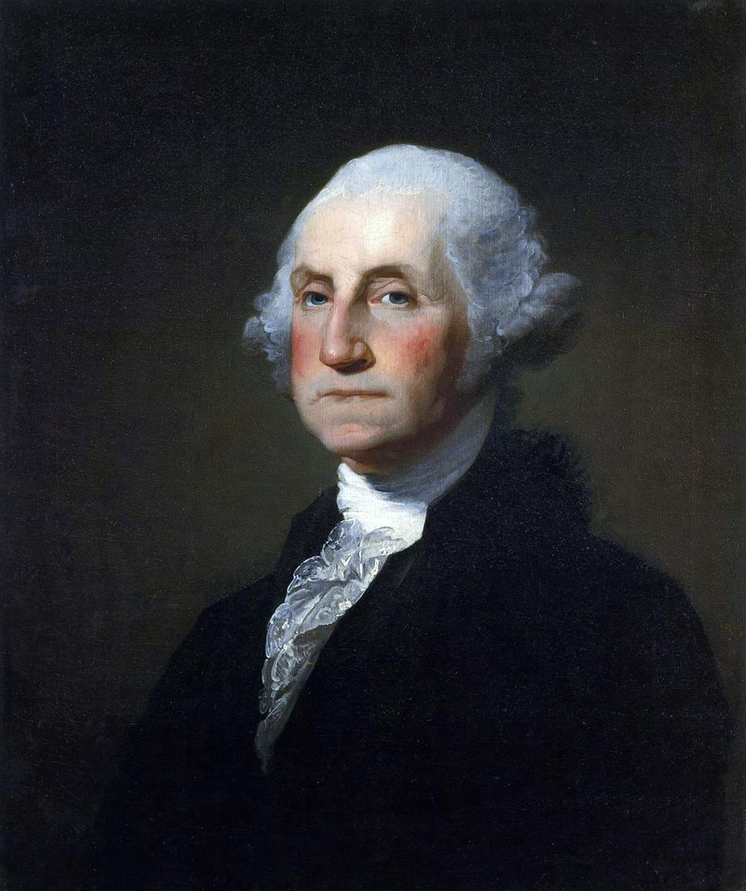
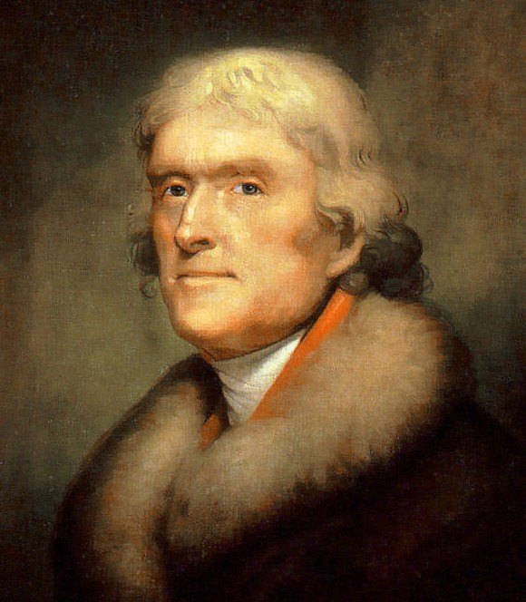

---

marp: true
theme: descartes
_class: lead
class: default
footer: Données climatiques : Acquisition, interprétation et manipulation
header: École d'été en sciences du climat
author: Trevor James Smith
paginate: true
backgroundColor: 
transition: fade
# backgroundImage: url('https://marp.app/assets/hero-background.svg')
size: 16:9
style: |
    footer {
      left: 5%;
      font-color: white;
      font-size: 20px;
    }
    header {
      right: 10%;
      left: 60%;
      text-align: right;
      font-size: 20px;
      text-shadow: 0px 0px 10px #fff;
    }
    img[alt~="center"] {
      display: block;
      margin: 0 auto;
    }
    .container{
      display: flex;
    }
    .col{
      flex: 1;
    }

---
<!-- _header: "" -->
<!-- _footer: "" -->
<!-- _paginate: skip -->

# <!-- fit --> Données Climatiques : Acquisition, Interprétation, et Manipulation

### Trevor James Smith

Avec remerciements à Blaise Gauvin St-Denis et l'équipe PCDO

- Plateformes climatiques, données et opérations, Ouranos
- École d’été en science du climat et des changements climatiques
- 30 mai 2024

---

# **Objectifs du cours**

* Connaissance de base de l’historique de la collecte de données climatiques, du fonctionnement des différents instruments et de leurs incertitudes.
* Vue d’ensemble des données disponibles pour faire des études climatiques.
* Connaissance des forces et faiblesses des différents types de jeux de données.
* Compréhension de la taille considérable de certaines des bases de données et des défis à les analyser.

---

<!-- _footer: "" -->

# Qui suis-je ?

Trevor James Smith

 [**github.com/Zeitsperre**](https://github.com/Zeitsperre)
 [**Zeit@techhub.social**](https://techhub.social/@zeit)

- Developpeur/packageur/mainteneur des logiciels de recherche scientifiques
- M.Sc. en Géographie, environnement et urbanisme
  - Sujet: Analyse des impacts des changements climatiques sur les vignobles en sud du Québec
- 10+ années d'expérience en utilisant Python, Linux, GIS, et autres téchnologies associées

---

# **Contenu du cours**

1. Historique des instruments d’observations météorologiques
2. Fonctionnement des instruments d’observations météorologiques
3. Données observées
4. Données de réanalyses
5. Données de modèles climatiques
6. Données dérivées
7. Formats habituels des données climatiques et outils d’analyses
8. Les services climatiques

---

# **1. Historique des instruments d'observations météorologiques.**

<!-- La NOAA «National Oceanic and Atmospheric Administration».
Célébration de ses 200 ans un petit historique sur la météorologie.
Centré sur les États-Unis mais quand même interessant. -->

---

<!-- Benjamin Franklin, connu pour son expérience du cerf-volant attaché à un fil conducteur pour démontrer que les éclairs c'est de l’électricité
en 1743, il avait noté le mouvement d'une tempête de Philadelphie à Boston et a remarqué que la direction du mouvement d'une tempête n'était pas nécessairement dans la direction des vents prédominants. 
Évoqué le lien entre un hiver très froid en Europe suite à une éruption du volcan Laki en Iceland. -->

# 1743

### Benjamin Franklin fait des observations des mouvements de tempêtes et patrons météorologiques.

---

<!-- _footer: "" -->

<!-- George Washington, qui a commencé à maintenir un journal d'observations météorologiques en 1767 jusqu'au dernier jour avant sa mort.
en lien avec ses intéresses pour la culture de tabac et de blé, et son rôle en temps que commandant durant la révolution américaine. -->

# 1767

## Georges Washington commence un journal d’observations météorologiques.

---

<!-- Et l'intérêt des grandes figures politiques américaine pour la météo se poursuit avec Thomas Jefferson qui faisaient aussi des observations météorologiques sur une base régulière. 
Deux observations par jour, à son levé, qu'il considérait comme étant la température minimum de la journée, et vers 3 ou 4h, qu'il considérait comme étant la température maximale. 
Il notait aussi l'arrivé d'oiseau ou la date de fleuraison des plantes. 
1776 : Thomas Jefferson recrutait des observateurs météo bénévoles à travers la Virginie. -->

# 1776

## Thomas Jefferson recrute des observateurs météo bénévoles en Virginie.

---

<!-- _paginate: false -->

<!-- 1800 : des bénévoles étaient présent dans 5 autres états : Massachusetts, Pennsylvanie, Connecticut, New York et La Caroline du Nord. -->

# 1800

## Le réseau de bénévoles s’étend dans 5 états.

- Massachusetts
- Pennsylvanie
- Connecticut
- New York
- Caroline du Nord

---

<!-- Thomas Jefferson a également commissionné l'expédition de Lewis et Clark, vers l'Ouest en 1804 et des observations météorologiques étaient faites sur une base régulière. -->

# 1803 / 1804

## L’expédition de Lewis et Clark vers l’ouest américain fait des observations météorologiques régulières

- [https://lewisandclarkjournals.unl.edu/item/lc.jrn.1803-08-30](https://lewisandclarkjournals.unl.edu/item/lc.jrn.1803-08-30)

---

<!-- _paginate: false -->

<!-- En 1814, le chirurgien en chef de l'armée américaine, James Tilton 
Noté l’importance des observations météorologiques pour les affaires du gouvernement
L'idée d'un réseau d'observation météorologique en utilisant plusieurs postes militaires à travers le pays -->

# 1814

## James Tilton ordonne les observations météorologiques dans les postes militaires.

---

<!-- Joseph Henry, premier secrétaire de l'institution Smithsonian, et plus connu pour ces découvertes par rapport à l'inductance des matériaux.
En 1848, il inaugurait un réseau télégraphique de 150 observateurs 150 bénévoles pour résoudre le problème des tempêtes américaine. -->

# 1848

## Joseph Henry inaugure un réseau télégraphique d’observateurs de 150 bénévoles.

---

<!-- _paginate: false -->

<!-- 1860 : 500 stations, opérés par des bénévoles, fournissaient des rapports télégraphiques journaliers. -->

# 1860

## 500 stations fournissent des rapports télégraphiques journaliers

---

<!-- En 1870, le président Ulysses S. Grant (GAUCHE) autorisait l'établissement d'un service météorologique national, le US Weather Bureau, qui deviendra plus tard la NOAA.

Brigadier général Albert J. Myer, du Signal Corps de l'armée, responsable pour infrastructures de communication américaine était premier en charge du US Weather Bureau. 

Les premières observations météo synchronisé ont eu lieu le 1er novembre 1870 à 7:35 du matin à 24 stations qui ont transmis à un site central à Washington.

3 ans plus tard à Vienne, l'idée d'avoir des échanges journaliers des observations météorologiques à travers le monde est lancé, ce qui marque aussi les début de la OMM (WMO : World Meteorological Organization). Rendu en 1891, le réseau d'observateurs météo bénévoles contenait plus de 2000 stations. -->

# 1870

## Ulysses S. Grant (**à gauche**) autorise un service météo national sous la direction de Albert J. Myer (**à droit**).

---

<!-- 1891 : le réseau d'observateurs météo bénévoles contenait plus de 2000 stations autour du pays. -->

# 1891

## Le réseau d'observateurs météo bénévoles contenait plus de 2000 stations autour du pays.

---

<!-- 1898 : le U.S. Weather Bureau commençait à expérimenter avec des cerf-volant pour mesurer la température, l'humidité relative et les vents en hauteur dans l'atmosphère. -->

# 1898

## Le U.S. Weather Bureau expérimente avec des cerf-volants.

---

<!-- _paginate: false -->

<!-- 1909 : l'utilisation de ballons pour obtenir ces information débutait. -->

# 1909

## Début de l’utilisation de ballons.

---

<!-- 1926 : le Weather Bureau a eu le mandat de fournir des services météorologiques à l'aviation civile.
 
Au même moment, des observations commençait à être prises à partir d'avions de l'armée américaine et du Weather Bureau. -->

# 1926

## L’aviation change le rôle du Weather Bureau qui doit fournir des services météorologiques à l’aviation civile.

---

<!-- 1931 : les vols d’avions pour prendre des observations à était possible jusqu’à une hauteur de 5Km et par 1934, 20 avions du Weather Bureau faisait des observations régulièrement -->

# 1931 à 1934

## Le Weather Bureau opère 20 avions d’observations météorologiques.

---

<!-- Cette pratique a était coûteuse et dangereuse pour les pilotes et alors a été remplacé par des radiosondes qui pourrait atteindre une hauteur au dessus de 16Km en 1939. -->

# 1939

## L’utilisation de radiosondes remplace les observations par avions.

---

<!-- Après WWII, les technologies de radar développé pour détecté les avions ennemies on été adapté aux observations météorologiques dans les années 1950.

La OMM à débutait comme direction des efforts internationaux pour la surveillance météorologique. -->

# 1950

## Les technologies radar développées durant la 2e guerre mondiale sont adaptées aux observations météorologiques.

---

<!-- -->

# 1960

## Les premiers satellites d’observations météorologiques sont lancés.

- TIROS-I (**à gauche**)
- TIROS-II (**à droit**)

---

<!-- Fonctionnement des différents instruments d'observations météo les plus utilisés, ainsi que les incertitudes ou potentiels problèmes associés à leur utilisation.

Je dois mentionner que ma formation est en géographie, alors je ne suis donc pas un expert en outils de mesure météorologique, mais si vous avez des questions spécifiques, n'hésitez pas à les poser tout de même. Je peux vous revenir si cela dépasse mes connaissances. -->

# **2. Fonctionnement des instruments d'observations météorologiques**

---

<!-- Les instruments d'une station météorologiques sont pour la plupart de type "in situ", c'est-à-dire en contact avec l’objet à mesurer.

Les stations peuvent être soit automatisé ou à observateur. Les stations à observateur requiert qu'une personne prenne des mesures deux fois par jours tout les jours de l'année. 

Québec, le MELCC maintient le document de référence pour les observateurs, et maintient un réseau de 329 stations, 241 avec observateurs et 88 automatiques.  -->

# Station d’observation météo

Observation **in situ** : observation obtenue par contact direct avec l’objet en question.

Stations à observateurs : un ou deux temps d’observations par jour.

Au Québec, les heures d’observations sont 8h et 18h heure normale de l’est.

Stations automatiques : observations possibles à toutes les heures.

---

<!-- _paginate: false -->

<!-- Des carnets des observateurs existent pour noter les observations. À l'époque, ces carnets étaient entré manuellement dans les systèmes par des techniciens, mais il existe maintenant des méthodes électroniques pour soumettre les observations.

Bien qu'une validation sommaire est faites sur les données soumises, il reste que des erreurs d'observations sont inévitable à long terme. Il faut aussi considérer que chaque instrument peut comporter un manque de précision ou se comporter de façon un peu différentes dans diverses conditions climatiques. -->

# Station d'observation météo

**source: MELCC**

---

<!-- Quelques détails sur les instruments de bases, le bon vieux thermomètre, qui est basé sur les propriété d'expansion en fonction de la température de certain liquides. 

Généralement au mercure, mais pour les température plus froide, il faut un thermomètre à l'alcool parce que le mercure gèle à -39 degrés Celsius. 

Pour des mesures automatiques, on peut utiliser une thermistance, qui est basé sur la variation de la résistance électrique d'un matériaux en fonction de la température. -->

# Thermomètre

La température minimum et maximum de l’air est mesurée à l’aide d’une combinaison d’un thermomètre à mercure et thermomètre à alcool.

Pour les stations automatiques, une thermistance est utilisée.

Au Québec, les mesures des observateurs se font à une précision d’un demi-degré Celsius

---

<!-- Pluviomètre : pas compliqué, l'observateur n'a simplement qu'a noté la quantité accumulé dans le cylindre depuis la dernière observation, puis le vider. -->

# Pluviomètre

---

<!-- _paginate: false -->

<!-- Pluviomètre à auget basculeur : Après une certaine quantité de pluie tombé, par exemple 0.1 mm, l'auget bascule et envoie un signal électrique. Donc le nombre de bascule multiplier par 0.1 mm donne la précipitation sur une période de temps donnée. 

Il est également possible d'avoir un système qui chauffe le cylindre qui permet également de mesurer l'équivalent en eau de la neige lors de précipitation solide. -->

# Pluviomètre cont.

---

<!-- Table a neige, pour mesurer la hauteur de neige tombé. Après un temps d'observation, la table est dégagé, replacé au niveau du sol ou du couvert de neige actuel. -->

# Table à neige

---

<!-- _paginate: false -->

<!-- Nivomètre à écran Nipher : pour mesurer la neige.
Cet instrument a une hauteur ajustable au fur et à mesure que le couvert de neige augmente, l'instrument est rehaussé. La forme de l'embouchure sert à limiter un peu la turbulence autour de l'instrument qui va affecté la quantité de neige accumulé dans l'appareil. Un observateur vient ensuite prendre le cylindre, fait fondre son contenu et mesure la quantité d'eau équivalente. -->

# Nivomètre à écran de Nipher

---

<!-- _header: "" -->
<!-- _footer: "" -->

<!-- Ici je vous montre des travaux de Julie Thériault, prof à l'UQAM, qui avait passé du temps à NCAR à Boulder au Colorado avec des instruments asser sophistiqué. Ce que vous voyez en bas à droite c'est le DFIR, Double Fence Intercomparison Reference qui est considéré comme ce qui se fait de mieux pour réduire la turbulence autour de l'appareil de collecte.

À gauche dans le graphique, vous avez l'efficacité de collecte entre le DFIR et un autre appareil, le single Alter, en fonction de la vitesse du vent, et du type de neige, mouillé ou sèche. On peut voir qu'à partir de vents de 2-3 m/s, les mesures d'appareils traditionnelle se dégrade rapidement pour aller jusqu'à 20% de la quantité de neige mesuré par le DFIR. Bref, c'est tout un casse-tête de mesurer la précipitation sous forme de neige. -->

<!-- # “Single alter” et DFIR -->

---

# « Sous Captation »

La **sous-captation** est un phénomène où le pluviomètre ou nivomètre sous-estime la quantité de précipitation tombée en période de grands vents ou lors de fortes tempêtes.

Au Québec, les mesures se font à une précision d’un dixième de millimètre.

---

<!-- Voici plusieurs photos courtoisie de Ross Brown et Barry Goodison d’Environnement Canada qui montre les nombreuses façons dont les nivomètres peuvent sous-capturer la neige. 

Le gel des plaques qui mesure le deplacements par poids, 
Une incapacité à faire fondre la neige assez rapidement. 

Les mesures peuvent mal se passer et elles le font assez souvent pour la neige. 

Cela souligne la nécessité de corriger les données, ce dont je parlerai à plus tard. -->

# « Sous Captation »

---

<!-- Jusqu'à présent, nous avons vu des moyens assez conventionnels d'observer les précipitations mais on peut s'imaginer des sites d'observations beaucoup plus sophistiquées qui sont en général des sites expérimentaux pour des projets de recherche spécifique. 

Ici, l'exemple d'une tour d'observation dans le BEREV, le bassin expérimental du ruisseau des eaux-volée dans la forêt Montmorency. C'est quelque chose qui est fait le cadre du projet EVAP piloté par François Anctil et Daniel Nadeau à l'université Laval. Ils s'intéresse à l'évapotranspiration qui est quelque chose de très peu mesurée, par la difficulté que sa représente. Et donc ils ont fait une tour de 10m au milieu de la forêt, entouré d'une peuplement d'arbre uniforme. Ils ont des instruments de mesures pour le rayonnement net, les flux de chaleurs latente et sensible, un scintillomètre qui mesure un profil d'évapotranspiration par méthode de covariance des tourbillons, des instruments dans les arbres pour mesurer l'écoulement de la sève, des capteurs de températures dans le sols, etc. -->

# Site expérimental - BEREV

---

<!-- _header: "" -->

<!-- Finalement, l'échelle à neige : vieille mais moins cher.

Permet de mesurer la hauteur de la neige au cours de l'hiver à un site précis. -->

# Échelle à neige

**source: MDDEFP**

---

<!-- Les stations et leurs instruments doivent répondre à une panoplie de critères afin d'uniformiser les observations à différents endroits. L’Organisation météorologique mondiale (OMM) est responsable de la publication du guide sur l'instrumentation météorologique et des méthodes d'observations. C'est un document de plus de 700 pages qui décrit la mise en place et les spécifications des instruments.

Par exemple, les thermomètres et hygromètres doivent être à l'intérieur d'un abri Stevenson pour les protéger de l'influence de la radiation solaire directe et des intempéries. La distance minimale à laquelle certains obstacles peuvent se trouver de la station est aussi décrite. -->

# *Standards* des stations d’observation météo

---

<!-- Il y a un station de météo automatique situé à Burnside Hall, à l'université McGill.

Il n'est pas dans la réseau du MELCC ou Environnement Canada mais prends des mesures à tous les 5 mins et les mettre en ligne. -->

# Stations d’observation météo

### [https://radar.mcgill.ca/imagery/weather-station.html](https://radar.mcgill.ca/imagery/weather-station.html)

---

<!-- Lancer des capteurs du sol vers l’atmosphère.

Radiosonde : outil de mesure atmosphérique généralement attaché à un ballon et capable de mesurer des éléments tels que la pression, l'humidité relative, la température, le vent et l'altitude, lors de sa navigation dans la troposphère et la stratosphère jusqu'à 30 km d'altitude.

Nous aide à comprendre les différences entre les zones atmosphériques, les cellules éoliennes, et sont lancées des centaines de fois par jour autour le monde. -->

# Radiosonde

La **radiosonde** est composée d’un ensemble d’instruments d’observations attachés à un ballon qui s’élève dans l’atmosphère.

Permet d’obtenir la distribution verticale de température, pression et humidité jusqu’à 30 km d’altitude.

Avec un équipement de localisation au sol, il est possible d’obtenir le profil vertical de vent.

---

<!-- Deux types : 

1. Lancés depuis le sol via un ballon, comme celle illustrée ici, s'appellent des rawinsondes (RADAR-WIND-SONDES)

2. Tombent ou « droppés » des avions vers le sol s'appellent des dropsondes. 

Légers - ne pesant que 250g.

Quand le ballon apparaît dans la haute atmosphère, déploie un parachute et retombe sur la terre. -->

# Radiosonde

---

<!-- Ici, on a une diagramme SkewT qui vient d’une radiosonde avec les isobares sur l'axe vertical et un paquet d'autres ligne, dont des isothermes, des adiabats, et les deux lignes en gras qui indique la température de l'air et la température du point de rosé à gauche. Les endroits ou les deux lignes se touchent se sont les niveaux dans l'atmosphère ou l'air est saturé en vapeur d'eau et ou on s'attend à avoir de la condensation.

À droite on a également les vents avec l'altitude, donc du nord à la surface et des vents de l'ouest en hauteur. Les météorologues utilisent ce genre de graphique pour dérivé une panoplie de variables secondaires comme le CAPE, l'énergie potentielle de convection disponible ou « Convective Available Potential Energy ». -->

# Radiosonde

---

<!-- _paginate: false -->

<!-- Télédétection : comme le radar et les satellites.

La production de nouvelles informations à partir de données observées à distance. 

Spectroscopie mais à grande échelle: l’identification des substances chimiques par les changements au radiation, réfléchi or émis.

L’interprétation par bande : pour les satellites, est utilisé pour identifier la végétation et d'autres types de couverture terrestre. Ça pourrait aussi être utilisé pour voir la concentration et distribution des espèces chimiques. Je vais revenir à ça.

Avant de continuer, je tiens à mentionner que même avec une formation en géographie, je suis pas une expert en télédétection.

Mais, ca se peut qu’on à des experts dans la salle.  -->

# Télédétection

- Différence entre les bandes spectrales ou l’intensité ou fréquence des signales
- Utile pour identifier la couverture des sols, la distribution spatiale des émissions ou d’espèces atmosphériques
- Essentielle pour générer des topographiques spatiales
- **Source : NASA Climate Science Investigations (https://www.ces.fau.edu)**

---

<!-- Radar : Télédétection in situ.

l’idée autour de radar c’est d’émettre des micro-ondes et d’utiliser les changements au signale récupéré pour savoir la nature des objets à distance.

L'effet Doppler : Déterminer si les particules sont en mouvement et donc d'inférer de l'information sur les vents auquel sont soumis les particules de précipitation

La polarisation : c'est-à-dire choisir l'axe dans lequel l'onde oscille pour obtenir de l'information sur la forme des particules. -->

# Radar

Observation de télédétection **in situ** : observation obtenue sans contact avec l’objet en question.

Trois (3) composantes majeures : 
- un émetteur d’ondes radioélectriques,
- une antenne, 
- et un receveur d’onde.

Portée d’environ 200 km autour du radar.

---

<!-- _paginate: false -->

<!-- Ici on a une photo du radar de l’observatoire du J.S. Marshall gérer par l'université McGill sur le campus à Saint-Anne de Bellevue dans l'ouest de l’île de Montréal qui fait partie du réseau d'observation radar d'environnement Canada. C'est d'une hauteur d'environ 5 étages dans un endroit bien dégagé histoire de ne pas être obstrué par des structures avoisinantes. À l'intérieur du dôme, on retrouve le radar en tant que telle. 

À McGill l'antenne est de 9m à l'intérieur de la coupole. Et donc le radar tourne continuellement, à plusieurs rotations par minute et après chaque rotation, l'angle vertical est augmenté afin de faire un image en 3D de l'atmosphère. Ce cycle de rotation horizontal et de changement d'angle vertical prend environ 5 à 10 minutes, puis recommence. -->

# Radar

**Source: Université McGill**

---

<!-- L'émetteur d'onde va émettre des pulses micro-onde sur des échelles de microsecondes avec des longueurs d'ondes de 1-10 cm, ce qui est environ 10x la taille des gouttes de précipitations et donc lorsque ces ondes rencontres de la précipitation dans l’atmosphère, il y a un phénomène de diffusion de Rayleigh par lequel les ondes sont redirigés dans plusieurs direction, dont certaines de retour vers le radar.

Après le pulse envoyé, le radar passe en mode écoute pendant environ une milliseconde et à ce moment là, si un signal de retour est enregistré, il est possible de calculer sa distance en multipliant le temps écoulé par la vitesse de la lumière dans l'air et en divisant par 2 pour tenir compte de l'aller-retour de l'onde.

On mesure aussi l'intensité du signal de retour par une mesure qu'on appelle la réflectivité en décibel. En fait, de nos jours la technologie est encore bien plus complexe. -->

# Radar

**Source: NOAA**

---

<!-- La puissance reçu peut être relié au facteur de réflectivité d'un volume de particule.

Ce facteur de réflectivité est à son tour dépendent de la distribution de la taille des gouttes.

Dans sa version la plus simple, la relation entre facteur de réflectivité et précipitation est donné par la relation Z-R. Z=200R^1.6 pour la pluie et Z=2000R^2 pour la neige, où Z est en mm^6/m^3 et R en mm/h. -->

# Relation Z-R

La puissance reçue est reliée au facteur de réflectivité d’un volume de particules.

Le facteur de réflectivité est dépendant de la distribution de la taille des gouttes.

Dans sa version la plus simple, la relation entre facteur de réflectivité et précipitation est donnée par la relation **Z-R**.

*Z = 200R^1.6 pour la pluie (Z en mm^6/mm^3, R en mm/h)*

*Z = 200R^2 pour la neige*

---

<!-- Réseau d’observation radar : Nécessaire pour la cartographie des systèmes de météo.

Environnement Canada : le réseau canadien d'observation radar. Comme vous pouvez le constater, la couverture spatiale se limite au sud du pays. -->

# Radars canadiens
