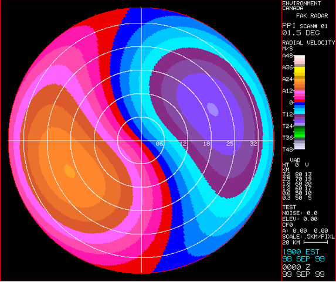
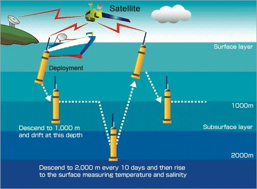
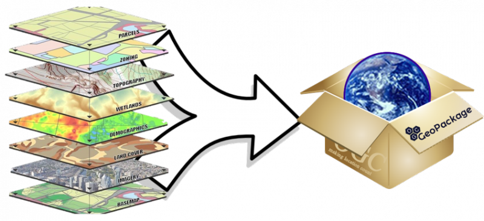

---

marp: true
theme: descartes
_class: lead
class: default
footer: Données climatiques : Acquisition, interprétation et manipulation
header: École d'été en sciences du climat 2024
author: Trevor James Smith
paginate: true
backgroundColor: 
transition: fade
# backgroundImage: url('https://marp.app/assets/hero-background.svg')
size: 16:9
style: |
  footer {
    left: 5%;
    right: 2.5%;
    font-color: white;
    font-size: 20px;
  }
  header {
    right: 5%;
    left: 30%;
    text-align: right;
    font-size: 20px;
  }
  img[alt~="center"] {
    display: block;
    margin: 0 auto;
  }
  .container{
    display: flex;
  }
  .column{
    flex: 1;
  }

---

<!-- _header: "" -->
<!-- _footer: "" -->
<!-- _paginate: skip -->

<!-- Bonjour!

On va aborder le sujet des données climatiques, donc comment on procède pour les acquérir, comment on les interprètes et aussi comment on peut les manipuler avec divers logiciels. -->

---

<!-- _footer: "**Crédit : [NASA Earth Observatory](https://earthobservatory.nasa.gov/)**" -->

<!-- Les objectifs du cours sont les suivants : [...] donc ici on va plus parler du travail qui est fait par les services météorologiques nationaux pour prendre des mesures. 

Ensuite [...] où là on va parler des données qui sont diffusées au public et donc que des organismes comme Ouranos ou des étudiants comme vous peuvent utiliser. 

Ensuite, comme vous allez le voir, il y a vraiment une quantité d'information faramineuse pour ce qui est de l'observation de la terre et de notre atmosphère et il n'y a pas le jeu de données parfaits qui répond à toute les questions donc il faut comprendre les [...], et aussi je souhaite vous donner une appréciation de la [...]. 

Photo : Cyclone extratropical au-dessus de la baie d'Hudson, Canada, août 2016
-->

# **Objectifs du cours**

- Connaissance de base de l’historique de la collecte de données climatiques, du fonctionnement des différents instruments et de leurs incertitudes.
- Vue d’ensemble des données disponibles pour faire des études climatiques.
- Connaissance des forces et faiblesses des différents types de jeux de données.
- Compréhension de la taille considérable de certaines des bases de données et des défis à les analyser.

---

<!-- _footer: "" -->

<!-- Alors bonjour, je m'appelle Trevor... --->

## **Qui suis-je ?**

### Trevor James Smith 

####  [github.com/Zeitsperre](https://github.com/Zeitsperre)

- Developpeur/packageur/mainteneur des logiciels de recherche scientifiques
- M.Sc. en Géographie, environnement et urbanisme de l'Université Concordia
  - Impacts des changements climatiques sur les vignobles en sud du Québec
- 10+ années d'expérience en utilisant Python, Linux, GIS, et autres téchnologies associées

---

<!-- _header: "" -->
<!-- _footer: "**Crédit : [Musées numériques Canada](https://www.communitystories.ca/v2/grand-verglas-saint-jean-sur-richelieu_ice-storm/)**" -->

<!-- Comme mes colleagues ont mentionné, mon employeur, Ouranos, est une organisation à but non lucratif basée à Montréal qui travaille avec les gouvernements canadien et québécois sur l'adaptation au changement climatique.

Nous avons été créés en réponse à une tempête extrême qui a laissé 1.5 million de personnes sans électricité pendant des semaines et avait  causé des dommages d'environ de 5.5 milliards de dollars. Notre rôle est de mettre en relation les gouvernements, l'industrie et les universités avec de nombreux types d'informations sur le climat afin que des événements comme ceux-là aient moins d'impact.

Depuis environ 8 ans, nous nous sommes orientés vers le développement de logiciels ouverts et de plateformes de recherche. Mon équipe en particulier est quand même petit, mais nous collaborons beaucoup à l'internationale. -->

### **C'est quoi [Ouranos](https://www.ouranos.ca/en) ?**

- Organisation à but non-lucratif, établi 2002 à Montréal, Québec
  - Crée en réponse à la [tempête de verglas massif de janvier 1998](https://fr.wikipedia.org/wiki/Verglas_massif_de_janvier_1998_dans_le_Nord-Est_de_l%27Am%C3%A9rique_du_Nord)
- Plans d'adaptations aux changements climatiques
- Source/producteur des données des modèles climatiques
- **Sevices d'informations climatiques**

---

<!-- Ce cours est séparé en huit (8) sections : [...] -->

# **Contenu du cours**

1. Historique des instruments d’observations météorologiques
2. Fonctionnement des instruments d’observations météorologiques
3. Données observées
4. Données de réanalyses et de prévisions
5. Données de modèles climatiques
6. Données dérivées
7. Formats habituels des données climatiques et outils d’analyses
8. Les plateformes et services climatiques 

---

<!-- La NOAA « National Oceanic and Atmospheric Administration ».
Célébration de ses 200 ans un petit historique sur la météorologie.
Centré sur les États-Unis mais quand même interessant. -->

# **1. Historique des instruments d'observations météorologiques.**

Pour en savoir plus : 
 - **Rétrospective de NOAA : (https://vlab.noaa.gov/web/nws-heritage)**

---

<!-- _paginate: false -->

<!-- Benjamin Franklin, connu pour son expérience du cerf-volant attaché à un fil conducteur pour démontrer que les éclairs c'est de l’électricité en 1743, il avait noté le mouvement d'une tempête de Philadelphie à Boston et a remarqué que la direction du mouvement d'une tempête n'était pas nécessairement dans la direction des vents prédominants.

Évoqué le lien entre un hiver très froid en Europe suite à une éruption du volcan Laki en Iceland. -->

## 1743

### Benjamin Franklin fait des observations des mouvements de tempêtes et patrons météorologiques.

---

<!-- _paginate: false -->

<!-- George Washington, qui a commencé à maintenir un journal d'observations météorologiques en 1767 jusqu'au dernier jour avant sa mort.

En lien avec ses intéresses pour la culture de tabac et de blé, et son rôle en temps que commandant durant la révolution américaine. -->

## 1767

### Georges Washington commence un journal d’observations météorologiques.

---

<!-- _paginate: false -->

<!-- Et l'intérêt des grandes figures politiques américaine pour la météo se poursuit avec Thomas Jefferson qui faisaient aussi des observations météorologiques sur une base régulière. 

Deux observations par jour, à son levé, qu'il considérait comme étant la température minimum de la journée, et vers 3h ou 4h, qu'il considérait comme étant la température maximale. 

Il notait aussi l'arrivé d'oiseau ou la date de fleuraison des plantes.

1776 : Thomas Jefferson recrutait des observateurs météo bénévoles à travers la Virginie. 

1800 : des bénévoles étaient présent dans 5 autres états : Massachusetts, Pennsylvanie, Connecticut, New York et La Caroline du Nord. -->

## 1776 à 1800

### Thomas Jefferson recrute des observateurs météo bénévoles en Virginie.

### Le réseau de bénévoles s’étend dans 5 états :
- Massachusetts, Pennsylvanie, Connecticut, New York, Caroline du Nord

---

<!-- _paginate: false -->

<!-- 1803 : Thomas Jefferson a également commissionné l'expédition de Lewis et Clark, vers l'Ouest en 1804 et des observations météorologiques étaient faites sur une base régulière. -->

## 1803 / 1804

### L’expédition de Lewis et Clark vers l’ouest américain fait des observations météorologiques régulières

- [https://lewisandclarkjournals.unl.edu/item/lc.jrn.1803-08-30](https://lewisandclarkjournals.unl.edu/item/lc.jrn.1803-08-30)

---

<!-- _paginate: false -->

<!-- En 1814, le chirurgien en chef de l'armée américaine, James Tilton 

Noté l’importance des observations météorologiques pour les affaires du gouvernement

L'idée d'un réseau d'observation météorologique en utilisant plusieurs postes militaires à travers le pays -->

## 1814

### James Tilton ordonne les observations météorologiques dans les postes militaires.

---

<!-- _paginate: false -->

<!-- Joseph Henry, premier secrétaire de l'institution Smithsonian, et plus connu pour ces découvertes par rapport à l'inductance des matériaux.

1848 : il inaugurait un réseau télégraphique de 150 observateurs 150 bénévoles pour résoudre le problème des tempêtes américaine. 

1860 : 500 stations, opérés par des bénévoles, fournissaient des rapports télégraphiques journaliers. -->

## 1848 à 1860

### Joseph Henry inaugure un réseau télégraphique d’observateurs de 150 bénévoles.

### 500 stations fournissent des rapports télégraphiques journaliers

---

<!-- _paginate: false -->

<!-- 1870 : le président Ulysses S. Grant (GAUCHE) autorisait l'établissement d'un service météorologique national, le US Weather Bureau, qui deviendra plus tard la NOAA.

Brigadier général Albert J. Myer, du Signal Corps de l'armée, responsable pour infrastructures de communication américaine était premier en charge du US Weather Bureau. 

Les premières observations météo synchronisé ont eu lieu le 1er novembre 1870 à 7h35 du matin à 24 stations qui ont transmis à un site central à Washington.

3 ans plus tard à Vienne, l'idée d'avoir des échanges journaliers des observations météorologiques à travers le monde est lancé, ce qui marque aussi les début de la OMM (WMO : World Meteorological Organization). Rendu en 1891, le réseau d'observateurs météo bénévoles contenait plus de 2000 stations. -->

## 1870

### Ulysses S. Grant (**à gauche**) autorise un service météo national sous la direction de Albert J. Myer (**à droit**).

---

<!-- _paginate: false -->

<!-- 1891 : le réseau d'observateurs météo bénévoles contenait plus de 2000 stations autour du pays. -->

## 1891

### Le réseau d'observateurs météo bénévoles contenait plus de 2000 stations autour du pays.

---

<!-- _paginate: false -->

<!-- 1898 : le U.S. Weather Bureau commençait à expérimenter avec des cerf-volant pour mesurer la température, l'humidité relative et les vents en hauteur dans l'atmosphère. -->

## 1898

### Le U.S. Weather Bureau expérimente avec des cerf-volants.

---

<!-- _paginate: false -->

<!-- 1909 : l'utilisation de ballons pour obtenir ces information débutait. -->

## 1909

### Début de l’utilisation de ballons.

---

<!-- _paginate: false -->

<!-- 1926 : le Weather Bureau a eu le mandat de fournir des services météorologiques à l'aviation civile.
 
Au même moment, des observations commençait à être prises à partir d'avions de l'armée américaine et du Weather Bureau. 

1931 : les vols d’avions pour prendre des observations à était possible jusqu’à une hauteur de 5Km.

1934 : 20 avions du Weather Bureau faisait des observations régulièrement.-->

## 1926 à 1934

### L’aviation change le rôle du Weather Bureau qui doit fournir des services météorologiques à l’aviation civile.

---

<!-- _paginate: false -->

<!-- 1939 : cette pratique a était coûteuse et dangereuse pour les pilotes et alors a été remplacé par des radiosondes qui pourrait atteindre une hauteur au dessus de 16Km. -->

## 1939

### L’utilisation de radiosondes remplace les observations par avions.

---

<!-- _paginate: false -->

<!-- 1950 : après WWII, les technologies de radar développé pour détecté les avions ennemies on été adapté aux observations météorologiques.

En même temps la OMM à débutait comme direction des efforts internationaux pour la surveillance météorologique. -->

## 1950

### Les technologies radar développées durant la 2e guerre mondiale sont adaptées aux observations météorologiques.

---

<!-- _footer: "**Photos : NASA**" -->
<!-- _paginate: false -->

<!-- 1960 : les premiers satellites d'observations météo (TIROS-1 et TIROS-2) ont étaient lancé.

Et donc, la combinaison de ces technologies, et de plusieurs autres que je présenterais plus tard, forme aujourd'hui l'ensemble des outils à notre disposition pour observer l'atmosphère et l'océan. -->

## 1960

### Les premiers satellites d’observations météorologiques sont lancés.

- TIROS-I (**à gauche**)
- TIROS-II (**à droit**)

---

<!-- On passe maintenant à la fonctionnement des différents instruments d'observations météo les plus utilisés, ainsi que les incertitudes ou potentiels problèmes associés à leur utilisation.

Je dois mentionner que ma formation est en géographie, alors je ne suis donc pas un expert en outils de mesure météorologique, mais si vous avez des questions spécifiques, n'hésitez pas à les poser tout de même. Je peux vous revenir si cela dépasse mes connaissances. -->

# **2. Fonctionnement des instruments d'observations météorologiques**

---

<!-- _footer: "**Source : CRAAQ**" -->

<!-- L'objectif ici est relativement simple. On cherche à obtenir un maximum d'information sur l'état local de l'atmosphère près de la surface. 

Donc de GAUCHE à DROITE, on peut voir ici un pluviomètre a pesée pour mesurer la quantité de précipitation tombée, un pyranomètre pour mesurer le flux thermique d'énergie solaire incidente à la surface, un abri météorologique qui contient des thermomètres et une thermistance, une deuxième pluviomètre à auget et un anémomètre à une hauteur de 10m pour la vitesse du vent. D'autres instruments courants qui se sont pas présent sur cette figure sont l'hygromètre pour mesurer l'humidité, et le baromètre pour mesurer la pression atmosphérique. 

Pour les stations plus avancées, principalement dans les aéroport, on peut aussi trouver des capteurs de gouttelettes pour mesurer la distribution de la taille des gouttelettes, un transmissiomètre pour la visibilité et un célomètre pour la hauteur des nuages, une girouette automatique ou un capteur de vent ultrasons pour la direction du vent. -->

## Station d'observation météo

---

<!-- Les instruments d'une station météorologiques sont pour la plupart de type "in situ", c'est-à-dire en contact avec l’objet à mesurer.

Les stations peuvent être soit automatisé ou à observateur. Les stations à observateur requiert qu'une personne prenne des mesures deux fois par jours tout les jours de l'année. 

Québec, le MELCCFP maintient le document de référence pour les observateurs, et maintient un réseau de 329 stations, 241 avec observateurs et 88 automatiques.  -->

## Station d’observation météo

Observation « **in situ** »
  - Observation obtenue par contact direct avec l’objet en question.

Stations à observateurs : un ou deux temps d’observations par jour.

Au Québec, les heures d’observations sont 8h et 18h heure normale de l’est.

Stations automatiques : observations possibles à toutes les heures.

---

<!-- _footer: "**source: MELCC**" -->

<!-- Des carnets des observateurs existent pour noter les observations. À l'époque, ces carnets étaient entré manuellement dans les systèmes par des techniciens, mais il existe maintenant des méthodes électroniques pour soumettre les observations.

Bien qu'une validation sommaire est faites sur les données soumises, il reste que des erreurs d'observations sont inévitable à long terme. Il faut aussi considérer que chaque instrument peut comporter un manque de précision ou se comporter de façon un peu différentes dans diverses conditions climatiques. -->

## Outils de station d'observation météo

---

<!-- Quelques détails sur les instruments de bases, le bon vieux thermomètre, qui est basé sur les propriété d'expansion en fonction de la température de certain liquides. 

Généralement au mercure, mais pour les température plus froide, il faut un thermomètre à l'alcool parce que le mercure gèle à -39 degrés Celsius. 

Pour des mesures automatiques, on peut utiliser une thermistance, qui est basé sur la variation de la résistance électrique d'un matériaux en fonction de la température. -->

## Thermomètre

La température minimum et maximum de l’air est mesurée à l’aide d’une combinaison d’un thermomètre à mercure et thermomètre à alcool.

Pour les stations automatiques, une thermistance est utilisée.

Au Québec, les mesures des observateurs se font à une précision d’un demi-degré Celsius

---

<!-- Pluviomètre : pas compliqué, l'observateur n'a simplement qu'a noté la quantité accumulé dans le cylindre depuis la dernière observation, puis le vider. -->

## Pluviomètre

---

<!-- Pluviomètre à auget basculeur : Après une certaine quantité de pluie tombé, par exemple 0.1 mm, l'auget bascule et envoie un signal électrique. Donc le nombre de bascule multiplier par 0.1 mm donne la précipitation sur une période de temps donnée. 

Il est également possible d'avoir un système qui chauffe le cylindre qui permet également de mesurer l'équivalent en eau de la neige lors de précipitation solide. -->

## Pluviomètre

---

<!-- _paginate : false -->

<!-- Table a neige, pour mesurer la hauteur de neige tombé. Après un temps d'observation, la table est dégagé, replacé au niveau du sol ou du couvert de neige actuel. -->

## Table à neige

---

<!-- _paginate: false -->

<!-- Nivomètre à écran Nipher : pour mesurer la neige.

Cet instrument a une hauteur ajustable au fur et à mesure que le couvert de neige augmente, l'instrument est rehaussé. La forme de l'embouchure sert à limiter un peu la turbulence autour de l'instrument qui va affecté la quantité de neige accumulé dans l'appareil.

Un observateur vient ensuite prendre le cylindre, fait fondre son contenu et mesure la quantité d'eau équivalente. 

Vous pouvez probablement constater que la précision de ces mesures dépend fortement de la vitesse du vent et de la turbulence. -->

## <!-- fit --> Nivomètre à écran de « Nipher »

---

<!-- _footer: "**Source : Landolt and Rasmussen (2007) Three-dimensional airflow analysis inside snow gauge shielding to determine snow gauge collection efficiencies**" -->

<!-- Ce que vous voyez à GAUCHE c'est le « Single Alter » et à DROITE c'est le DFIR, ou « Double Fence Intercomparison Reference ». Ces deux instruments essaie de diminuer l'effet de turbulence et vitesse du vent, mais le DFIR est considéré comme ce qui se fait de mieux pour réduire ces phénomènes autour de l'appareil de collecte.

Quand même, à partir des vents de 2-3 m/s, les mesures d'appareils traditionnelle se dégrade rapidement pour aller jusqu'à 20% de la quantité de neige mesuré par le DFIR. 

C'est tout un casse-tête de mesurer la précipitation sous forme de neige. -->

## « Single Alter » et « DFIR »

---

<!-- Le mot pour cet effet sur les mesurements s'appelle ;a « Sous-captation » et ça se présente en particulierement pour la mesure de la précipitation sous forme de neige. -->

## « Sous-captation »

La **sous-captation** est un phénomène où le pluviomètre ou nivomètre sous-estime la quantité de précipitation tombée en période de grands vents ou lors de fortes tempêtes.

Au Québec, les mesures se font à une précision d’un dixième de millimètre.

---

<!-- _footer: "**Photos : Ross Brown et Barry Goodison**" -->

<!-- Voici plusieurs photos courtoisie de Ross Brown et Barry Goodison d’Environnement Canada qui montre les nombreuses façons dont les nivomètres peuvent sous-capturer la neige. 

Les plaques qui mesure le deplacements par poids peuvent se geler.

Une incapacité à faire fondre la neige assez rapidement. 

Les mesures peuvent mal se passer et elles le font assez souvent pour la neige. 

Cela souligne la nécessité de corriger les données, ce dont je parlerai à plus tard. -->

## « Sous-captation »

---

<!-- _footer: "**Source : Bassin expérimental du ruisseau des Eaux-Volées (BEREV) de la Forêt Montmorency ([lien](https://www.cef-cfr.ca/pmwiki.php?n=Membres.SylvainJutrasBEREV))**" -->

<!-- Jusqu'à présent, nous avons vu des moyens assez conventionnels d'observer les précipitations mais on peut s'imaginer des sites d'observations beaucoup plus sophistiquées qui sont en général des sites expérimentaux pour des projets de recherche spécifique. 

Ici, l'exemple d'une tour d'observation dans le BEREV, le bassin expérimental du ruisseau des eaux-volée dans la forêt Montmorency. C'est quelque chose qui est fait le cadre du projet EVAP piloté par François Anctil et Daniel Nadeau à l'université Laval. Ils s'intéresse à l'évapotranspiration qui est quelque chose de très peu mesurée, par la difficulté que sa représente. Et donc ils ont fait une tour de 10m au milieu de la forêt, entouré d'une peuplement d'arbre uniforme. Ils ont des instruments de mesures pour le rayonnement net, les flux de chaleurs latente et sensible, un scintillomètre qui mesure un profil d'évapotranspiration par méthode de covariance des tourbillons, des instruments dans les arbres pour mesurer l'écoulement de la sève, des capteurs de températures dans le sols, etc. -->

## Site expérimental « **BEREV** »

---

<!-- _footer: "**source : MDDEFP**" -->

<!-- Finalement, l'échelle à neige : vieille mais moins cher.

Permet de mesurer la hauteur de la neige au cours de l'hiver à un site précis. -->

## Échelle à neige

---

<!-- _footer: "**Sources : OMM, MELCCFP, NOAA**" -->

<!-- Les stations et leurs instruments doivent répondre à une panoplie de critères afin d'uniformiser les observations à différents endroits. L’Organisation météorologique mondiale (OMM) est responsable de la publication du guide sur l'instrumentation météorologique et des méthodes d'observations. C'est un document de plus de 700 pages qui décrit la mise en place et les spécifications des instruments.

Par exemple, les thermomètres et hygromètres doivent être à l'intérieur d'un abri Stevenson pour les protéger de l'influence de la radiation solaire directe et des intempéries. La distance minimale à laquelle certains obstacles peuvent se trouver de la station est aussi décrite. -->

## **Standards** des stations d’observation météo

---

<!-- _footer: "**Photo : UQAM**\n**Source : Station de météo UQAM (https://eos.meteo.mcgill.ca/stations/4/live-data)**" -->

<!-- Il y a un station de météo automatique situé à UQAM (et aussi à McGill, mais il marche pas au moment).

Ces stations ne sont pas dans la réseau du MELCC ou Environnement Canada mais prends des mesures en direct et les mettre en ligne. -->

## Stations d’observation météo *indépendants*

---

<!-- Lancer des capteurs du sol vers l’atmosphère.

Radiosonde : outil de mesure atmosphérique généralement attaché à un ballon et capable de mesurer des éléments tels que la pression, l'humidité relative, la température, le vent et l'altitude, lors de sa navigation dans la troposphère et la stratosphère jusqu'à 30 km d'altitude.

Nous aide à comprendre les différences entre les zones atmosphériques, les cellules éoliennes, et sont lancées des centaines de fois par jour autour le monde.

Christopher peut-être avait parler un peu de ces choses l’autre jour. -->

## Radiosonde

La **radiosonde** est composée d’un ensemble d’instruments d’observations attachés à un ballon qui s’élève dans l’atmosphère.

Permet d’obtenir la distribution verticale de température, pression et humidité jusqu’à *30 Km d’altitude*.

Avec un équipement de localisation au sol, il est possible d’obtenir le profil vertical de vent.

---

<!-- Deux types : 

1. Lancés depuis le sol via un ballon, comme celle illustrée ici, s'appellent des rawinsondes (RADAR-WIND-SONDES)

2. Tombent ou « droppés » des avions vers le sol s'appellent des dropsondes. 

Légers - ne pesant que 250g.

Quand le ballon apparaît dans la haute atmosphère, déploie un parachute et retombe sur la terre. -->

## Radiosonde

---

<!-- Ici, on a une diagramme SkewT qui vient d’une radiosonde avec les isobares sur l'axe vertical et un paquet d'autres ligne, dont des isothermes, des adiabats, et les deux lignes en gras qui indique la température de l'air et la température du point de rosé à GAUCHE. Les endroits ou les deux lignes se touchent se sont les niveaux dans l'atmosphère ou l'air est saturé en vapeur d'eau et ou on s'attend à avoir de la condensation.

À DROITE on a également les vents avec l'altitude, donc du nord à la surface et des vents de l'ouest en hauteur. Les météorologues utilisent ce genre de graphique pour dérivé une panoplie de variables secondaires comme le CAPE, l'énergie potentielle de convection disponible ou « Convective Available Potential Energy ». -->

## Données de radiosonde

---

<!-- _footer: "**Source : NASA Climate Science Investigations (https://www.ces.fau.edu)**" -->
<!-- _paginate: false -->

<!-- Télédétection : comme le radar et les satellites.

La production de nouvelles informations à partir de données observées à distance. 

Spectroscopie mais à grande échelle: l’identification des substances chimiques par les changements au radiation, réfléchi or émis.

L’interprétation par bande : pour les satellites, est utilisé pour identifier la végétation et d'autres types de couverture terrestre. Ça pourrait aussi être utilisé pour voir la concentration et distribution des espèces chimiques. Je vais revenir à ça.

Avant de continuer, je tiens à mentionner que même avec une formation en géographie, je suis pas une expert en télédétection.

Mais, ca se peut qu’on à des experts dans la salle.  -->

## Télédétection

- Différence entre les bandes spectrales ou l’intensité ou fréquence des signales
- Utile pour identifier la couverture des sols, la distribution spatiale des émissions ou d’espèces atmosphériques
- Essentielle pour générer des topographiques spatiales

---

<!-- _footer: "**Source : Service météorologique du Canada (ECCC)**" -->

<!-- Radar : Télédétection in situ.

l’idée autour de radar c’est d’émettre des micro-ondes et d’utiliser les changements au signale récupéré pour savoir la nature des objets à distance.

L'effet Doppler : Déterminer si les particules sont en mouvement et donc d'inférer de l'information sur les vents auquel sont soumis les particules de précipitation

La polarisation : c'est-à-dire choisir l'axe dans lequel l'onde oscille pour obtenir de l'information sur la forme des particules. -->

## Radar - Observation de télédétection **in situ**

Obtenue sans contact avec l’objet en question
- Portée d’environ **200 Km** autour de l'installation

Trois composantes majeures : 
- **un émetteur d’ondes radioélectriques**,
- **une antenne**, et 
- **un receveur d’onde**

---

<!-- _header: "" -->
<!-- _footer: "**Photo : Université McGill**" -->

<!-- Ici on a une photo du radar de l’observatoire du J.S. Marshall gérer par l'université McGill sur le campus à Saint-Anne de Bellevue dans l'ouest de l’île de Montréal qui fait partie du réseau d'observation radar d'environnement Canada. C'est d'une hauteur d'environ 5 étages dans un endroit bien dégagé histoire de ne pas être obstrué par des structures avoisinantes. À l'intérieur du dôme, on retrouve le radar en tant que telle. 

À McGill l'antenne est de 9m à l'intérieur de la coupole. Et donc le radar tourne continuellement, à plusieurs rotations par minute et après chaque rotation, l'angle vertical est augmenté afin de faire un image en 3D de l'atmosphère. Ce cycle de rotation horizontal et de changement d'angle vertical prend environ 5 à 10 minutes, puis recommence. -->

## Installations de radar

- Photo : **Observatoire de J.S. Marshall, Sainte-Anne-de-Bellevue, Québec**
- Pour en savoir plus:
  - [Limite de visibilité du radar de l'université McGill](https://www.canada.ca/en/environment-climate-change/services/weather-general-tools-resources/radar-overview/mcgill-visibility-map.html)

---

<!-- _footer: "**Photo : NOAA**" -->

<!-- L'émetteur d'onde va émettre des pulses micro-onde sur des échelles de microsecondes avec des longueurs d'ondes de 1-10 cm, ce qui est environ 10x la taille des gouttes de précipitations et donc lorsque ces ondes rencontres de la précipitation dans l’atmosphère, il y a un phénomène de diffusion de Rayleigh par lequel les ondes sont redirigés dans plusieurs direction, dont certaines de retour vers le radar.

Après le pulse envoyé, le radar passe en mode écoute pendant environ une milliseconde et à ce moment là, si un signal de retour est enregistré, il est possible de calculer sa distance en multipliant le temps écoulé par la vitesse de la lumière dans l'air et en divisant par 2 pour tenir compte de l'aller-retour de l'onde.

On mesure aussi l'intensité du signal de retour par une mesure qu'on appelle la réflectivité en décibel. En fait, de nos jours la technologie est encore bien plus complexe. -->

## Installations de radar

---

<!-- La puissance reçu peut être relié au facteur de réflectivité d'un volume de particule.

Ce facteur de réflectivité est à son tour dépendent de la distribution de la taille des gouttes.

Dans sa version la plus simple, la relation entre facteur de réflectivité et précipitation est donné par la relation Z-R. Z=200R^1.6 pour la pluie et Z=2000R^2 pour la neige, où Z est en mm^6/m^3 et R en mm/h. -->

## Relation Z-R

La puissance reçue est reliée au facteur de réflectivité d’un volume de particules.

Le facteur de réflectivité est dépendant de la distribution de la taille des gouttes.

Dans sa version la plus simple, la relation entre facteur de réflectivité et précipitation est donnée par la relation **Z-R**.

- *Z = 200R^1.6 pour la pluie (Z en mm^6/mm^3, R en mm/h)*

- *Z = 200R^2 pour la neige*

---

<!-- _footer : "**Source : Service météorologique du Canada (MSC)**" -->

<!-- Réseau d’observation radar : Nécessaire pour la cartographie des systèmes de météo.

Environnement Canada : le réseau canadien d'observation radar. Comme vous pouvez le constater, la couverture spatiale se limite au sud du pays. -->

## Installations de radar canadiens

---

<!-- _header: "" -->
<!-- _footer: "**Source : National Weather Service (NOAA)**" -->

<!-- Si on regarde au États-Unis, le territoire entier est presque couvert et la densité des radars est aussi supérieur à celle du canada. -->

## Installations de radar americains

---

<!-- Au Canada, on peut suivre en temps réel, avec des images aux 10 min, les observations radar d'environnement Canada. De même au États-Unis aux 5 min. 

Avantage : résolution temporelle et spatiale. La résolution spatiale d'un radar est d'environ 1 degré en azimut et en élévation, et quelques centaines de mètres en distance. Donc une image radar de 200 km enregistre la puissance moyenne à chaque pas de temps dans environ 3 millions de points de grille. 

Problème : La taille des données. Réseau = plusieurs terabytes de données produites par jour. Il faut donc développer des produits intermédiaires ou des cartes qui eux pourront être archivé. -->

## Données de radar

Résolution temporelle de *5 à 10 min*.

Résolution spatiale de *1 degré en azimuth et en élévation*, *~100 m sur l’axe de l’onde émise*.

Une image de 200 km → *3 millions points de grille*

Plusieurs téraoctets (To) de données produites par jour

---

<!-- _footer: "**Source : Fairman et al. (2015) A Radar-based rainfall climatology of Great Britain and Ireland (https://doi.org/10.1002/wea.2486)**" -->

<!-- Difficile de transformer l’information sur une grille uniforme de précipitation.

Problème est causée par la résolution du radar qui se dégrade en fonction de la distance.

Exemple : climatologie en Angleterre ou l'on peut voir des artefacts de blocage du rayon ou de délimitation entre les radars.

Erreurs peut venir du terrain, tels que les montagnes, ainsi que des insectes et des oiseaux en vol. 

Donc, nous avons dévéloppé plusieurs approches pour corriger ces artefactes avec données des autres sources, comme par exemples les sorties de modèles de prévision. -->

## Radar composé /
## « Composite Radar »

---

<!-- _header: "" -->
<!-- _footer: "**Photo : Université McGill**\n**Source : McGill Radar Nowcasting ([site web](https://radar.mcgill.ca/imagery/nowcasting.html))**" -->
<!-- _paginate: false -->

<!-- Voici le page internet de l’observatoire du J.S. Marshall qui j’ai parlais de plus tôt. On peut voir les images de ce radar en temps réelle avec couplée avec une modèle de prévision qui estime les prochains trois (3) heures. -->

## Radar et prévision immédiat
### « Nowcasting »

---

<!-- _header: "" -->
<!-- _footer: "**Source : NASA**" -->

<!-- Observations satellitaires : Beaucoup à apprendre sur l'imagerie par satellite. 

Une source d'information non-négligeable pour le climat et toutes sortes d'informations provenant des satellites peuvent nous aider à mieux comprendre le système climatique, indépendamment des facteurs climatiques directement observés.-->

## Satellites

---

<!-- _header: "" -->
<!-- _footer: "**Source : NASA**" -->

<!-- Toutes sortes d'informations provenant des satellites peuvent nous aider à mieux comprendre le système climatique, indépendamment des facteurs climatiques directement observés.

L’image ici parvient à GPM, le mission de « Global Precipitation Measurement » une initiative de plusieurs pays.-->

## Données satellitaires

- Coordination à l'international

- Plusieurs « **missions** » en opération en même temps

---
<!-- Deux types d'orbites de satellite possible :

1. Géostationnaire : un satellite à 36000km au dessus de la terre qui orbite l'équateur au même rythme que la rotation de la terre et donc reste fixé au dessus du même point terrestre en permanence. 

2. Orbite polaire : Passent au dessus du pole nord et pole sud à une altitude d'environ 850 km. 

Au fur et a mesure que la terre tourne vers l'est, le satellite passe au dessus d'une région à l'ouest et enregistre des bandes successives d'information sur le globe. Un satellite à orbite polaire typique va faire une rotation complet autour de la terre en un peu moins de deux heures, 14 fois par jour. -->

## Types des satellites

Également de la famille d’observation par « **télédétection** »

Deux types d’orbites : **géostationnaires** et **à orbite polaire**

- Géostationnaire : 
  - *36,000 Km au dessus de la terre* fixé au dessus du même point terrestre en permanence

- À orbite polaire : 
  - *~850 Km au dessus de la terre*
  - *~14 orbites par jour*

---

<!-- _header: "" -->
<!-- _footer: "**Crédits des images : NASA, NOAA, JMA**" -->

<!-- L'utilisation de base des satellites d'observations consistait en une image photographique afin d'observer les nuages, comme on peut voir ici des satellite géostationnaires GOES-1 et GOES-18. 

Le nombre d'instruments et leur capacité d'observation c'est grandement amélioré avec les années. -->

## Mission Satellitaire de NASA
## « GOES »

**GOES-1 (1975)**

**GOES-18 (2022)**

---

<!-- Un capteur photographique multispectrale à plusieurs bande pour capter autant la lumière visible que l'infrarouge. 

Ils ont aussi un sondeur qui permet de mesurer un meilleur profile vertical de température et d'humidité dans l'atmosphère. 

Il permet de dériver une panoplie d'information comme la hauteur et l'épaisseur des nuages, la température de surface de l'océan, l'étendu de la neige en hiver, la glace de mer et la hauteur de la surface de l'océan. -->

## Satellites - Informations

Équipé d’un capteur photographique multispectres et sondeur,

Information obtenue sur : 
- Hauteur et épaisseur de nuages, 
- Température de surface de l’océan, 
- Étendue de la neige et glace de mer, 
- Hauteur de la surface de l’océan, 
- etc...

---

<!-- _footer: "**Source : NASA**" -->

<!-- Acquisition : Collecter des données à différentes fréquences dans des bandes spectrales très spécifiques :

Visible (380 à 740 nanomètres).

Proche infrarouge (1 micromètre).

Infrarouge (10 micromètres).

Radar (dizaines de centimètres).

Détectés de l'espace pour donnez l’idée de l'énergie réfléchi et émis de la surface. 

Avec quelques corrections, ce type d'imagerie peut déterminer de manière très fiable des choses telles que la couverture nuageuse. -->

## Satellites - Aspects optiques

---

<!-- _header: "" -->
<!-- _footer: "**Source : Li (2014): Object-based land-cover mapping with high resolution aerial Photography at the county scale in midwestern USA (https://doi.org/10.3390/rs61111372)**" -->

<!-- Télédétection et Machine Learning : Créer des images de nombreuse phénomènes, identifier les objets ou surveiller les événements climatiques.
Ouragans, les El Nino, tempêtes. -->

## Satellites
### Imagerie aérienne

---

<!-- _footer: "**Source : Herrera et al. (2022) Predicting Atlantic Hurricanes Using Machine Learning (https://doi.org/10.3390/atmos13050707)**" -->
<!-- _paginate: false -->

<!-- Télédétection et apprentissage automatique : Créer des images de nombreuse phénomènes, identifier les objets, ou surveiller les événements climatiques.

Il y a eu plusieurs avancements récemment dans la domaine d’identification et prévision des Ouragans, les El Nino, tempêtes, et autres phénomènes. -->

## Satellites
### Les ouragans et apprentissage machine (« Machine Learning »)

---

<!-- Grand réseau demande nombreux satellites et ressources alors les responsabilités sont partagés.

« Japan Meteorological Agency » JMA : Himawari (« Tournesol »)

NASA « Geostationary Operational Environmental Satellites » (GOES West et GOES East)

EUMETSAT : METEOSAT. 

ISRO : INSAT « Indian National Satellite System »

Satellites à orbite polaire : Données de plus haute résolution sur la géologie, l'hydrologie, l'océanographie et l'écologie. -->

## Satellites en opération

Couverture globale de satellite géostationnaire :
- **GMS Himawari 8** (japonais : **JMA**)
  - l’est asiatique et l’océan pacifique.
- **GOES West et GOES East** (américains : **NASA**)
  - l’océan pacifique\, les Amériques\, l’océan atlantique.
- **METEOSAT** (européen : **EUMETSAT**)
  - Europe et Afrique.
- **INSAT** (indien : **ISRO**)
  - Asie et l’océan Indien.
- Les satellites en orbites polaires ont des missions plus spécialisées 
  - e.g. **LANDSAT**, **SRTM**, **Terra**, **Aqua**, etc.

---

<!-- _footer: "**Source : JAMSTEC (http://www.jamstec.go.jp/e/about/equipment/observe/seawater.html)**" -->

<!-- Plusieurs autres systèmes d'observations existes.

Les bouées Argos qui consistent en une flotte de quelque 4000 bouées dont le déploiement à débuté au début des années 2000. Ces bouées dérivent à une profondeur de 1000 m et à chaque 10 jours, plongent jusqu'à 2000 m pour ensuite remonter à la surface et transmettre le profil vertical de conductivité, température et pression, à partir desquels la salinité et densité peuvent être calculé.

Ceci est une des outils qui est déployé pour mieux comprendre la circulation thermohaline que Chris avait présenté lundi. -->

##  Données des courants / océans

### Bouée Argos

---

<!-- _footer: "" -->

<!-- Pour les hydrologues : Station de jaugeage pour mesurer le débit en rivière.

Basé sur une relation hauteur débit, ou une courbe d’étalonnage qui est calibré par des techniciens lors de périodes de différents débits. 

Si vous avez des questions spéciqiues à ces genres de structures, je vous suggerez de parler avec les experts au fond de la salle. -->

##  Données des rivières 

### Stations de jaugeage

---

<!-- _header: "" -->
<!-- _footer: "**Source : Scripps Institution of Oceanography (UCS) (https://keelingcurve.ucsd.edu/)**" -->

<!-- On parle souvent de la concentration de CO2 dans l'atmosphère. 

Montré : Station de mesure de CO2 de Mauna Loa à Hawaï Ainsi qu'une photo du spectrophotomètre original utilisé au début des années 1950 par le chercheur Charles Keeling

Fameuses mesures qui sont la base de la courbe Keeling qui montre l'évolution du CO2 dans l'atmosphère avec ces variations saisonnière.

la dernière lecture que j'ai faite pendant la semaine passée suggère que les niveaux de CO2 sont supérieurs à 427 PPM. -->

## Mesures de CO2 in situ
### Spectrophotomètre - Courbe de Keeling

---

<!-- _footer: "**Source : World Data Center for Greenhouse Gases (https://gaw.kishou.go.jp)**" -->

<!-- Greenhouse Gases Observing Satellite (« GOSAT ») maintien par NASA et Japan Aerospace Exploration Agency (« JAXA »)

La distribution du CO2 dans l'atmosphère à travers le monde en utilisant ces genres de techniques de spectroscopie avec télédétection -->

## Mesures de CO2 par satellite

---

<!-- On a fait un survol théorique des instruments d'observations. 

On va maintenant regarder plus concrètement qu'est ce qui est disponible comme données climatiques et à quoi ça ressemble de trouver les données dont on a besoin, les obtenir et les manipuler.

QUESTIONS ? -->

# **3. Données observées**

---

<!-- _footer: "**Source : \"DRAW: Data Rescue Archives and Weather\" (https://citsci.geog.mcgill.ca/en/)**" -->

<!-- La plupart des centres urbains ont des stations météo qui sont opérationnelle depuis très longtemps, souvent colocalisé avec les aéroports. 

Au Canada, les données de stations archivées remontent jusqu'en 1840 pour la ville de Toronto.

À McGill il y une programme pour numériser les archives météo pour Montréal. Les carnets historique semble à ce qu’on voit. -->

## Données de stations

---

<!-- Si vous êtes intéressé aux données d'une station d'Environnement Canada un grand portion des données sont disponible en ligne

Environnement Canada publie les sommaires mensuelles sur leur site web en fichier CSV des données. 

Autrement le service météorologique du Canada offre un service de téléchargement des données brutes aux stations en utilisant un API ou par FTP. -->

## Données de stations canadiens

Les archives débutent vers les années 1840

Les données de stations d’Environnement Canada sont disponibles en tableaux mensuels :
- https://climat.meteo.gc.ca 

Pour un usage plus comprehensif, le Service météorologique du Canada (SMC) offre quelques manières d'accéder aux données observées gratuitement
- https://eccc-msc.github.io/open-data/

---

<!-- _header: "" -->
<!-- _footer: "**Source: Environnement Canada**" -->

<!-- Environnement Canada document ses données en gros détail. 

On peut voir ici la liste des variables à fréquence journalière (température minimum, maximum et moyenne, la précipitation autant sous forme de neige que liquide, ou total et la neige au sol). 

Ce n'est pas toutes les stations qui rapporte toutes les variables et que chaque station a son historique d'opération et de période hors d'usage. 

Et donc souvent on regarde ces listes et on se dit que tout est beau, c'est exactement ce qu'il nous faut pour faire notre analyse, mais dans les faits, lorsqu'on utilise des données de stations, on ne saura pas si c'est adéquat tant que l'on aura pas récupéré les données et vérifier leur couverture réelle. -->

## Sommaires de données de stations canadiens

---

<!-- _footer: "**Source : Mekis et al. (2016) An Overview of Surface-Based Precipitation Observations at Environment and Climate Change Canada (https://doi.org/10.1080/07055900.2018.1433627)**" -->

<!-- Environnement Canada n'est pas le seul réseau de stations météorologiques en activité au Canada. 

De nombreuses industries situées dans des régions éloignées du Canada exploitent leurs propres stations afin de déterminer les conditions dans les aéroports régionaux, les sites miniers ou pour des raisons hydrologiques et hydroélectriques. 

Notez les points énumérés comme « partenaires » dans la figure ici. -->

## Données de stations canadiens

---

<!-- _header: "" -->
<!-- _footer: "**Source : [MELCCFP](https://www.environnement.gouv.qc.ca/climat/surveillance/index.asp)**" -->
<!-- _paginate: false -->

<!-- Environnement Canada n’est pas seul le seul réseau météo au Canada. 

Au Québec, il existe le RMCQ, le « Réseau météorologique coopératif du Québec » qui regroupe des stations opérées par Rio Tinto Alcan, Environnement Canada, Hydro-Québec, le MELCC, le ministère de l'énergie et des ressources naturelles (MERN) et la société de protection des forêts contre le feu (SOPFEU). 

Ces données en temps réel sont disponible via le site agrometeo.org. 

Les données historiques ne sont pas publiques. -->

## Données de stations du MELCCFP

* *Les ministres changent leurs noms/acronyms après tous les élections*
  * *c'est ennuyeux !*

---

<!-- _footer: "**Menne et al. (2012): Global Historical Climatology Network - Daily (GHCN-Daily), Version 3 (https://doi.org/10.7289/V5D21VHZ)**" -->

<!-- Globale : il y a les National Centres for Environmental Information (NCEI) (était le NCDC) de NOAA qui regroupe des données observées à travers le monde sur une base mensuelle qui provient en fait des partenaires de la OMM. 

La carte ici montre plusieurs sources des stations, incluant ceux de l'OMM, le NCEI et aussi les partenairs régionales.
-->

## Données de stations globales

---

<!-- Sont nos sources les plus anciennes d’enregistrements continus et ininterrompus de conditions climatiques et météorologiques. 

Les observations peuvent être erronées ou pourraient être influencées par des événements à proximité. S'agissant d'observations spatiales uniques, elles ne décrivent pas non plus les tendances régionales. 

Des erreurs systématiques dans nos données en raison de facteurs tels que la turbulence du vent et l’accumulation de neige sur les capteurs. -->

## **Données de stations - Conclusions**

**Forces**

- Information locale à partir d'instruments
- Représentatif de l’échelle à laquelle l’humain perçoit la météo
- Records les plus anciens des valeurs « *vérifiées sur le terrain* » (« *ground-truthed* »)

**Faiblesses**

- Possibilité d’erreurs par les observateurs
- Peut être affecté par la proximité de perturbations (chaleur urbaine, masse d’eau)
- Déplacement et fermeture de stations
- Discontinuités temporelles
- Couverture spatiale très hétérogène

---

<!-- Données manquantes sur une longue période. 

Données homogénéisées : Consiste en des méthodes pour boucher ces trous dans les données à l'aide de stations avoisinante et aussi d'éliminer les sauts dans les données qui pourraient être du à des déplacements de stations ou changement d'instruments. 

Résultat : beaucoup moins de stations, mais des séries plus complètes et sans rupture. -->

## Données homogénéisées

Ajustement des données brutes de stations à l’aide de connaissances sur les erreurs des différents instruments, le déplacement de stations, etc.

Utilisation de données de stations avoisinantes pour combler les données manquantes.

Détection et correction des sauts dans les séries à l’aide de méthodes statistiques 
  - *régression linéaire*, *test de Student*, *test de Mann-Kendall*, etc.

---

<!-- Environnement Canada (Lucie Vincent et Éva Mékis)

Plus de 400 stations homogénéisées pour les température minimum et maximum et la précipitation à une échelle temporelle journalière.

les vents de surface à l'échelle horaire pour une centaine de stations et la pression de surface pour environ 600 stations.

La semaine passée, Environnement Canada ont annoncé qui la prochaine version (3) sera disponible dans quelques mois. -->

## Données homogénéisées

Environnement Canada est le principal pourvoyeur de ce type de données au pays via les travaux des chercheurs en climat et météo

- **http://www.ec.gc.ca/dccha-ahccd/**

**Plus de 400 stations** homogénéisées pour les *températures minimum, maximum et la précipitation.*

- **Wan et al. 2007; Wan et al. 2010 (Génération 1)**
- **Mekis et Vincent 2011; Vincent et al. 2012. (Génération 2)**
- **Vincent et al. 2020 (Génération 3)**

---

<!-- _footer: "**Mekis & Vincent 2011. An Overview of the Second Generation Adjusted Daily Precipitation Dataset for Trend Analysis in Canada (https://doi.org/10.1080/07055900.2011.583910)**
" -->

<!-- Éva Mékis et al. 2011 : Données homogénéisées de précipitation, et ce que vous voyez ici ce sont la différences entre les tendances de 1950-2009 avant et après homogénéisation. 

Les données de précipitation liquide : Surestimés. Les tendances sur cette période de façon systématique au pays allant jusqu'à une surestimation de 15%. 

Les données précipitation sous forme de neige : Des différences régionales. Dans l'ouest canadien les données homogénéisées montrent des tendances plus élevé, encore une fois de l'ordre de 5 à 15%. -->

## Données homogénéisées

---

<!-- Forces : informations climatiques locales, plus continues et fiables avec a peu près les mêmes faiblesses spatiales que les données brutes. 

Dans un contexte d'étude des tendances et changement climatique, il est préférable d'utiliser les données homogénéisées lorsque possible. -->

## **Données homogénéisées - Conclusions**

**Forces**

- Information locale
- Représentatif de l’échelle à laquelle l’humain perçoit la météo
- Séries (plus) continues
- Corrigé pour donner des tendances plus représentative de la réalité

**Faiblesses**

- Moins de stations disponibles
- Couverture spatiale très hétérogène
- Peu d’information sur l’incertitude des méthodes d’homogénéisation
- Seulement température et précipitation disponible

---

<!-- _footer: "**Source : MELCCFP**" -->

<!-- C’est génial d’y avoir des données aux endroits, mais si je s’intéresse sur les tendances régionales ou des conditions loin d’un station d’observation, je devais interpoler les valeurs spatialement. 

Une manière de comparer les données observées avec les grilles implique les méthodes d’interpolation sur grille.

On le voit ici un exemple d’une interpolation faite par la MELCC des données de stations à travers le Québec. -->

## Données interpolées

---

<!-- Interpolation : Utilisé pour produire des jeux de données sans données manquantes. 

Pleines des méthodes possible avec leurs forces et faiblesses.

Souvent les erreurs associées avec les interpolation viennent des erreurs dans les données utilisées pour les produire.

Régions éloignées d'une bonne densité de stations sont susceptible d'être couverte de données qui ne reflète pas les conditions réelles. -->

## Données interpolées - Méthodes

Interpolation de données de stations (brutes ou homogénéisées) sur une grille.

Plusieurs méthodes possibles :
- **Bilinéaire**
- **Interpolation multivariée** (Gandin 1963)
- « **Inverse distance weighting** » (Shepard 1968)
- « **Thin-plate splines** » (Duchon 1976, Wahba 1979)
- **Krigeage** (Matheron 1960), etc.

---

<!-- _footer: "**Source : CRU (http://www.cru.uea.ac.uk/)**" -->

<!-- Populaire : « Climate Research Unit » (CRU) de l'Université d'East Anglia. 

CRU combine des informations sur la température du sol pour produire une température continue quadrillée à l'échelle globale du sol (CRUTEM). 

Hadley Centre for Climate Research and Prediction porte sur la température de surface de la mer (HadSST). 

La combinaison de ces deux jeux de données : température continus dans le monde entier (HadCRUT version 4). -->

## Données interpolées - Globales

---

<!-- _header: "" -->
<!-- _footer: " **Source : Jones et al. (1999) (https://doi.org/10.1029/1999RG900002)**" -->

<!-- Ces ensembles de données peuvent remonter à 1850.

Utilisés pour examiner les tendances à grande échelle des températures pour l'ensemble de l'historique, à un intervalle mensuel. -->

## Données interpolées - Globales

Le CRU produit plusieurs produits d’interpolations (**CRUTEM**, **HadCRUT**, **HadSST**...)
 - Résolution temporelle mensuelle *à partir de 1850*.
 - Résolution spatiale de *~500 km sur le globe*
 - **Données direct - [HadCRUT4](https://climatedataguide.ucar.edu/climate-data/global-surface-temperature-data-hadcrut4-and-crutem4)**

---

<!-- Canada est reconnue globalement comme pionnière en matière d'analyse spatiale

Territoire aussi vaste que Canada : Des ensembles de données climatiques interpolés fiables sont indispensables.

CANGRD : Données homogénéisé et une interpolation multivariée simple pour combler les lacunes spatiales de l'ensemble du Canada.

La résolution relativement grossière : Réduisent les erreurs dues à la technique d'interpolation.

Ressources Naturelle Canada utilise *ANUSPLIN*, une méthode très populaire pour créer leur grille de 10 km au Canada (NRCanMet).

Cette méthode d'interpolation multivariée prennent en compte la variation spatiale en fonction de l'altitude et autres facteurs. -->

## Données interpolées - Canada

**[CanGRD](https://www.canada.ca/en/environment-climate-change/services/climate-change/canadian-centre-climate-services/display-download/technical-documentation-historical-climate-data.html)** est une interpolation des données homogénéisées d’Environnement Canada avec une interpolation optimale.
 - Résolution temporelle mensuelle *à partir de 1900*.
 - Résolution spatiale de *~50 km sur le territoire canadien*.

Ressources Naturelles Canada produit une grille interpolée en utilisant la méthode ANUSPLIN (**[NRCanMet](https://doi.org/10.1016/j.agrformet.2006.03.012)**)
 - Résolution temporelle journalière *à partir de 1950*.
 - Résolution spatiale de *~10 km sur le territoire canadien*.
 - *ANUSPLIN* : **Hutchinson, M. F. (1995) (https://doi.org/10.1080/02693799508902045)**

---

<!-- _header: "" -->
<!-- _footer: "**Source : Service Info-Climat (MELCCFP) (https://www.environnement.gouv.qc.ca/climat/surveillance/index.asp)**" -->

<!-- Plusieurs méthodes disponible pour la choix de méthode
La groupe Info-Climat de la MELCCFP produisent une grille à 10 Km de résolution en utilisant le Krigeage comme interpolation.

Il y a plusieurs manières de faire interpolation par Krigeage mais l’objectif de cette approche c’est de trouver la valeur potentiel par régression Gaussien avec le moins d’erreur possible. -->

## Données interpolées - Québec

Produit de la MELCCFP
 « *Grille climatique quotidien* »
 - Méthode interpolation : Krigeage
 - Résolution temporelle journalière à partir de 1961.
 - Résolution spatiale de ~10 km sur le territoire de Québec.
 - **Données non-public, sauf pour les chercheurs**

---

<!-- Exemple d'un produit du RNCan et autres.

Semblait que le centre de Québec ne recevait aucune pluie pour quelques années. 

Les produits intégraient des données brutes au réseau de stations météorologiques du Québec. Peu de stations : les méthodes traditionnelles d'identification précoce de cette erreur n'ont pas réussi à trouver la problème. 

Été interpolée à partir de si peu de stations : L’interpolation a créé un véritable trou dans le jeu de données. -->

## **Attention** - Propagation des erreurs

---

<!-- _header: "" -->
<!-- _footer: "**Source : ORNL (NASA) - (https://daymet.ornl.gov/overview)**" -->

<!-- Un autre jeu de données souvent noté est celle de NASA qui s’appelle DayMET qui est basé sur la même approche ANUSPLIN de NRCan

DayMET intègre les observations satellitaires en plus des stations du réseau de l’OMM, qui rendre possible une grille sur terre à un résolution très fine.

Un application de ces données pourrait examiner les conditions loco-régionales pour la période de passé récent.

J’ai décider de présenter ça comme la dernière exemple à cause que cette approche de s’intégrer des données de nombreux types de sources se rendre DayMET très similaire à un réanalyses – Mais ceci n’est pas un! -->

## Données interpolées – Amérique du Nord

« **DayMET** » : Interpolation de NASA
- Résolution temporelle quotidien à partir de 1980
- Résolution spatiale de ~1 km sur Amérique du Nord

Intégration des données :
- Aux stations (États Unis, Canada, Mexique)
- Satellitaires (NASA SRTM)

---

<!-- Les techniques d'interpolation peuvent grandement influencer notre compréhension du climat entre les observations. 

Les erreurs qui surviennent souvent ne proviennent pas des techniques d'interpolation mais des données source.

Les données interpolées doivent toujours faire l’objet d’un examen critique. 

Si la zone ne dispose pas d'une couverture de stations cohérente ou si une interpolation inappropriée est utilisée, des problèmes peuvent survenir. 

Impossible de savoir quelle méthode est utilisée à moins d’être bien documentée. -->

## **Données interpolées - Conclusions**

**Forces**

- Couverture spatiale complète à haute résolution.
- Séries temporelles continues.

**Faiblesses**

- Les données dans les régions à faible densité de stations sont de moindre qualité.
- Peu d’information sur les incertitudes liées aux méthodes d’interpolation.
- Les erreurs dans les données de stations utilisées se propagent dans les données interpolées.

---

<!-- BREAK – ON VA PRENDRE UN POSE ICI

Je présente ici les réanalyses et les prévisions comme des jeux de données un peu uniques, mais interreliés.

Les objectifs des réanalyses sont de recréer des événements passées, et les prévisions essaie de prévenir les événements immédiats à venir.

Les deux types de modèles essaie de reproduire ou anticiper les conditions météo à couverture globale, tout en intégrant le maximum de sources de données le plus efficacement possible.

QUESTIONS ? -->

# **4. Données de réanalyses et prévisions**

## Expériments de « Hindcasting » et « Forecasting »

---

<!-- _footer: "**Source : ECMWF**\n**Vidéo : https://www.youtube.com/watch?v=FAGobvUGl24**" -->

<!-- Intègre les observations climatiques dans des modèles climatiques qui peut ensuite compléter les données manquantes ou extrapoler à un avenir proche à l'aide de formules physiques.

Les centres de recherche sont toujours en train de développer des méthodes d'assimilation de plus en plus sophistiqués pour contrer ces problèmes là qui se base sur des mathématiques très avancés.

Des ruptures peut se passe dans les données des modèles de réanalyse quand même. -->

## Réanalyses

---

<!-- On voit ces genres des modèles commencent à arrive pendant les années 1990.

Les nouvelles générations de réanalyses suivent généralement les avancés dans les nouvelles générations de modèles prévisionnelles ainsi que les évolutions majeurs dans les méthodes d'assimilations et leurs entrées.

Avec chaque génération on voit des avancements pour la résolution spatio-temporelle et plus de variables disponibles.

Aujourd’hui : on à plusieurs continuations de ces produits avec quelques produits nouveau et interessant. -->

## Historique des réanalyses

Première génération (~1990) : **NCEP1, ERA-15**

Deuxième génération (~2000) : **NCEP2, NARR, JRA-25, ERA-40, ERA-interim**

Troisième génération (~2008) : **CFSR, 20CR, MERRA, JRA55, ERA20C**

Quatrième génération (~2014) : **CFSv2, MERRA2, ERA-20CM**

et ça continue… (~2019 et après) : **ERA5, ERA5-Land, RDRS**

---

<!-- _footer: "" -->

<!-- Aperçu de complexité de ces données : Produits les plus récents sont disponibles à l’échelle de 30 km et sont produits à partir des données observées plusieurs fois par jour. 

Pour les variables individuelles et les niveaux d’altitudes, il s'agit d'une quantité maniable de données

Pour ERA5, la taille de la totalité du catalogue augmente de 11 To chaque mois.

Pour ERA5-Land, la résolution est encore plus fine, alors... encore plus grand.  

Collecter uniquement ce qui est nécessaire est une bonne approche. -->

## Données des réanalyses

Réanalyses modernes :
  - **Résolutions spatiales entre ~25 à 10 Km (ou moins!)**
  - **Résolution temporelle d’archivage jusqu’aux heures**

Plusieurs Go de données par mois/niveau/variable.

- *16 octets* * *24 heures* * *~30 jours* * *12 mois* * (*360 / résolution longitude*) * (*180 / résolution latitude*) * *nombres de niveaux en altitude* * etc... = **ENORME**

Quelques exemples :
- **ERA-Interim (ancien)** : 30 ans de réanalyses pour une vingtaine de variables
  - *~7 To de données en totale*
- **ERA5** : *11 To de nouvelles données par mois*
  - **ERA5-Land** : Résolution encore plus fine (*~7 fois plus fine qu’ERA5*)

---

<!-- C’est important de noter que plusieurs critiques pour les réanalyses s’applique aux prévisions aussi.

Les centres avancent bien sur le problème d'assimilation de données pour rediriger leurs modèle vers les observations plusieurs fois par jour.

Même avec tous ces avancements technologiques, il restent encore des difficultés avec les comparaisons statistiques entre les jeu de données de réanalyses et leurs données assimilés. -->

## Réanalyses appliquées

La comparaison de réanalyses et l’évaluation de leurs forces et faiblesses respectives est encore très anecdotiques.

Plusieurs avancements dans l’assimilation des données, mais...
- **Les incertitudes associées au jeu de données de référence sont souvent ignorées lors de la validation !**

Pour en savoir plus :

- https://reanalysis.org/
- https://climatedataguide.ucar.edu

---

<!-- _footer: "" -->

<!-- Évolution rapide des données observées au cours des années : Maintenant millions de données d'entrée à tout les cycles de 12h aux stations et les  satellites créer des sauts énormes quand ils sont mise en ligne.

Cette quantité d'information disponible rendre des difficultés dans la validation des observations. Les avancements dans la contrôle de qualité des sortis des réanalyses traîne. -->

## Intégration des données

Augmentation du nombre des données des sources satellitaires intégrés dans la production des réanalyses ECMWF de 1996 to 2011.

Pour en savoir plus :

- [Simmons. 2017](https://climate.copernicus.eu/sites/default/files/repository/Events/ICR5/Talks/Simmons_keynote_ICR5_13pm.pdf)

---

<!-- _footer: "**Source : CERRA (Copernicus) (https://climate.copernicus.eu/copernicus-regional-reanalysis-europe-cerra)**" -->

<!-- Avant de passer vers les prévisions, je voudrais aussi mentionner quelques produits récents. Il n'y a pas encore une bonne manière de les catégoriser, mais ils sont un genre de réanalyse dérivée d'un autre réanalyse où les données observées sont ré-intégrée pour ré-forcer le modèle durant leur production. -->

## <!-- fit --> Réanalyses « ré-injectées »

Jeu de donnée hybride à base de :
- Modéles typiquement utilisées pour générer des prévisions
- Données observées ré-intégrées
- Piloté par une autre réanalyse

---

<!-- _footer: "**Source : Gasset et al. (2022) A 10 km North American precipitation and land-surface reanalysis based on the GEM atmospheric model. (https://doi.org/10.5194/hess-25-4917-2021)**" -->
<!-- _paginate: false -->

<!-- Un autre exemple de ce produit vient d'environnement Canada et s'appelle la grille RDRS. 

On peut voir ici à doite les deux premiers rangées montre le sortis pour le modèle, comparé aux données interpolées des stations et celles des satellites. -->

## Réanalyses « ré-injectées »

**RDRS** (Environnement Canada)

- Modèle de prévision « **GEM** »
- Données de stations **RMCQ**, **MELCCFP**
- Piloté par réanalyses **ERA-interim** ou **ERA5**

---

<!-- _footer: "**Source : Sabarly, et al. (2016) (https://doi.org/10.1175/JHM-D-15-0093.1)**" -->

<!-- Nombreuse réanalyses disponibles : Le fait que nous avons pas une grille de validation disponible pour toute la terre, les méthodes pour les valider pour savoir quelle réanalyse on doit utiliser sont toujours en développement.

Certaines produits fonctionnent mieux que les autres pour les analyses, dépendamment sur la phénomène.

Débat continuelle entre les statisticiens, hydrologues et modélisateurs du climat. -->

## Réanalyses 

- Plusieurs produits disponibles
- Forces et faiblesses avec certains produits dependamment la phénomène
- Débat continuelle entre les producteurs et utilisateurs

---

<!-- _footer: "**Source : ECMWF (TIGGE) (https://confluence.ecmwf.int/display/TIGGE)**" -->

<!-- Comme Dominique avait expliqué hier, on peut faire des prévisions météorologiques à l'aide de modèle, la capacité prédictive de jour le jour est limité par la nature chaotique de la circulation atmosphérique, à disons l'ordre de deux semaines.

Nous avons tous des expériences avec les prévisions quand on regarde le Weather Channel ou entends CBC / Radio-Canada – des fois c’est précis, ds fois pas du tout. -->

## Modèles de prévision

---

<!-- Le service météorologique du Canada roule 20 configurations du modèle « GEM » deux fois par jour sur un horizon de 16 jours pour faire les prévisions d'ensembles. Les 20 simulations diverges tranquillement dans le temps et c'est ce qui mène à des situations ou un système de précipitation, ou la ligne de délimitation pluie-neige, passe par exemple au nord ou au sud de Montréal, dépendamment du membre de l'ensemble.

Après ça, c'est au météorologues d'assigner des probabilités à ces événements. La nature de ces données là font en sorte qu'elles sont archivé pour une durée limitée et rarement utilisé pour des études climatiques. -->

## Modèles de prévision

Modèles utilisés pour faire des prévisions pour (souvent) les *14 jours à venir*.

Le service météorologique du Canada roule 20 configurations du modèle « **GEM** »
- *2 * jour*, sur un horizon de *16 jours*

Archivage de durée limitée et rarement utilisé pour des études climatiques.

Intégration des données observées de plusieurs sources pour piloter les prévisions

---

<!-- _footer: "**Source : VentuSky (https://www.ventusky.com/?p=47.515;-70.201;10&l=temperature-2m)**" -->

<!-- Je voudrais montrer cette visualisation des données prévisions.

J’ai pris cette carte de la prévision du modèle GEM pour ce matin l’autre jour. Ça se peut que la chiffre pour la température est précis ou proche. On verra. -->

## Prévisions en temps réelle

---

<!-- _footer: "**Source : ERA5-Land-T (Copernicus) (https://climate.copernicus.eu/c3s-launches-new-era5-land-t-service)**" -->

<!-- Lors de la création de nouvelles grilles climatiques à partir de données à résolution plus générale, les modélisateurs décideront des éléments à privilégier.

Avec ces produits de résolution plus fines, les grilles ne représentent souvent que quelques variables ou un domaine spatial spécifique ou seulement la surface au lieu des niveaux d'altitude. Il convient d'en tenir compte lors de l'identification des ensembles de données qui répondront à vos besoins. -->

## À côté - Résolutions

- **Résolutions plus fines : Choix des variables ↓, tailles des domaines ↓** 
- **Résolutions plus grossières : Choix des variables ↑, tailles des domaines ↑**

---

<!-- Données de réanalyse : Résolvent un bon nombre des problèmes qui peut découler des données de station et peuvent protéger contre certains problèmes pouvant être propagés par interpolation.

Lorsque les systèmes d’observations qui sont intégrés changent très souvent, c’est difficile de déterminer la qualité des estimations entre produits et années. 

Il existe des différences majeures entre les produits et il peut être impossible de savoir lequel est le bon pour vos besoins. -->

## **Réanalyses - Conclusions**

**Forces**

- Couverture spatiale complète.
- Séries continues à haute résolution temporelle
- Cohérence physique entre les variables.
- Utilise un maximum de données observées pour initialiser le modèle plusieurs fois par jour.
- Variables souvent beaucoup plus intéressantes.

**Faiblesses**

- Plusieurs phénomènes encore paramétrés (p. ex. précipitation).
- Les modèles de réanalyses / prévisions ont des différences majeures entre elles.
- Les normes relatives aux variables ne sont pas toujours cohérentes entre les jeux des données réanalyses / prévisions et les modèles climatiques.

---

<!-- Jusqu'ici on a seulement regardé des jeux de données qui nous informent sur le climat et les événements météorologiques passés et présents. 

Études d'impacts futures nous prends des projections des conditions climatiques qui nous attendent dans le future.

QUESTIONS -->

# **5. Données des modèles climatiques**

---

<!-- Donc ce qui va nous intéressé davantage ici ce sont les modèles du climat qui sont utilisés pour faire des longues séries climatiques, soit des possibilités climatiques passées ou des projections futures.

Un modèle climatique qui roule dans le passé ne vise pas à reproduire les événements météorologiques, mais bien les statistiques de ces événements, ce qu'on appelle le climat.

Par exemple – Simulations futures – le modèle indique une précipitation extrême le 1er juin 2038 – ça veut dire que les conditions générales de ce type d'événement sont plausible

Les données sont archivées sur des serveurs dédiés de longue durée, généralement pour un sous-ensemble de variables que le modèle produit et allant jusqu'à des fréquences horaires. -->

## Modèles du climat

Modèles utilisés pour faire de longues séries climatiques, soit des possibilités climatiques passées ou des projections futures.

Archivage de longue durée pour une sélection de variables climatiques jusqu’à des fréquences horaires.

Expériences fortement guidées par les scénarios développés par le **GIEC** (le « **IPCC** » )

- **AR/AR4 → SRES; AR5 →  RCP; AR6 → SSP**

---

<!-- _footer: "" -->

<!-- Échelle mondiale nécessitent une certaine agrégation spatiale, se prêtant à des résolutions plus grossières. 

Pour CMIP5, données étaient généralement agrégées et archivées aux trois heures.

Il s'agit quand même d'une grande quantité de données, compte tenu du nombre de projets, de scénarios et de variables disponibles.

Perspective d’Ouranos, les données CMIP5 que nous avons maintenant dépasse 20 To. pour les 5 ou 6 variables que nous utilisons souvent.

Avec CMIP6 les données de base sont offerts aux heures avec des résolutions encore plus fines. -->

## Modèles du climat global (GCM)

Les modèles du climat modernes ont une résolution spatiale allant jusqu’à **50 Km*** et une résolution temporelle d’archivage jusqu’aux heures.
 * *Ce chiffre peut descendre, dépendamment le modèle / expériment

La base de données CMIP5 récupérée à Ouranos fait environ *20 To* pour quelques variables, ce qui représente seulement une infime partie de la base de données CMIP5 complète.

**Données CMIP6** : Pas raisonnable de télécharger toute la base 
 - *8 ou 16 octets* * *expérience* * *modèle* * *réalisation* * *niveaux* * *pas de temps* * *projet* * etc... = **ENORME**

---

<!-- Plusieurs modèles globaux existe et la communauté international est organisé pour coordonner les activités des différents centre de modélisation à travers le monde. L’organisme en haut, le WCRP s’occupent de plusieurs projets liées à la modelisation, mais on s’intéresse à CMIP aujourd’hui.

Dominique avait mentionné ça, mais le CMIP est un regroupement des instituts et chercheurs qui s’occupe des efforts de standardisation des expériences climatiques, les formats, les métadonnées des GCMs. Ils ont même établi un ensemble de portail web pour retrouver un maximum de données des modèles participants, géré par la ESGF.

Les modélisations qu’on trouvent dans le rapport du GIEC sont toujours basés sur les modèles CMIP, et les 5e et 6e  rapports ont étés basées sur CMIP5 et CMIP6, respectivement. -->

## Coordination des modèles globales

**WCRP** : « **World Climate Research Program** »
 - **CMIP** : « **Coupled Model Intercomparison Project** »

Standardisation de la priorité des expériences évalués

Standardisation du format / métadonnées de données
 - **Vocabulaire Contrôlée**

Établissement de portail de données sur le web
- **ESGF** : « **Earth System Grid Federation** »

Présentement : **CMIP6** (utilisation)

---

<!-- _footer: "**Source : Taylor et al. (2011) An Overview of the CMIP5 Experiment Design (https://doi.org/10.1175/BAMS-D-11-00094.1)**" -->

<!-- Pour les gens qui aime à savoir, les relations entre les organismes de recherche en climat sont pas énormément compliqués, mais quand même.

Je vais parler maintenant de l’exemple de la structure de CMIP5. La génération actuel, CMIP6, est différent en quelques manières mais pour la plupart, l’idée de priorisations de l’ordre des simulations et la structure des expériences sont très similaires. -->

## Structure organisationel

---

<!-- _footer: "**Source : Eyring et al. 2016: Overview of the Coupled Model Intercomparison Project Phase 6 (CMIP6) experimental design and organization (https://doi.org/10.5194/gmd-9-1937-2016)**" -->

<!-- Dominique avait parlé un peu de ça hier mais l’idée de la coordination pour CMIP6 est pour établir les expériences prioritaires selon les instituts des modèles. 

Au centre, il y a le DECK pour « Diagnostic, Evaluation and Characterization of Klima » qui contient les 4 expériences que sont fait toujours , donc le contrôle préindustriel, la simulation AMIP, le 4x CO2 et le 1% CO2 par années. 

Ils inclus aussi l’expérience historique de CMIP6 dans le cœur des priorités. Tout le reste est divisé en MIP, qui répondent à diverses questions et les grands défis scientifiques identifiés par les groupes de travail. -->

## CMIP6

---

<!-- _footer: "**Source : IPCC AR6 WG1 1.20**" -->

<!-- Je voudrais retourner à cette carte super qu’on a vue hier avec Dominique.

Les pays riche qui peuvent se permettre d'entreprendre ces efforts de modélisation

Même si on ne voit pas des instituts dans Afrique par exemple, dans une monde connecté, nos collaborateurs sont des fois partout et les efforts de s’améliorer les modèles sont un travail faite par la communauté « at large » -->

## Instituts participants à CMIP

---

<!-- _header: "" -->
<!-- _footer: "**Source : Knutti, et al. (2013) Climate model genealogy: Generation CMIP5 and how we got there (https://doi.org/10.1002/grl.50256)**" -->
<!-- _paginate: false -->

<!-- Knutti 2013 avait commencer le travaux de « comment rassembler les modèles CMIP ? ». Ici on voit à travers les générations de CMIP (CMIP2, CMIP3 et CMIP5) la distance des modèles par rapport aux observations en considérant les moyennes de la température et la précipitation de surface. 

Les modèles s'améliore (on se rapproche de zéro), et les modèles problématiques continue à améliorer. 

On ne peut pas dire que le CESM1 est le meilleur modèle et simplement ne pas examiner les autres. 

Cette mesure ne contient aucune information sur les performance de distribution spatiale, la capacité du modèle à bien répondre au forçage radiatif future, ou le comportement de d'autres variables climatiques que la température et la précipitation. 

Pour tel raison, il n’y a pas un CMIP4 (les modèles utilisés dans le 4e rapport du GIEC était basées sur CMIP3) – Je ne sais pas pourquoi. Peut-être Dominique le sait. -->

## Modèles participants de CMIP2 à CMIP5

*NOTE: CMIP4 n'existe pas!*

---

<!-- _header: "" -->
<!-- _footer: "**Sources : Knutti et al. (2013) - (https://doi.org/10.1002/grl.50256)\nBrunner et al. (2020) - (https://doi.org/10.5194/esd-11-995-2020)**" -->

<!-- Arbre généalogique des modèles climatiques. CMIP5 à GAUCHE et CMIP6 à DROITE.

Attention : CMIP6 – Les modèles de CMIP6 sont plus nombreux, mais ils sont regroupés par famille – les chiffres à cotés des entrées.

Modèles qui proviennent d'un même centre de recherche ou qui partage beaucoup de leurs composantes, ici indiqué par le code de couleur des noms de modèles vont avoir des climat passé simulé plus semblable, 

Réponses à l'augmentation du CO2 sont aussi similaires. 

Donc ce qu'on va généralement viser à faire dans ces études climatiques c'est d'échantillonner cet ensemble de modèle de façon à prendre des modèles variés. C'est ce qu'on appelle des méthodes de sélection par grappe, ou « cluster analysis ». -->

## Généalogies des modèles participants de CMIP5 et CMIP6

---

<!-- _footer: "**Meehl et al. (2020) Context for interpreting equilibrium climate sensitivity and transient climate response from the CMIP6 Earth system models (https://doi.org/10.1126/sciadv.aba1981)**" -->

<!-- Pour mieux illustrer ce point voici un comparaison de quelques métriques, en particulière le « Equilibrium Climate Sensitivity » en orange et le « Transient Climate Response » en vert.

Ces deux métriques représente les dynamiques des modèles et les modeleurs essaie de trouver les contraintes pour mieux simuler le système climatique.

On peut voir pour les derniers 3 générations, la TCR ne bougent pas vraiment, et malheureusement, la élongation de ECS nous indique que les prévisions pour la sensibilité du système étaient peut-être trop conservateurs. -->

## Comparaison de modèles CMIP

---

<!-- Modèles climatiques sont l'un des meilleurs outils dont nous disposons pour mieux comprendre notre environnement et notre climat. 

Nous pouvons examiner les impacts du changement d'affectation des sols, de la pollution et des événements environnementaux à grande échelle. 

Aide à comprendre l'impact potentiel du changement climatique sur l'environnement mondial à l'avenir.

Pas très capable à reproduire des événements à courte ou petite échelle.

Un défi de trouver la bonne manière de les comparer à cause que leurs sorties sont très différents des fois. -->

## **Modèles du climat globales - Conclusions**

**Forces**

- Couverture spatiale complète.
- Séries continues.
- Cohérence physique entre les variables.
- Permet de faire des projections dans le futur.
- Standards souvent bien suivi pour le calcul des variables et formats de données

**Faiblesses**

- Plusieurs phénomènes encore paramétrés (p. ex. types spéciales de la précipitation).
- Les modèles ont des différences majeures entre eux.
  - Analyses des statistiques nécessaires
- Les résolutions spatiales ne supportent pas les analyses aux echelles locales / régionales

---

<!-- _footer: "**Source : Kotamarthi, et al. (2021) Global Climate Models. In: Downscaling Techniques for High-Resolution Climate Projections: From Global Change to Local Impacts. Cambridge University Press; 2021:19-39.**" -->

<!-- Dominique a mentionné dans son cours la catégorie des modèles régionales, qui permettent de faire une modélisation à plus fine échelle sur une région limitée.

La façon générale dont les modèles régionales marchent c’est en utilisant des sortis de modèles globaux – ça veut dire, en utilisant les conditions vue à la limite de domaine, le RCM simule les dynamiques qui sont souvent paramétrés à l’échelle globale.

Sans les sortis globaux pour piloter les simulations RCM, ils ne fonctionnent pas. -->

## Modèles régionaux du climat (RCM)

---

<!-- La communauté de la modélisation régional fait aussi des efforts pour standardiser ces pratiques. 

Le premier effort de rassemblement c'est fait à travers le projet PRUDENCE, une coordination des modèles et expériences régionaux. On suivi en Europe avec ENSEMBLES et en Amérique du Nord avec NARCCAP. 

Aujourd'hui : Projet CORDEX ou le « Coordinated Regional Downscaling Experiment ».

CORDEX est un gros famille des expériences qui fait partie des projets en sous le DECK. Dans le passé, il était basé sur CMIP5, mais maintenant on commence à associer les données CORDEX aux génération de CMIP. -->

## Modèles régionaux du climat (RCM) - CORDEX

Tout comme la communauté de modélisation globale, la modélisation régionale a aussi établi des protocoles d’expériences.

Les projets **PRUDENCE**, **ENSEMBLES** et **NARCCAP** sont les prédécesseurs de **CORDEX** :
- « *CO*ordinated *R*egional *D*ownscaling *EX*periment »

**CMIP5-CORDEX (passé) et CMIP6-CORDEX (en production)**
- Plus que 10 instituts de recherche font partie du projet CMIP6-CORDEX
  * **Ouranos** et **UQAM**

---

<!-- _header: "" -->
<!-- _footer: "**Source : CORDEX (https://cordex.org/domains/)**" -->

<!-- CORDEX : Regroupement des modèles régionaux, divisées par domaine régionale

Europe, Afrique, les Amériques, Asie, etc. 

Comme j’ai mentionné, les données produites par cette coordination se font partie du même regroupement gérer par le ESGF, alors ils sont accessibles au même lieu que CMIP5/CMIP6. 

La couverture des expériences par région n’est pas uniforme – grappes de calcul pour rouler des modèles climatiques sont coûteux en temps et ressources. -->

## CMIP5-CORDEX

---

<!-- _header: "" -->
<!-- _footer: "**Source : https://na-cordex.org**" -->

<!-- Centres de recherche font souvent des séries d'expériences en modélisation climatiques qui vont au delà des protocoles des projets internationaux : tester les nouveaux développement dans les modèles ou répondre à des questions de recherche spécifique.

Le modèle régional canadien du climat ou le MRCC version 5 a été utilisé à Ouranos pour faire l'ensemble des simulations suivants. 

Différentes version de modèles, différentes résolution, différents pilotes et des expériences de perturbation.

Pas nécessairement basées dans la région d’intérêt d’un projet. Pour le projet CORDEX-NA on trouve Ouranos et UQAM, mais aussi le DMI ou « Danish Meteorological Institute » et le SMHI ou « Swedish Meteorology and Hydrology Institute » se trouvent comme participants. -->

## CMIP5-CORDEX

Domaine Amérique du nord
- « **NA-CORDEX** »

Couverture des expériences inégales

---

<!-- _header: "" -->
<!-- _footer: "**Source : ESGF-LLNL (https://esgf-node.llnl.gov/search/esgf-llnl/)**" -->

<!-- Rappel que l’ESGF est responsable pour la gestion de ces données, incluant les grands laboratoires où les données des modèles globaux roulent.

Cette archive est distribué sur plusieurs nœuds hébergées aux instituts de recherche partout le monde pour les mieux sauvegarder et diffuser globalement.

Le portail web offre accès à CMIP, CORDEX, et plusieurs autres projets.

Utilisation est gratuit pour raisons de la recherche. -->

## Le reseau ESGF

Portail web

Distribué entre plusieurs centres de recherche

---

<!-- _header: "" -->
<!-- _footer: "**Source : ESGF/esgf-download (https://esgf.github.io/esgf-download/)**" -->

<!-- Un API existe pour connecter et télécharger les données et des outils comme ESGF-Download nous aident à faire des grands téléchargements intelligents au besoin. -->

## ESGF-Download

Gestion des données d'ESGF par ligne de commande
* Je contribue au projet sur GitHub!

---

<!-- Ouranos : Modèles du famille MRCC (modèle regionale canadien de climat) version 5.

Tester la sensibilité aux perturbations au départ d’une scénario, ou pour évaluer des nouvelles modules ou changements aux modèle ou pour aider des chercheurs avec des questions spécifiques liées aux questions d’hydrologiques, socio-sanitaires, ou environnementales. -->

## Ensemble du MRCC5

Quelques centres de recherche climatiques développent un ensemble de simulation relié à leur(s) modèle(s).
 - Pour faire des tests de sensibilité
 - Pour évaluer des améliorations ou ajouts au modèle
 - Pour diverses expériences spécifiques
 - Pour offrir des nouvelles jeu de données

---

<!-- Résolution très haut en considérant le progrès d’avancement des ordinateurs, alors on utilise l’infrastructure HPC ou High Performance Computing du réseau Calcul Québec pour rouler tous nos expériences ou simulations. 

Grands nombres de simulations demande des centaines de tera octets (To) d’espace sur disque juste pour les récupérer du réseau .

Aussi, une système d’archivage est nécessaire pour sauvegarder des centaines des simulations que nous avons produites depuis qu’Ouranos à commencé. -->

## Ensemble du MRCC à Ouranos

Le MRCC a une **résolution spatiale allant jusqu’à ~12 km** et une **résolution temporelle d’archivage jusqu’aux heures**.

Conserver une centaine de variables aux *3h* sur une grille de *12 Km* sur l’Amérique du Nord pour une simulation de 100 ans requiert environ **~32 To d’espace disque**.
 - **MRCC5-CMIP6 : 2500 années simulées à date → ~800 To d'espace disque**

**Ouranos a une système d’archivage créée uniquement pour les sortis du modèle MRCC**

---

<!-- _header: "" -->
<!-- _footer: "**Crédit : Travis Logan et Pascal Bourgault, équipe PCDO**" -->
<!-- _paginate: false -->

<!-- Chez Ouranos, notre système d'archivage contient plus de 5 pétaoctets, aux dernières nouvelles. Cela nécessite une salle de serveur dédiée et des armoires de cassettes de données qui sont automatiquement sauvegardées tous les jours. 

Un robot déplace les cassettes lorsque nous devons archiver ou rechercher quelque chose C'est tellement cool, selon moi.

Vous pourriez voir à DROITE les cassettes en rangées.
 -->

## Système d'archivage à Ouranos

---

<!-- _header: "" -->
<!-- _paginate: false -->

<!-- Pour contexte, un de ces cassettes peuvent en contenir 18 téra octets des données. -->

## Système d'archivage à Ouranos - Cassettes LTO

**LTO : « Linear Tape-Open » peuvent contenir** 
**jusqu'à *18 To par cassette* présentement!**

---

<!-- Quelques distinctions des modèles globaux.

Pas toujours le cas ou on se trouve les mêmes expériences entre les domaines. 

Pas souvent de nombreuses instituts qui font des expériences sur la même domaine.

Propagation des biais des GCMs.

Nous libère pour rouler des expériences  et poser des questions à l’échelle plus locaux et régionales de nos données : Impacts potentiels des changements climatiques. -->

## **Modèles régionaux du climat - Conclusions**

**Forces**

- Couverture spatiale à haute résolution sur un domaine choisi.
- Séries continues.
- Cohérence physique entre les variables.
- Permet de faire des projections dans le futur.

**Faiblesses**

- Plusieurs phénomènes encore paramétrés (p. ex. formes de  précipitation spéciales).
- Les modèles ont des différences majeures entre eux.
- Multiplication des expériences requises pour couvrir l’incertitude des modèles pilotes.
- Coûts énormes en calcul et en stockage / archivage des données

---

<!-- _footer: "**Source : Leduc et al. (2019) - (https://doi.org/10.1175/JAMC-D-18-0021.1)**" -->

<!-- Avant de passer vers les données dérivées, je dois aussi mentionner les expériences avec les Grands Ensembles.

Celles sont des simulations qui utilise les mêmes modèles mais avec des conditions initiales légèrement perturbés.

Ici on voit les travaux de Martin Leduc, un chercheur d’Ouranos qui a développé un ensemble qui utilise notre modèle MRCC5. -->

## Grands ensembles des modèles

---

<!-- Un autre type d'ensemble qui a fait surface dans les dernières années sont les grands ensembles.

Dizaines de simulations avec des conditions initiales légèrement perturbées pour évaluer le climat dans un contexte non-stationnaire. 

Ces travaux ont débuté avec l’ensemble du CCSM3 de NCAR. 

Les produits d’Environnement Canada sont aussi connues pour leurs simulations à base de leur GCM « CanESM2 », un autre qui utilise les sortis de GCM pour rouler leur RCM « CanRCM4 » , et récemment ils offrent un produit corrigé pour mieux aider les chercheurs qui s’appelle CanLEAD. -->

## Grands ensembles des modèles

Les grands ensembles consistent à produire plusieurs dizaines de membres d’une même configuration d’un modèle.

Permet de mieux évaluer le rôle de la variabilité naturelle dans la chaîne d’incertitude de la modélisation climatique.

**NCAR CESM1 LENS** (*40 membres*)

**CanESM / CanESM2 Large Ensemble** (*50 membres*)
 - **CanRCM4-LE → CanLEAD-LE (données post-traitées)**

---

<!-- _footer: "**Source : Leduc et al. (2016) The ClimEx Project: Dynamical downscaling of a GCM large ensemble at very high resolution for Bavaria and Quebec. International Conference on Regional Climate-CORDEX, Stockholm, 17-20 May 2016. Poster.**" -->

<!-- Scientifiques du Bavière et Ouranos ont rouler une nouvelle ensemble large nommé ClimEx. Cette ensemble avait utilisé 5 familles de perturbations pour rouler le CanESM2 pour 50 simulations sur les domaines d’Europe et le Québec, incluant le Nord-Est des États-Unis. 

ieux comprendre les effets hydrologiques dans le futur par créer des données d’entrée pour les modèles hydriques et hydrologiques à l’échelle très fine. 

Disponible pour l’Europe et on est en discussion pour l’ouvrir accès aux public pour le données qui contient le Québec. -->

##  Ensemble de Simulations « ClimEx »

---

<!-- Il y a une particularité plutôt troublante à laquelle vous devrez faire face quand tu travail avec les données de modèles. 

Notre calendrier standard est compliqué face au évènements des années bissextil

Simplification: certains centres ont a leur début fait le choix d'utiliser des calendriers uniforme, soit de 360 jours, ou 365, ou 366. 

Ils ajustent la rotation de la terre autour du soleil en conséquence pour garder les équinoxe constant. 

Échelle journalière : difficile de comparer les séries continuelles.

Si on export ces données vers les modèle hydrologiques, qui ne fonctionne qu'avec un calendrier régulier, on suggère généralement de rajouter la journée manquante avec une interpolation linéaire.

Par contre pour les rares modèles à 360 jours, ça devient plus compliquer et on va généralement les ignorer de ce genre d'étude. -->

## Calendriers climatiques

Différents modèles climatiques utilisent différents calendriers  :
 - « *standard* » (ancien nom : « *gregorian* » )
 - « *proleptic_gregorian* »
 - « *julian* »
 - 360 jours (« *360_day* » : modèles **HadGEM** en particulier) 
 - 365 jours (« *no_leap* »)
 - 366 jours (« *all_leap* »)

Pour savoir en plus :
 - **Conventions CF (http://cfconventions.org/cf-conventions/cf-conventions#calendar)**

---

<!-- _footer: "**Source : Feigenwinter et al (2018) Exploring
quantile mapping as a tool to produce user-tailored climate scenarios for Switzerland ([lien](https://www.meteosuisse.admin.ch/services-et-publications/publications/publications-scientifiques/2018/exploring-quantile-mapping-as-a-tool-to-produce-user-tailored-climate-scenarios-for-switzerland.html))**" -->

<!-- Rapidement, pour les utilisateurs qui ne souhaitent pas suivre un cours de science climatique pour apprendre à corriger les biais des modèles afin d'utiliser les projections des modèles climatiques, nous commençons à avoir de nombreuses options que nous appelons grilles « post-traitées ». Plusieurs méthodes existe pour faire ce genre d'opération. -->

## <!-- fit --> Données « post-traitées »

Sortis des modèles ajustées statistiquement pour enlever les biais de modèles et pour supplémenter les analyses du climat générales.

---

<!-- Lorsque j'ai commencé chez Ouranos, il n'y avait pas beaucoup d'options disponibles pour ce type de produit. À l'époque, nous produisions notre propre produit basé sur CMIP5 et la grille NRCanMet, mais nous avons récemment publié deux nouvelles versions basée sur CMIP6 appelée ESPO-G (« Ensemble de Simulations Post-traitées d’Ouranos »). 

L'explication de ces produits dépasse quelque peu le cadre de cet exposé, mais je pense que François en parlera plus tard. -->

## Données « post-traitées »

- Ouranos
  - **ESPO-G** (https://doi.org/10.1038/s41597-023-02855-z)

- Climate Impact Lab
  - **GDPCIR** (https://doi.org/10.5194/gmd-17-191-2024)

- NASA Center for Climate Simulation (NCCS)
  - **NEX-GDDP** (https://doi.org/10.1038/s41597-022-01393-4)

Pour en savoir plus
- **Maraun D. (2016) Correcting Climate Change Simulations - a Critical Review (https://doi.org/10.1007/s40641-016-0050-x)**

---

<!-- Je vais terminer la section sur les sources des données avec des données qui sont typiquement produites pendant la transformation vers informations. Ce qu’on fait durant l’étape de l’analyse.

QUESTIONS ? -->

# **6. Données « dérivées »**

---

<!-- _footer: "**Source : IPCC AR5 WG1 - FigTS_TFE9.1**" -->

<!-- Données dérivées : Indices climatiques pré-calculé à partir des données sources.

Données climatiques traités légèrement ou fortement pour donner des informations très spécifiques.

Avec ces données on peut fournir aux utilisateurs des informations spécifiques pour soutenir des analyses très distinctes en générant ce que nous appelons des indices climatiques ou « données dérivées ».

Indicateurs inclure les degrés-jours de croissance ou la date du dernier gel printanier : particulièrement utiles pour les agronomes. -->

## Données « dérivées »

Transformation de données bruts vers des indices qui décrit des conditions climatiques dans une manière plus accessible / décrivant / pertinente

Aide en faisant les comparaisons des conditions climatiques entre :
 - Sources des données; Horizons temporelles; Régions spatiales; etc...

Pour mieux communiquer les informations avec les grands publics

---

<!-- Il y a plusieurs jeu de données qui sont basées sur les observations ou les modèles.

Canada est très avancé sur cet enjeu et nous produisons plusieurs jeu de données dérivées.

Les traitements pour rendre des données plus utiles peuvent êtres légères comme les totales de pluie par saison ou plus complexe pour donner des informations très spécifiques. 

Indicateurs inclure les degrés-jours de croissance ou la date du dernier gel printanier : particulièrement utiles pour les agronomes.

ETCCDDI un groupe de recherche de l’OMM ont créé un guide sur les indices climatiques qui est utilisé comme référence pour plusieurs analyses aujourd’hui -->

<!--

RNCan dispose d'un grand nombre de ces ensembles de données traitées via ses portails de données climatologiques.

19 indices bioclimatiques produits par RNCan. Comme quoi il n'est pas toujours nécessaire de repartir à zéro.
 -->

## Données « dérivées »

Plusieurs indicateurs climatiques sont calculés à partir de données observées et publiés comme jeu des données

Ressources Naturelles Canada calcule des indicateurs bioclimatiques (p. ex. début de la saison de croissance)

Standard pour plusieurs indices climatiques : European Climate Assessment & Dataset (ECAD)

Pour en savoir plus : 
- **ETCCDI Comparaison - https://www.ecad.eu/documents/ETCCDMIndicesComparison.pdf**

---

<!-- _header: "" -->
<!-- _footer: "" -->
<!-- _paginate: false -->

<!-- À Ouranos, on produit plusieurs jeu de données dérivées ou pré-calculés pour le province au complet

Une plateforme très souvent consulté sur notre site web est nommé les portraits climatiques. Ceci montre les statistiques sur grilles des conditions présentement et un scénario de futur pour les degrès-jours de croissance selon quelques produits de données. 

On a récemment mis cet produit à jour avec plusieurs nouvelles indicateurs climatiques, basées sur des nouveaux produits des données utilisées maintenant par Environnement Canada. Je vous retourner à nos offres climatiques plus tard. -->

## Données « dérivées » par Ouranos

### [Les Portraits climatiques](https://portraits.ouranos.ca)

- Données CMIP5 ou CMIP6 post-traitées
- **25 indices climatiques** pré-calculées
- Domaine de Québec* (et sous-domaines)
- Sommaires disponible pour téléchargement
- Données sources accssibles par OPeNDAP / PAVICS, etc..

---

<!-- Un autre avancement que s’intéresse aux chercheurs c’est les analyses climatique sur mesure. Cette approche aide les gens à calculer des indicateurs très coûteux ou spécifiques sur un serveur qui est proche aux données.

Ça évite la nécessité de télécharger des données et faire l’analyse elle-même. 

Depuis plusieurs années, Ouranos travaille aussi comme partenaire avec Environnement Canada sur le site « Données Climatiques » ou « Climate Data » Point CA.

En Europe, l’agence Copernicus aussi offrent des indicateurs sur mesure sur leur plateforme « Climate Data Store ». Encore, Ouranos avait contribué du travail sur les logiciels qui roule dans le back-end de ce projet aussi. -->

## Données dérivées « sur mesure »

Calculs des indices par requête internet / en-ligne :

- Microsoft Planetary Computer (Global) : https://planetarycomputer.microsoft.com/

- Données Climatiques (Canada) : https://donneesclimatiques.ca/  

- Copernicus Data Store (Global / Europe) : https://cds.climate.copernicus.eu/

- PAVICS (Amérique du Nord) : https://pavics.ouranos.ca/

---

<!-- _header: "" -->
<!-- _footer: "**Source : ClimateData.ca (https://donneesclimatiques.ca/analyser/)**" -->

<!-- Voici une exemple de DonneesClimatiques.ca – Il me donne l’option de calculer les jours avec précipitation en haut d’un seuil pour un bassin versant (proche à ici). Cet requête serait envoyer à un serveur qui va retourner un tableau ou une grille qui contient l’indicateur calculer. -->

## Données dérivées sur site-web - **DonneesClimatiques.ca**

---

<!-- Ces produits sont destinés à transmettre des informations à l'aide de mesures que les gens comprennent, et ils réussissent très bien à donner aux gens exactement ce qu'ils recherchent. Ils éliminent ainsi un grand nombre d'informations secondaires qui ne sont pas pertinentes pour leur cas d'utilisation spécifique.

Cela dit, une fois que vous avez obtenu ces informations, si vous voulez quelque chose de différent, comme un indicateur avec un seuil de température différent, vous devez recommencer depuis le début. Cela peut parfois nécessiter une grande puissance de calcul et des algorithmes avancés, en particulier si l'on s'intéresse aux résultats statistiques.

Dans le passé, ces produits étaient généralement réalisés une seule fois pour un produit particulier, mais c'est de moins en moins le cas avec les calculs à la demande. -->

## **Données dérivées - Conclusions**

**Forces**

- Transformation des données vers les informations utiles pour montrer des conditions / changements au grand public 
- Facilite la comparaison entres sources / formes différents des données
- Moins d’espace disque nécessaire pour les stocker

**Faiblesses**

- « Filtrage » des données - enlève plusieurs détails   
- Seuils et paramétrages sont très spécifiques de cas à cas – besoin de refaire des calculs 
- Outils et algorithmes de calcul complexe nécessaires pour traiter des données énormes
- ~~Produits « one-shot » (Faite une fois) – besoin de refaire des calculs souvent~~

---

<!-- On est terminés avec les sources des données climatiques – Félicitations !

On passent maintenant vers la section où on va apprendre comment tous des données sont sauvées, gérées, et les attributs associées avec tous ces données.

QUESTIONS ? -->

# <!-- fit --> **7. Formats habituels des données climatiques et outils d’analyses**

---

<!-- _footer: "**Source : [Centre canadien des services climatiques](https://www.canada.ca/fr/environnement-changement-climatique/services/changements-climatiques/centre-canadien-services-climatiques.html)**" -->

<!-- Nous revenons aux données des stations d’Environnement Canada, les fichiers source bruts se présentent comme suit.

Ligne de saisie par jour avec le numéro de station, la date et une valeur avec un indicateur de confiance par heure. 

Ce format est fourni sur demande mais il est rare que quelqu'un le veut. -->

## Format des données de stations

---

<!-- Peuvent être très spécifiques à chaque fournisseur et peuvent être difficiles à gérer. 

Pour comprendre ce format maison, il faut se référer à la documentation sur le site web d'environnement Canada.

Pour les ingénieurs, on pourrais dire RTFM : Read the « fantastic » Manual. -->

## Format des données de stations

L’information sur les variables, les unités et les “flags” se trouve dans une documentation à part.

Pour les données de précipitations sur le Canada, la base de données contient *~10000 fichiers texte pour un total de ~550 Mo.*

Ce format des données est utilisé à l’interne d’ECCC, alors pas facilement accessible aux grand publics.

---

<!-- _footer: "**Source : [Centre canadien des services climatiques](https://www.canada.ca/fr/environnement-changement-climatique/services/changements-climatiques/centre-canadien-services-climatiques.html)**" -->

<!-- Par exemple, pour obtenir le nom et l'emplacement de la station météo, nous avons besoin d'une table de consultation contenant ces informations, comme celle ici. -->

## Format des données de stations

---

<!-- _header: "" -->
<!-- _footer: "**Source : https://ruc.noaa.gov/raobs/fsl_format-new.html**" -->
<!-- _paginate: false -->

<!-- Certains formats de données brutes peuvent contenir des lectures à très haute fréquence ou de nombreuses variables qui nécessitent beaucoup de déchiffrement comme les données de radiosonde.

Je n'ai pas travaillé avec des données de radiosondage et je ne les trouvent pas cela très excitant. -->

## Formats « maison »

### Données de radiosonde dans le format « FSL »

---

<!-- Si on regarde les données interpolées de RNCan, ils utilisent un format de donnée texte plus connu dans le domaine de SIG appelé ArcInfo.

Les dimensions et les coordonnées de la grille, ainsi que le code pour les valeurs manquantes sont spécifié dans l'entête du fichier. -->

## Format ArcInfo (Grille ASCII)

---

<!-- Plusieurs problèmes avec les fichiers texte.

Contiennent rarement de l'information sur la source des données et la façon dont elles ont étés produite. 

Ne profitent pas des méthodes de compression de données moderne et prennent donc beaucoup plus d’espace sur disque. -->

## Format ArcInfo (Grille ASCII)

Pour une base de données comme les données journalières interpolées de Ressource Naturelle Canada sur une grille à 10 km (1068x510) :

Un fichier par jour de ~5 Mo :
 - Pour 62 années → ~22 000 fichiers pour un total de *~110 Go par variable*

**Simple, stable, mais...**
 - **Aucun compression (gourmand pour l’espace disque)**
 - **Aucun métadonnées**

---

<!-- Les métadonnées sont critiques pour mieux comprendre les données qu’on joue avec.

Sans ces informations, c’est très facile de trompé les calculs ou utiliser la mauvaise fichier, convertir les en mauvaise unités etc. -->

## À côté – Les métadonnées

Des données qui décrit / défini les données
 - Historique / changements / provenance des opérations
 - Créateur, origine, date de création, versions des outils, modèles et grilles utilisées, standard de métadonnées, unités des valeurs, etc.
 - Calendrier(s), fréquences de temps
 - Codes de qualité de données

---

<!-- _header: "" -->
<!-- _footer: "**Source : EO4Society (https://eo4society.esa.int)**" -->

<!-- Il est parfois judicieux de combiner une grille avec des métadonnées, mais aussi de fournir plusieurs dimensions ou variables au sein de la même structure de données.

C'est le principe qui sous-tend le « datacube », dont il existe de nombreuses implémentations.

Ce faisant, nous créons quelque chose qui ne peut pas être facilement lu comme un CSV, mais nous obtenons la possibilité de compresser nos données ainsi que de prendre en charge l'auto-description des données. -->

## Format « Datacube »

Données avec plusieurs dimensions
(« N-dimensional matrices »)
 - latitude, longitude, élévation, temps, autres coordonnées, variables, etc...
 - Données satellitaires et climatiques sur grille
 - **Compression !**
 - **Métadonnées intégrés !**

---

<!-- Pour ces raisons, plusieurs tentatives de développer un format de données standard pour les applications climatiques : Le format gagnant de ce processus est le NetCDF. 

etCDF : Structuré pour des données multidimensionnelles qui préserve les métadonnées et bénéficie de la compression facultative. 

Développé par la «University Corporation for Atmospheric Research» et est devenu la norme pour de nombreux ensembles de données climatiques. -->

## Format « NetCDF »

Ce format permet d’enregistrer des données multidimensionnelles ainsi que les métadonnées qui s’y rattachent.

Algorithmes de compression disponibles lors de l’écriture du fichier.

Développé par UCAR (pas UQAR, malheureusement) et le National Science Foundation (NSF) aux États-Unis

Pour en savoir plus :
 - **Site web du projet (https://www.unidata.ucar.edu/software/netcdf)**
 - **Entrée sur Wikipédia (https://en.wikipedia.org/wiki/NetCDF)**

---

<!-- _footer: "**Source : CEDA UK (https://artefacts.ceda.ac.uk/formats/netcdf/index_cf.html)**" -->

<!-- Le format de données inclut les dimensions par lesquelles les variables sont définies, les définitions des variables, leurs unités et leurs méthodes de cellule, ainsi que les dimensions qu’elles utilisent.

Il possède des attributs globaux réservés qui stockent des informations telles que la date de production, les traitements éventuellement appliqués, les auteurs des données, etc. -->

## Définition du format « NetCDF »

---

<!-- La communauté scientifique du climat a également élaboré de nombreuses conventions sur la définition des données NetCDF, ce qui a permis de garantir que les données peuvent être lues, analysées et interprétées facilement. -->

## Format « NetCDF »

La communauté des sciences du climat a établi une convention à suivre pour bien écrire des données climatiques.

Standards pour les données parmi les climatologues
 - **Conventions CF : http://cfconventions.org**
 - **COARDS (ancien) : https://ferret.pmel.noaa.gov/Ferret/documentation/coards-netcdf-conventions**

Les variables ont des noms standardisés.

La définition des unités temporelles et de la grille géospatiales est standardisée.

---

<!-- _paginate: false -->

<!-- Si la programmation vous intéresse, je suggère de regarder ce projet en développement qui s'appelle « Miranda » pour standardiser les données et métadonnées météorologiques et climatiques. -->

## À côté - Standardisation des données

Outils de **conversion** / **gestion** / **conformité** des données et métadonnées en NetCDF
- En développement pour plusieurs années
- Objectif : en opérationpendant hiver 2024

Pour en savoir plus :
- **GitHub : [Ouranosinc/Miranda](https://github.com/Ouranosinc/miranda)**

---

<!-- Il y a aussi les données en formats optimisées pour le partage sur l’internet, comme des « data streams » et « data lakes » ou flux lacs des données, en bon français.

Plusieurs exemples des systèmes propriétaires sont offerts par Google, Microsoft, Amazon, basées sur technologies provenant de « Apache » et autres.

Ces formats de données peuvent êtres structurés (en base de données relationnel/SQL), semi-structurés (comme les CSV et les JSON), non-structurés (comme les PDFs) ou en binaire (comme les images).

À Ouranos on offrent plusieurs données en-ligne en utilisant un technologie qui s'appelle OPeNDAP qui interopère bien avec Python et R et aussi dans un format très similaire a NetCDF mais optimisé pour la téléchargement des données en-ligne qui s’appelle « Zarr » . -->

## Formats infonuagiques

Services propriétaires de calcul et entreposage :
 - « Amazon AWS » (S3)
 - « Google Big Query » / « Earth Engine » (Cloud)
 - « Apache Spark » (Hadoop)

Protocole ouverte pour servir des données NetCDF et formats similaires en-ligne : « [OPeNDAP](https://www.opendap.org/) »

« Datacube » similaire à NetCDF optimisé pour la téléchargement et lecture en-ligne : « [Zarr](https://zarr.dev/) »

---

<!-- Autres : le format GRIB (Gridded Binary) est un maintenant vieux format utilisé encore pour les données provenant du OMM qui ressemble au format NetCDF.

Centres de recherches d’Environnement Canada travailles encore avec leur format binaire maison, comme le CCC de CCCMA et RPN du groupe Recherche en Prévision Numérique.

Je veux mentionner les fichiers de type vectorielle, qui sont en fait des définitions des points, lignes, et polygones que nous utilisons définir des endroits ou régions géographiques. Le plus connu est le Shapefile, mais ça commence à être remplacé par des nouvelles formats ouverts. -->

## Autres formats traditionnels

GRIB « Gridded Binary » : http://www.grib.us/

CCC, RPN : formats de données sur grille d’Environnement Canada.

Vectorielle : définition des points, des lignes ou des contours de polygones représentant des phénomènes ou objets spatiaux.

 - *Shapefile*, *GeoJSON*, *GML*, *KML* ...
 - *PostgreSQL/PostGIS*, *SQLite*, *GeoPackage* **→**

---

<!-- Pour travailler avec ces fichiers très volumineux, il faut généralement avoir des logiciels d'analyses ou écrire des fonctions ou scriptes dans des langages de programmation.

Quelques langages traditionnel : C/C++, Fortran, Java, MATLAB/Octave

Populaire récemment : R, Python, ArcGIS/QGIS, Julia, Rust, etc.

Quand j’ai commencer avec NetCDF Il y avait aussi le langage IDL ou « Interactive Data Language » , mais il à était pas mal remplacé par GDL. Je crois qu’avec les nouvelles avancements en Python et Julia, ces deux langaes sont maintenant désuets. -->

## Plateformes et langages de programmation

---

<!-- La plupart de ces outils ont étés crées pour les grandes familles des systèmes Linux (tous les logos en vert), UNIX comme macOS et BSD mais si il y a aussi les façons de manipuler les données directement du « command prompt » ou « Powershell » si tu veux vraiment rester en Windows.

Aussi on on peut trouver des logiciels natifs pour UNIX et Linux comme Ncview, Panoply, CDO et NCO qui ont étés produite spécifiquement pour les NetCDFs. -->

## Outils pour systèmes d’opérations

---

<!-- Si on à le temps je pourrais faire un exemple très vite de comment l’outil ncvue se voit. -->

## Exemple : `ncvue` 

- Un nouveau implémentation de `ncview`

---

<!-- _footer: "**Source : Ouranosinc/xclim (https://github.com/Ouranosinc/xclim)**\n**Présentation à PyCon Global 2023 (https://www.youtube.com/watch?v=3zS3lQJ6pb4) (25 mins)**\n**Bourgault et al. (2023). xclim: xarray-based climate data analytics (https://joss.theoj.org/papers/10.21105/joss.05415)**" -->

<!-- Pour ceux et celles qui s'intéressent à la gestion des indices climatiques, Ouranos a développé un package en Python qui permette de faire ces genres des analyses climatiques. Je pourrais en parler à plus tard si les gens sont intéressés. -->

## Outils d'analyses crées par Ouranos

---

<!-- Complexités avec les recherches climatiques.

« Quelles sont les échelles spatiales et temporelles qui nous intéressent? »

« Quel niveau d'incertitude avec la précision des données sommes-nous prêts à accepter? »

« Quelle est la raison de nos besoins en données »

Peut être décourageant même pour les chercheurs expérimentés qui ont déjà travaillé avec des données climatiques.

Quantité de données disponibles nécessite un ensemble de compétences lui-même pour naviguer et trouver les données nécessaires. -->

## Comment choisir ses données ?

Qu’est-ce qui est **disponible** (ou **accessible**) à la résolution spatiale et temporelle nécessaire ?

Est-ce que le jeu de données **représente bien** le processus à étudier ?

Lors de la validation, est-ce que **l'incertitude** sur les données observées et l’aspect de **la représentativité spatiale et temporelle** est pris en compte ?

Faites-vous une **étude d’impact** ou un projet d’**analyse de processus** ?

---

<!-- La capacité des spécialistes à réduire l'écart entre la science du climat et la recherche généralisée s'est étendue au domaine des services climatologiques.

Ouranos : Rencontrer ou de discuter avec des chercheurs sur divers produits et de déterminer le niveau de complexité, les produits et le volume de données dont un chercheur a besoin pour faire avancer ses recherches.

Données brutes; Données tabulaires; Des représentations cartographiques corrigées : l’Équipe de Scénarios et Services Climatiques. -->

# **8. Les services climatiques**

Pont entre la science du climat et la prise de décisions en matière d’adaptation aux changements climatiques.

Les groupes **Scénarios et services climatiques (SSC)** et **Plateformes climatiques, données et opérations (PCDO)** à Ouranos offre des produits synthétisés ou pré-traités, et aussi les rapports informationnels aux partenaires qui n’ont pas l’expertise ou la capacité pour traiter autant de données.

Ouranos offre aussi une plateforme de calcul intégré avec les données climatiques.

---

<!-- _header: "" -->
<!-- _footer: "**Pour enregistrer : https://pavics.ouranos.ca/**" -->
<!-- _paginate: false -->

## Plateforme de calcul « **PAVICS** »

---

<!-- L’idée en générale c’est d’offrir une système qui pourrait aider plusieurs type des chercheurs. 

Directement dans la plateforme on offre un environnement basé sur JupyterLab qui donne la capacité de rouler et partager les notebooks de calcul

Ou bien si on veut seulement utiliser les processus de calcul ou les données directe, on pourrait travailler sur nos ordis personnels et envoyer des requête comme voulus de Python ou R ou n’importe quoi.

PAVICS offrent même la capacité de rouler les calculs sur données qui sont hébergés dans d’autres serveurs.

Par exemple, j’ai parlé de Climatedata.ca tantôt - la base de données et les calculs sont fait sur un système basée sur PAVICS.

Toute ça fonctionne par communication WPS un standard de requête sur le web géré par le « Open Geospatial Consortium » dont nous à Ouranos ont fait plusieurs contributions de code et ressources. -->

## Plateforme de calcul « **PAVICS** »

---

<!-- À Ouranos on offrent la même genre de capacité pour nos nouvelles jeux de données et au lieu de seulement offrir des indicateurs climatiques pré-calculées sur notre site web, usagers ont l’option de rouler des calculs au besoin ou télécharger des données de manière intelligent, etc. -->

## Les services climatiques chez Ouranos

---

<!-- _footer: "**Diapositives disponible à : FIXME: LIEN-ICI**" -->

<!--
Canadian Historical Station Data: http://climate.weather.gc.ca/historical_data/search_historic_data_e.html
US Land-Based Station Data: https://www.ncdc.noaa.gov/data-access/land-based-station-data
Adjusted and Homogenized Canadian Climate data (AHCCD): http://www.ec.gc.ca/dccha-ahccd/
Climate Research Unit (CRU) datasets: http://www.cru.uea.ac.uk/data
NOAA/ESRL Radiosonde database: https://ruc.noaa.gov/raobs/
University of Wyoming atmospheric soundings for North America: http://weather.uwyo.edu/upperair/sounding.html
Suivi Hydrologique au Québec (DEH): https://www.cehq.gouv.qc.ca/suivihydro/default.asp
Canadian Historical Weather Radar Images: http://climate.weather.gc.ca/radar/index_e.html
NCAR/RAP Real-Time Weather for the US (surface, radar, satellite, forecasts): http://weather.rap.ucar.edu/
Geostationary Satellite Server: http://www.goes.noaa.gov/
CFSR Reanalysis data: https://rda.ucar.edu/datasets/ds093.1/
MERRA-2 Reanalysis data: https://goldsmr4.gesdisc.eosdis.nasa.gov/data/
JRA-55 Reanalysis data: https://rda.ucar.edu/datasets/ds628.0/
ERA-Interim Reanalysis data: http://apps.ecmwf.int/datasets/data/interim-full-daily/levtype=sfc/
Web-based Reanalysis Intercomparison Tool (WRIT): https://www.esrl.noaa.gov/psd/data/writ/
Earth System Grid Federation node at DOE/LLNL (CMIP5, CMIP6, CORDEX, etc.): https://esgf-node.llnl.gov/search/esgf-llnl/
ClimEx Project (Bavaria Portal) : https://www.climex-project.org/ 
NRCan Gridded Observations : https://cfs.nrcan.gc.ca/projects/3/4 
CanGRD Interpolated Homogenized Observations : https://www.canada.ca/en/environment-climate-change/services/climate-change/canadian-centre-climate-services/display-download/technical-documentation-historical-climate-data.html

-->

## Merci pour votre attention !

---

<!-- _header: "" -->
<!-- _footer: "" -->
<!-- _paginate: false -->

